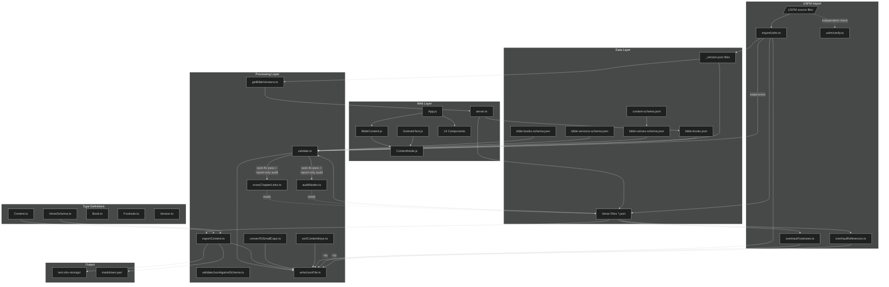

# EGP Graphai - Project Context

> **Updated:** September 3, 2026  
> **Repository:** [LegendaryMediaTV/EGP-Graphai](https://github.com/LegendaryMediaTV/EGP-Graphai)

## Project Summary

EGP Graphai (γραφαὶ – "writings" or "scriptures" in Koine Greek) is a comprehensive JSON standard for Bible resources with structured data, rich metadata including Strong's numbers, morphological codes, lexical lemmas, and conversion tools for text and markdown formats.

### Key Capabilities

- **Multi-Version Support** – Stores and serves multiple Bible translations (ASV, KJV, WEB, MSB, BYZ Greek 2026, YLT, CLV)
- **Rich Annotations** – Strong's numbers, morphological parsing, lexical lemmas per word
- **Flexible Content Model** – Recursive structure supporting paragraphs, headings, subtitles, footnotes, Bible reference links, and abbreviation references resolved against the version's own registry
- **Export Formats** – Text with Strong's annotations, paragraph-formatted Markdown, with bold/italic rendering
- **Web Reader** – React-based SPA for reading and studying with toggleable tools
- **Validation** – `npm run validate` is the one command that runs every normalization and validation rule this repo enforces: an auto-fix pass (key order, JSON formatting, `bibleLink` dash/range normalization and unresolvable-target unlinking, fraction/ellipsis/straight-quote normalization, Greek dialytika repair, script-run tagging, and several Strong's-node placement repairs), checked against itself for a fixed point, then schema/structure checks, then report-only audits (declared chapter counts, cross-chapter links, truncated `bibleLink` ranges, Strong's-node placement, unresolvable `bibleLink` targets, unresolved and duplicate abbreviation ids). No separate audit script or `--fix` flag exists anywhere else in the tree
- **Strong's-Node Placement Audit** – Detects many ways a node's text-flow placement can drift from this repo's own conventions; several of them repair themselves inside the auto-fix pass above — see [strongs-node-audit.md](4-domains/strongs-node-audit.md) for which
- **USFM Import** – Converts USFM translation source files directly into verse JSON (`utils/importUsfm.ts`, `utils/usfm/`), with an independent post-import checker (`usfm/verify.ts`), a retroactive footnote re-classification tool (`overhaulFootnotes.ts`), and a retroactive embedded-reference re-linking tool (`overhaulReferences.ts`)

## Recent Changes (MSB2025 Added, BYZ2018 Retired, Footnote Classifier and Acrostic-Heading Fixes)

- **MSB2025 Added** – The Majority Standard Bible, all 66 Old and New Testament books, with its own 19-entry abbreviation registry spanning critical-text editions, the Majority/Byzantine tradition, and named textual witnesses (Dead Sea Scrolls, Samaritan Pentateuch, both major Textus Receptus editions)
- **BYZ2018 Retired in Favor of BYZ2026** – The Guardian Press / Robinson-Pierpont 2026 Byzantine Textform is now the corpus's only Byzantine Greek New Testament; BYZ2018's version folder and exports are removed from the tree. Its own edition sigla and real footnote/text shapes are still cited by name in source comments and test descriptions as the historical origin of the rules they justify, even though the data itself no longer ships — the same convention this doc's own "Previous Changes" entries below follow
- **Footnote Classifier's Book-Name Slot Now Reads the Registry** – A citation-only test that used to cap a book name at one plain ASCII word now also recognizes any full spelling in `bible-books/bible-books.json`, so a spelled-out `1 Thessalonians 5:1–11` or `Song of Solomon` list stops falling through to `stu` for not fitting the one-word slot
- **Edition-Siglon Guard Closes a Citation Misread** – The same book-name slot is now barred from matching a printed-edition or manuscript siglon (`LXX`, `TR`, `WH`, and others), fixing a real MSB2025 case where a variant reading `WH 76` (the number 276) was read as chapter 76 of an invented book called `WH`
- **Comma-Separated Reference Lists No Longer Overrun Their Chapter** – A chapter-only embedded reference followed by a comma list is now read as more chapters, not a verse list of the one chapter already named; a real MSB2025 note citing `Psalms 32, 42, 44–45, 52–55, 74, 78, 88–89, and 142` no longer misreads the numbers past the first as impossible verses of Psalm 32
- **Acrostic Letter-Name Table Widened Across Editions, Gains Combined Stanzas** – `headings.ts`'s Psalm 119 letter-name table, previously WEB's own spellings only (misspelling "KAPF" included, kept so already-imported data still classifies), now recognizes every transliteration a shipped or attested edition uses for the same Hebrew letter, plus any two of them joined into one combined-stanza heading in any of several real joiner styles (`AND`, `&`, `/`, a dash)
- **Book-Division and Acrostic-Glyph Headings No Longer Assume One Specific Marker** – A Psalter book-division heading used to be recognized only on `\ms1`, so a division heading on any other marker of the `\ms` family silently leaked into the surrounding verse's own prose instead of becoming a heading; all four now classify by their own printed "BOOK n" text. A `\qc` span used to be assumed to always be Psalm 119's acrostic glyph heading; it is now classified by its own text, so an edition using `\qc` for an ordinary centered poetic line is no longer misread as an acrostic marker
- **Hebrew Script Range Extended for Presentation Forms** – The non-Latin glyph range `splitScriptRuns.ts` and the acrostic-glyph-heading classifier both rely on was missing the Hebrew presentation-form block a shipped acrostic heading needed; both are corrected by the same range now covering it
- **Web Reader Script Styling Scoped to the Text Node** – `ContentNode.js` now applies the Hebrew/Greek script class and `dir="rtl"` directly to the span wrapping a node's own text, rather than the wrapper span around the whole node (text, footnote marker, and parsing overlay together)
- **Test Coverage** – The USFM pipeline suite gained a dedicated `splitScriptRuns.test.ts` and grew substantially in `footnoteTypeRules.test.ts` (132 → 231 tests) and `headings.test.ts` (15 → 30); total suite: 1,571 tests across 43 files. See [Test Status](#test-status) below
- See [4-domains/bible-versions.md](4-domains/bible-versions.md), [4-domains/usfm-import.md](4-domains/usfm-import.md#key-business-rules), and [documentation/EGP-Graphai/usfm-import.md](../documentation/EGP-Graphai/usfm-import.md#footnote-classification-and-cross-references) for full detail

## Previous Changes (BYZ2026, Per-Version Abbreviation Registries, Superscript Mark, Dialytika Repair)

- **BYZ2026 Added** – The Guardian Press / Robinson-Pierpont 2026 Byzantine Textform, all 27 New Testament books with text and markdown exports. Its apparatus is the densest in the corpus and is what motivated the abbreviation registry below
- **Abbreviation Registry, Per Version and Never Shared** – A new `{ abbr: "<id> }` content node carries only an id; `_version.json` gained an `abbr` array of `{ _id, name, description }` entries where `name` is itself content (so `NA27` prints as `NA` plus a `sup`-marked `27`) and `description` is what the siglum stands for. Registries are per-version by design, because the same short code means different things in different editions: one version's `MT` is the Masoretic Text, another's the Majority Text, and BYZ2018's bare `M` is neither. `utils/abbreviations.ts` audits every id against its own version's registry as a fifth report-only peer in `validate.ts`, reporting both unresolved ids and ids the registry defines twice; there is no auto-fix, since only a person can say whether the content or the registry is wrong. Populated for BYZ2026, then backfilled for BYZ2018 (six edition sigla, N/B/C/S/M/E, whose definitions come from the byztxt source repo) and WEBUS2020 (seven witness sigla, whose definitions come from the translation's own front matter). ASV1901, CLV1880, KJV1769, and YLT1898 carry no registry because they name their witnesses in prose rather than by siglum. See [content-verses.md](4-domains/content-verses.md) and [bible-versions.md](4-domains/bible-versions.md)
- **`sup` Mark Added** – A fifth formatting mark for superscript siglum modifiers (edition numbers like `NA27`, manuscript corrector and legibility markers like `D2` and `1143vid`). Applied where each node's `core` is built rather than in `wrapEmphasisMarks`, since the exporter's array branch never calls the latter; a mark applied anywhere else works on a lone node and vanishes inside an array
- **A Marked Registry Name Shares the Emphasis Run Around It** – `exportContent.ts` treats an abbreviation node as a boundary, which split a siglum away from the editorial remark beside it (`_om._ _here but add at 16:25–27_` where the source edition prints one italic run). A registry `name` that is a single mark-bearing object now joins the run, mirroring the existing `markedBibleLinkOverride` precedent exactly; a bare-string name has no emphasis to share and an array name can vary its marks element by element, so both stay opaque
- **Greek Dialytika Repair Joins the Auto-Fix Pass** – `functions/normalizeGreekDiacritics.ts` composes a dialytika written after its accent, or left uncomposed, into the letter it belongs to. Confined to the affected letter rather than normalizing whole strings to NFC, which would fold the Greek ano teleia and question mark that BYZ2018 and BYZ2026 use in thousands of places. `auditNodes.ts` carries the matching detector; BYZ2018 had 94 occurrences, now corrected
- **Five BYZ2026 Import Gaps Closed** – Where the source markdown wrapped the `om.` siglum and the remark after it in one italic run, the importer emitted a single literal text node instead of a registry reference. Per-book parity between the source's italic `om.` runs and the corpus's `OM` nodes now holds for all 27 books

## Previous Changes (Mark-Boundary Spacing, Embedded-Reference Linking, and Footnote-Type Fixes)

- **Mark-Boundary Space Merge Joins the Auto-Fix Pass** – The mark-boundary-space check (a bare whitespace-only sibling node between two real, similarly-marked nodes) used to be report-only. `utils/fixMarkBoundarySpaces.ts` now repairs it as a step in `npm run validate`'s own pass, rolling the blank onto whichever real side is the *smaller* mark set — exact `marks`/`script` agreement still defaults forward, but a subset match (one side's marks a non-empty subset of the other's) can now roll the space *backward* instead, and a blocked-both-directions case (the smaller side already carries `strong`/`foot`) is left untouched rather than forced. `auditNodes.ts` gained a matching `isTextlessFootSibling` flag so both this check and the footnote-marker-spacing check skip through a run of textless foot siblings, not just textless Strong's ones, the same way. See [strongs-node-audit.md](4-domains/strongs-node-audit.md) and [validation.md](4-domains/validation.md)
- **Embedded Reference Linking Overhauled** – `utils/usfm/references.ts`'s embedded-reference scanner was rewritten to fix a regex-backtracking bug that truncated multi-digit verse numbers, and now recognizes Roman-numeral book ordinals, period-abbreviated names, parenthetical book names, a single-chapter book's own bare "C:V" shorthand, Oxford-comma verse lists, and a bare "C:V" continuation chained onto a prior reference. A named-book chapter-only mention (no verse) now links too — a genuine reversal of the scanner's own earlier verse-mandatory rule, though a bare ambient "(C:V)" parenthetical with no book name of its own still requires one. Embedded-reference matching, and `crossChapterLinks.ts`'s own unresolvable-`bibleLink`-target check, both stopped treating a book outside the version's own canon as an error — a footnote can legitimately cite a book its version doesn't carry. New `npm run overhaul-references <version> [<book>] [-- --fix]` (`utils/overhaulReferences.ts`) retroactively re-scans already-built `bible-versions/**/*.json` the same way `overhaul-footnotes` does for footnote types, purely additive with no `--hard-reset`. See [usfm-import.md](4-domains/usfm-import.md) and [cross-chapter-links.md](4-domains/cross-chapter-links.md)
- **Footnote-Type Classification Gained Several Constructs** – `footnoteTypeRules.ts` now recognizes a versification-variant note (CLV1880's "Originally verse C:V."), a sub-verse lettered citation, Song of Solomon's own three-token abbreviation, and Obadiah's bare book-name citation; strips a "Fulfilled in"/"Foretold in" lead-in before the citation check; and closed two named-witness false positives (`Aquila` dropped as an ordinary New Testament person's name, "(the) Latin" scoped to a real reading-claim verb instead of matching as a bare word)
- **A Stale Defensive Workaround Removed from Export Rendering** – `exportContent.ts` no longer adds a compensating trailing space around a textless footnote-only node; that was papering over a spacing bug now fixed upstream in the data itself, and the extra space was producing a duplicate

## Previous Changes (Test Suite No Longer Depends on a Local Raw-USFM Corpus)

- **Every Corpus-Reading Test Rewritten Against Tracked Data** – The suite's last dependency on the gitignored `imports/webus2020/ebible-usfm/`, `imports/asv1901/ebible-usfm/`, and `imports/msb2025/ebible-usfm/` directories is gone. A check that used to read one of them directly now runs against a tracked `.usfm` fixture under `utils/usfm/__tests__/fixtures/` (three are new: `ezra-4-16-17-b-p.usfm`, `genesis-front-matter-and-chapter-markers.usfm`, `psalm-33-22-34-1-textless-footnote-node.usfm`), an inline verbatim USFM or footnote-body literal quoted straight in the test, or a byte-exact snippet of this repo's own committed `HEAD` content pinned as a literal and compared through `utils/usfm/__tests__/upstreamHeadConvention.ts`'s `upstreamMatchesRule`/`fixedOutputMatchesRule` helpers. That module's own `git show`/`git ls-tree` reads (`readCanonicalBooks`, `readUpstreamBookJson`) and its `SOURCE_DIR`/`usfmFilesByRegistryId` pair were dead code once both convention specs moved to pinned literals, so they were deleted along with the unused `countScriptNodes` import left behind in `verify.test.ts`
- **The `describe.skip`-With-Placeholder Pattern Is Gone** – Every test file that guarded a corpus read with a plain `if (!fs.existsSync(...))` check, falling back to one named `describe.skip` placeholder so a fresh clone reported a skip instead of a pass, has both the guard and the read it protected removed. Nothing is left to skip
- **Two Source Functions Gained an Injectable Root Directory** – `utils/crossChapterLinks.ts`'s `readVersionBookFiles()` now resolves an absolute `versionId` as a directory to read directly, instead of always joining it under `bible-versions/`, so a test can point it at a synthetic fixture directory with no change to any other function in the module. `utils/validate.ts`'s `collectJsonFiles()` gained an optional `versionsRoot` parameter, defaulting to the real `bible-versions/`, overridable the same way for the same reason
- **A Few Narrow Corpus-Specific Checks Were Dropped, Not Rewritten** – `metadata.test.ts` lost the check that read ASV1901's and MSB2025's own raw `\id` lists directly to confirm both new sources resolve to the identical 66-book canon with no new crosswalk rows needed; the 17-mismatch crosswalk itself survives as a plain hardcoded-list assertion, no longer cross-read against either corpus. `footnotes.test.ts` lost the corpus-wide collision check that ran `capitalizeFootnoteOpening` against every real WEBUS2020 footnote body via `extractFootnoteBodiesIn`. Both existed to prove something against the now-unavailable-by-design local corpus, with no fixture-sized replacement worth building
- **Total Suite Size Shifts By File And Test Count** – The suite goes from the old doc's claimed 38 files and 1,265 tests to 39 files and 1,213 tests. The difference comes from tests dropped outright, corpus-wide sweeps replaced by narrower fixture- or `HEAD`-literal-backed checks, and one pre-existing file, `normalizeStraightQuotes.test.ts`, that the old count never included. See [Test Status](#test-status) below

## Previous Changes (Audit/Fix Tooling Consolidated into `npm run validate`)

- **One Entry Point for Every Normalization and Validation Rule** – Every standalone audit CLI and `--fix` flag this repo ever shipped (`auditCrossChapterLinks.ts`, `auditStrongsNodes.ts`/`auditNodes.ts`'s own CLI, the `audit-links` and `audit-nodes` npm scripts) is gone. `crossChapterLinks.ts` and `auditNodes.ts` are now pure library modules with no `main()`; `utils/validate.ts` is their only caller. Eleven one-off scripts under `imports/` (edition-specific fixers, an OT morphology migration, a small-caps casing pass) were retired outright rather than promoted, since each encoded a rule that either already lives here or belonged one time, at import, and never again. `utils/overhaulFootnotes.ts` is the one deliberate exception, staying a standalone opt-in CLI because its safe default depends on preserving a stored human judgment it can't re-derive
- **Auto-Fix Pass Grew from Eight to Sixteen Steps** – New: `bibleLink` truncated-range reconstruction and unresolvable-target unlinking, untagged non-Latin script-run tagging (corpus-wide, not just headings), footnote-marker leading-space relocation (`foot`'s own mirror of the `strong` convention the trailing-whitespace check already enforced), duplicate-footnote-anchor removal, empty-text-key dropping widened to a husk riding alongside other properties, and equivalent-sibling merging. A new fixed-point step re-applies the whole pass to every changed file and fails by name if a second application would still find something to change
- **Strong's-Node Audit Grew from Seven to Sixteen Checks** – New: unnormalized-ellipsis detection, ASCII straight-quote/apostrophe detection, footnote-marker-after-whitespace detection, untagged script-run detection, duplicate-footnote-anchor detection, mergeable-sibling detection, and non-standard-whitespace detection (report-only, permanently)
- **Straight-Quote Direction Auto-Fixes** – The straight-quote check's straight quote/apostrophe finding now repairs itself in the same pass, via `functions/normalizeStraightQuotes.ts`: direction resolves from the character immediately before each quote, with an adjacent already-resolved quote character propagating its own direction so a bunched-up run (`"'"`) nests correctly. Backtick was dropped from the check entirely — it carries no direction to resolve, so it belongs in whichever import introduced it, not this corpus-wide convention
- **BYZ2018 Apparatus Notation Recognized** – `footnoteTypeRules.ts` gained a symbolic-notation signal (`⇒`, standalone `~`, `¦`) checked alongside the prose-based witness signal, right after cross-reference. Without it, an edition whose apparatus is built entirely from these operators fell through every prose rule straight to the `stu` default
- **Report-Only Audits Run as Peers, Not a Pipeline** – The trailing audits (declared chapter counts, cross-chapter links, truncated ranges, Strong's-node placement, unresolvable `bibleLink` targets) depend on none of each other, so all of them always run to completion and report in full even after one fails
- **No Standing Exceptions — `npm run validate` Is Expected to Exit Clean** – A version whose source content is still incomplete (CLV1880's Esther and Daniel are short their deuterocanonical additions) declares only the chapters its own verse files actually carry; the declared count moves up in the same change that imports the rest. There is no version and no finding this repo treats as a permanently accepted exception
- **Markdown Export Escapes Literal `_`/`*`** – BYZ2018's Beta-code apparatus notes cite manuscript sigla using `_`/`*` as ordinary notation; the markdown exporter now backslash-escapes both when they come from content text verbatim, so CommonMark doesn't misread them as emphasis markup. The text export has no delimiter grammar to collide with, so it escapes nothing
- **Version 1.20.0** – See [4-domains/validation.md](4-domains/validation.md), [4-domains/strongs-node-audit.md](4-domains/strongs-node-audit.md), [4-domains/cross-chapter-links.md](4-domains/cross-chapter-links.md), [4-domains/usfm-import.md](4-domains/usfm-import.md), and [4-domains/bible-versions.md](4-domains/bible-versions.md) for full detail

## Previous Changes (Heading-Paragraph Convention Enforced on Import; USFM Scaffold Resolved)

- **Heading Dispatch Now Opens a Paragraph Unconditionally** – `segmentVerses.ts`'s handling of `\d`/`\sp`/`\s1`/`\qc` used to set `pendingParagraph = true` only for `\sp` (Song of Solomon's speaker labels). It now sets it for all four, matching `auditNodes.ts`'s own heading-paragraph check's corpus-wide convention (a heading or subtitle run is always followed by a node carrying `paragraph: true`) instead of leaving the other three markers to whatever `\b`/`\c` happened to share the boundary
- **New Fixer for the Heading-Paragraph Check** – `utils/fixHeadingParagraphs.ts` retrofits the flag onto already-imported content for the versions with no USFM source to reimport from (KJV1769, YLT1898, CLV1880, BYZ2018), reusing `auditNodes.ts`'s own `findHeadingParagraphMismatches` rather than re-deriving the judgment. `utils/fixUnmergedNodes.ts` does the same for the unmerged-connector check. Both are `npx ts-node` scripts, not npm scripts, matching `importUsfm.ts`'s pattern
- **`splitScriptRuns` No Longer an External Scaffold** – The Hebrew/Greek run-splitting helper `headings.ts`, `footnotes.ts`, and `verify.ts` depend on now lives at the tracked `utils/usfm/splitScriptRuns.ts`, not a gitignored `imports/_lib/` path
- **Full Suite Passes** – With the WEBUS2020 raw USFM corpus present in this checkout and `splitScriptRuns` now tracked, all 29 test files and 925 tests pass; see [Test Status](#test-status) below
- See [4-domains/usfm-import.md](4-domains/usfm-import.md#key-business-rules), [4-domains/strongs-node-audit.md](4-domains/strongs-node-audit.md#key-business-rules), and [6-tests-and-build.md](6-tests-and-build.md#usfm-import-pipeline-domain) for full detail

## Previous Changes (Footnote Classifier Redesign)

- **Construct-Based Classification, Not Memorized Phrases** – `utils/usfm/footnoteTypeRules.ts` no longer sorts footnote types by matching literal phrases lifted from WEBUS2020's own house style (down to a source-side typo, `"authorites insert"`). It now asks structural questions of a footnote body: is it nothing but citations, does it name a manuscript witness, does it open with a translation marker, does it weigh one language's reading against another. The same rules hold across editions without a fresh pass of new literals per translation
- **Priority Is No Longer a Flat Four-Step Order** – `classifyFootnote()` now checks, in order: nothing-but-citations (`xrf`), a strong witness signal (`var`), a translation-alternative signal (`trn`), a weaker witness signal comparing a language name across a semicolon (`var` again), then falls back to `stu`. The weak `var` check runs last specifically because a bare language name is at least as often background etymology as a real textual claim
- **`WITNESS_SIGLA` Made Case-Sensitive** – Matching `MT`/`TR`/`NU`/`LXX`/`DSS`/`RP`/`FH` case-insensitively was the single defect behind the largest share of the old classifier's disagreements with ASV1901: `Mt. 4:23` (Matthew) matched `MT` (Masoretic Text) under `/i`. A narrow, verb-gated exception (`LOWERCASE_SIGLON_READING`) still catches Acts 4:27's real "nu adds..." casing slip without reopening that collision
- **`overhaulFootnotes.ts` Doesn't Downgrade a Real Type to `stu` by Default** – `stu` is `classifyFootnote()`'s own no-signal fallback, not a considered judgment. `reclassifyFootnotesIn()` now skips any recomputed `stu` when the stored type is something else real, so a corpus with many bare-gloss `trn` notes and no textual marker at all doesn't lose a human's prior classification to a false negative. Every upgrade out of `stu` still applies unconditionally
- **`--hard-reset` Re-Derives Every Type from Scratch** – The counterpart to the rule above: `--hard-reset` gives the stored type no weight at all, so a corpus whose existing types aren't worth keeping (a bulk-typed placeholder, an earlier machine pass now known to be wrong) can be reclassified in one pass. Without it, a stored non-`stu` type is unreachable by `stu` and a caller would have to blank every type by hand first. Composes with `--fix`
- **Rules Were Checked Against Many Editions' Real Conventions, Not Just WEB's** – The construct-based rules were validated during development against real footnote text from editions well beyond this repo's own six shipped versions, to confirm they generalize rather than overfitting to WEB's own house style
- **No Third-Party Translation Text or Names in Source or Tests** – This repo ships and redistributes only public-domain/CC0 translations. Source comments and test fixtures that illustrate a construct now use synthetic example text instead of verbatim excerpts from copyrighted, non-shipped editions, and no longer name those editions. Behavior is unchanged: every affected test still exercises the same code path and asserts the same result, confirmed by a full test-suite run before and after
- **Test Coverage** – `utils/usfm/__tests__/footnoteTypeRules.test.ts` rewritten to 67 tests (was a smaller phrase-based suite); `utils/__tests__/overhaulFootnotes.test.ts` grew to 18 tests, covering the never-downgrade rule and its `--hard-reset` counterpart. Total suite: 551 tests passing, 1 skipped, across the same 19 of 29 files (neither changed file is among the 10 still blocked by the missing `imports/` scaffold)
- See [4-domains/usfm-import.md](4-domains/usfm-import.md#key-business-rules) and [documentation/EGP-Graphai/usfm-import.md](../documentation/EGP-Graphai/usfm-import.md#footnote-classification-and-cross-references) for full detail

## Previous Changes (USFM Import Pipeline & WEBUS2020 Apocrypha)

- **New USFM → Graphai Import Pipeline** – `utils/importUsfm.ts` plus eleven supporting modules under `utils/usfm/` (`tokenize.ts`, `segmentVerses.ts`, `blockStructure.ts`, `headings.ts`, `footnotes.ts`, `footnoteTypeRules.ts`, `references.ts`, `inlineMarks.ts`, `fractions.ts`, `metadata.ts`, `paragraphNoise.ts`) convert USFM translation source into this repo's verse JSON. `segmentVerses.ts` is the pipeline's largest module: it's the only place that decides paragraph/stanza/chapter boundaries from the token stream `tokenize.ts` produces; everything else renders a span it's already identified
- **Independent Post-Import Verifier** – `utils/usfm/verify.ts` deliberately never imports `tokenize.ts` or `segmentVerses.ts`, re-deriving verse/chapter/footnote/marker counts straight from raw USFM so a shared bug can't cancel itself out between the importer and its own check. Standalone CLI, not part of `npm run validate`
- **Retroactive Footnote Re-Classification** – New `npm run overhaul-footnotes <version> [-- --hard-reset --fix]` (`utils/overhaulFootnotes.ts`) reruns footnotes already on disk through the same `classifyFootnote()` table the importer uses, for versions that predate this pipeline
- **A Real Import Regenerates Downstream via Subprocess** – After writing, `importUsfm.ts` shells out to `audit-links --fix` and `validate` as separate child processes rather than in-process calls, specifically because `crossChapterLinks.ts` caches its version index for the process lifetime
- **WEBUS2020 Apocrypha Added** – WEBUS2020 grew from 66 to 81 books: 15 deuterocanon books inserted at order 40–54, between Malachi (39) and Matthew (now 55), then the whole version was reimported through this pipeline. Only two book-registry entries (`PS2`, `DAG`) were new; the other 13 ids already existed in `bible-books.json`. `testament` still only distinguishes `"OT" | "NT"`; apocrypha is grouped under `"OT"`, not a new value
- **WEBUS2020 Imports Without Strong's Numbers** – `--no-strongs` is set for this translation specifically, after a quality review found its automatically assigned Strong's numbers unreliable across a large share of sampled words
- **Known Gap: Local Import Scaffolding Isn't Shipped** – `headings.ts`, `footnotes.ts`, and `verify.ts` import a Hebrew/Greek run-splitting helper from a gitignored `imports/_lib/` path, and one fixture test expects source USFM under an equally absent `imports/webus2020/` path. Neither exists in this checkout. Running `npx vitest run` reports 10 of 29 test files failing to load for this reason. See [6-tests-and-build.md](6-tests-and-build.md#usfm-import-pipeline-domain) for the exact list
- **Test Coverage** – 18 new test files (16 under `utils/usfm/__tests__/`, plus `importUsfm.test.ts` and `overhaulFootnotes.test.ts`); 8 of them load and pass today, the other 10 are blocked by the gap above. Total suite: 522 tests passing across 19 of 29 files
- See [4-domains/usfm-import.md](4-domains/usfm-import.md), [documentation/EGP-Graphai/usfm-import.md](../documentation/EGP-Graphai/usfm-import.md), and [4-domains/bible-books.md](4-domains/bible-books.md#core-entities) for full detail

## Previous Changes (Whole-Chapter Link Splitting, YLT1898 Node Bugfixes & Audit Tooling)

- **Whole-Chapter Ranges Now a Finding, Not Excluded** – `wholeChapterRange` (e.g. `"Romans 1–11"`) used to be classified separately and explicitly excluded from `findings` as out of scope. It's now split the same way as `crossChapterRange`, just with no verse anchor on either half. `splitCrossChapterLink()` branches on the classified shape to pick the right formula. `findCrossChapterLinks()` no longer returns a separate `wholeChapterRanges` count
- **Real YLT1898 Findings Fixed** – Nine outline references across Romans, 1–2 Corinthians, and Revelation's introductory footnotes (e.g. `"Romans 1–11"`) split into their chapter-scoped halves via `auditCrossChapterLinks.ts --fix`
- **YLT1898 Node Bugfixes** – A missing array wrapper on `marks` (`"marks": "sc"` instead of `["sc"]`) in five books' introductory footnotes, and four stray joining-space nodes that should have led the following word instead. Both are exactly the shapes `auditNodes.ts` and `validate.ts`'s content checks exist to catch
- **`auditStrongsNodes.ts` Renamed to `auditNodes.ts`** – npm script renamed `audit-strongs-nodes` → `audit-nodes` to match; `isClean()` and `printFindingLines()` are now exported for reuse
- **`validate.ts` Now Runs Both Corpus-Wide Audits** – For each version it validates, `main()` also calls `findCrossChapterLinks()` and `auditVersion()` (read-only, never `--fix`), reusing each module's own report formatting rather than duplicating it. The two run to completion regardless of each other's outcome, unlike the hierarchical schema-checking phases before them, so a version failing one still gets audited by the other in the same run
- **Test Coverage Expansion** – 5 new tests for the whole-chapter split behavior, bringing the suite to 320 tests across 11 files
- See [4-domains/cross-chapter-links.md](4-domains/cross-chapter-links.md), [4-domains/strongs-node-audit.md](4-domains/strongs-node-audit.md), and [4-domains/validation.md](4-domains/validation.md#key-business-rules) for full detail

## Previous Changes (Strong's-Node Audit & Export/Validation Fixes)

- **Strong's-Node Audit Tool** – New [utils/auditNodes.ts](../../utils/auditNodes.ts) sweeps every version for five drift patterns: unmerged connector/Strong's-node pairs, trailing whitespace on a `strong`-carrying node, leading punctuation glued to the wrong neighbor, a bare joining space stranded between two same-formatting nodes, and a verse whose own content opens with a space. Read-only. No `--fix` path; see [4-domains/strongs-node-audit.md](4-domains/strongs-node-audit.md)
- **`--verbose` Survives npm's Own Flag-Swallowing** – `npm run audit-nodes KJV1769 --verbose` (no `--` separator) never delivers a literal `--verbose` to the script; npm's own CLI parsing consumes it first. The tool also checks `process.env.npm_config_loglevel`, the one signal that invocation shape leaves behind, so verbose output still works as typed
- **Corpus Cleaned Up** – Every finding the new checks (and the pre-existing unmerged-pair/punctuation checks) surfaced across KJV1769 and WEBUS2020 was fixed. This restored the leading-space convention through the Words-of-Christ-heavy Gospels/Acts/Revelation text and removed 73 verse-initial spaces from WEBUS2020, all verified byte-for-byte text-preserving against the pre-fix corpus
- **Export: Bold/Italic Rendering Added** – `exportContent.ts` now wraps `b`/`i` marks in markdown (`**bold**`, `_italic_`; a no-op in the text export). Adjacent siblings sharing the same open marks share one delimiter pair instead of each emitting its own. This fixes broken markdown like `**word****word**` for a bold+italic quotation built word-by-word
- **Export: Two Rendering Fixes** – A word's second footnote (forced to ride as a textless sibling, since only one `foot` is allowed per node) now places its marker before the Strong's number, matching the first footnote's position; a Strong's/morph/lemma tag with nothing separating it from the following word now gets a synthetic space, fixing fused output like `H2822was`
- **Validation: Two New Structural Checks** – `findMeaninglessContentNodes()` (formatting with no text to apply it to, or an empty `""` husk) and `findStrongTrailingWhitespaceNodes()` (a `strong`-carrying node's own trailing-whitespace convention violation), both exported and independently testable
- **Web Reader: Shared Footnote-Text Extraction** – New `web/public/js/footnoteText.js` (`window.getFootnoteText`) replaces two slightly different inline flattening implementations in `ContentNode.js`. The leaf-content path previously silently dropped `bibleLink`-shaped footnote segments; both paths now share the same, more complete recursive logic. Footnote markers also now render before the verse-break instead of after
- **Bible Versions: Duplicate Display Names Disambiguated** – `getBibleVersions()` now appends each colliding version's own trailing-year suffix (parsed from `_id`) when two versions share an exact-match display `name`, so the picker never shows duplicates; the singular `getBibleVersion()` lookup deliberately does not do this
- **ASV1901 Overhaul & KJV1769 Bugfixes** – Data-only changes across several commits: ASV1901 re-imported corpus-wide, plus KJV1769 corrections for straight quotes, small caps, and spacing
- **Test Coverage Expansion** – 125 new tests, bringing the suite to 312 tests across 11 files (up from 187 across 8)
- See [4-domains/strongs-node-audit.md](4-domains/strongs-node-audit.md), [4-domains/export-system.md](4-domains/export-system.md#key-business-rules), [4-domains/validation.md](4-domains/validation.md#key-business-rules), [4-domains/web-reader.md](4-domains/web-reader.md#key-business-rules), and [4-domains/bible-versions.md](4-domains/bible-versions.md#key-business-rules) for full detail

## Previous Changes (Acrostic Heading Node)

- **Heading `type` Discriminator** – The heading content node gains an optional `type: "standard" | "acrostic"` (default `"standard"`), mirroring the existing `Footnote.type` pattern; added to [content-schema.json](../../content-schema.json) and [types/Content.ts](../../types/Content.ts)'s `ContentHeading`
- **Distinct Rendering** – Acrostic headings render one heading level smaller in markdown (`####` vs. `###`), with a triple-bracket marker in text export (`[[[...]]]` vs. `[[...]]`), and one Tailwind size step smaller in the web reader (`h4`/`text-lg` vs. `h3`/`text-xl`); see [utils/exportContent.ts](../../utils/exportContent.ts) and [web/public/js/ContentNode.js](../../web/public/js/ContentNode.js)
- **Shared Visibility Toggle** – Acrostic headings are governed by the same "Show Headings" setting as standard ones; no new toggle was added
- **Real Data Tagged** – All 66 existing acrostic stanza-marker headings (22 each) across WEBUS2020, KJV1769, and CLV1880's Psalm 119 now carry `"type": "acrostic"`, confirmed by exhaustive scan to be the only heading nodes anywhere in the Psalms corpus; ASV1901, YLT1898, and BYZ2018 had none to tag
- **JSON Write Pipeline Fixed** – [functions/writeJsonFile.ts](../../functions/writeJsonFile.ts) stringified with an indent argument before handing text to Prettier, which locked every object onto its own lines regardless of length (Prettier preserves a pre-existing line break rather than re-deriving it from width). Now stringifies compact first via a shared `formatJsonData()` helper, which [utils/validate.ts](../../utils/validate.ts)'s own formatting pass also calls, so both paths always converge on the same width-driven canonical form instead of possibly drifting
- **Whole Corpus Reformatted** – Running the fixed `npm run validate` once reformatted 208 files; verified value-for-value against Git history that every change was pure whitespace except the five files with the acrostic-heading edits above, which changed by exactly the intended amount and nothing else
- **Test Coverage Added** – 11 new tests (4 for the schema addition, 1 for key-sort coverage, 5 for export rendering, 1 regression test pinning the compact-stringify fix), bringing the suite to 187 tests across 8 files
- See [4-domains/content-verses.md](4-domains/content-verses.md#heading-types) for the acrostic heading domain detail and [data-pipeline.md](../documentation/EGP-Graphai/data-pipeline.md#writing-files) for the write-pipeline fix

## Previous Changes (Cross-Chapter Link Audit)

- **New Rule Owner** – [utils/crossChapterLinks.ts](../../utils/crossChapterLinks.ts) classifies every `bibleLink` target shape (`singleChapter`, `crossChapterRange`, `wholeChapterRange`, `mergedTarget`, `unparsed`) and splits a genuine cross-chapter range into two chapter-scoped links joined by an en dash
- **New Corpus Sweep & CLI** – [utils/auditCrossChapterLinks.ts](../../utils/auditCrossChapterLinks.ts) audits every version (dry-run by default) and writes fixes only when run with `--fix`; exits non-zero on any unsplit finding so it can gate CI like `validate.ts`
- **Version-Scoped, Never Shared** – Chapter length and book-name resolution are both read from each version's own data, never a table borrowed from another translation, since versification and canon differ between them
- **Real Finding Fixed** – WEBUS2020's Hebrews 11:34 footnote (`"2 Kings 6:31—7:20"`) split into `"2 Kings 6:31–33"` and `"2 Kings 7:1–20"`
- **Test Coverage Added** – 39 new tests (31 for classification/splitting, 8 for the corpus sweep and CLI), bringing the suite to 176 tests across 7 files
- See [4-domains/cross-chapter-links.md](4-domains/cross-chapter-links.md) for full domain detail

## Previous Changes (Atomic File Writes & Dependency Updates)

- **Atomic File Writes** – New [functions/writeJsonFile.ts](../../functions/writeJsonFile.ts) module (`writeFileAtomic` + `writeJsonFile`) stages writes to a temp file and renames over the target, retrying transient failures on a backoff; see [Writing files](../documentation/EGP-Graphai/data-pipeline.md#writing-files)
- **Four Writers Migrated** – `validate.ts`, `exportContent.ts`, `convertToSmallCaps.ts`, and `sortBibleKeys.ts` all now write through this module instead of `fs.writeFileSync` + a per-file `npx prettier --write` subprocess; their `processBook`/`main` functions are now `async`
- **Test Coverage Expansion** – Added 9 new tests for the write helper (Prettier-subprocess byte parity, atomic replace semantics, multibyte handling, retry/backoff and failure-naming under fake timers)
- **Dependency Updates** – `@types/lodash` 4.17.24 → 4.17.25, `@types/node` 24.12.4 → 24.13.3 (capped at v24 to match Node runtime), `prettier` 3.8.3 → 3.9.6, `vitest` 4.1.7 → 4.1.10; `typescript` held at 6.0.3 (7.x is a major, skipped)
- **Override Removed** – The `ajv` → `fast-uri` override was dropped; `fast-uri` now resolves to a safe version naturally without it

## Previous Changes (Branch: Add-bibleLink-node)

- **Bible Reference Links** – New `bibleLink` content variant for cross-reference targets; optional `content` override for display text
- **Schema, Types, Sorter Updated** – `content-schema.json`, [types/Content.ts](../../types/Content.ts), and canonical key order in [functions/sortContentKeys.ts](../../functions/sortContentKeys.ts) all recognize `bibleLink`
- **Export Dispatch** – [utils/exportContent.ts](../../utils/exportContent.ts) renders the override when present, otherwise the reference string
- **Web Reader Anchor** – [web/public/js/ContentNode.js](../../web/public/js/ContentNode.js) renders `bibleLink` as a clickable anchor with `onBibleLinkClick` callback
- **WEB Translation Migration** – WEBUS2020 footnotes updated to use `bibleLink` for embedded references; verse ranges normalized to en-dash separators with spaces after commas
- **Dependency Updates** – `vitest` 4.1.5 → 4.1.7, `@types/node` 24.12.2 → 24.12.4 (capped at v24 to match Node runtime), `fast-uri` override for high-severity advisories

## Previous Changes (Branch: Standardize-Bible-verse-key-order)

- **Key Ordering Standardization** – Added automatic key sorting during validation
- **Small Caps Utilities** – CLI tool for batch conversion of LORD/GOD to small caps format
- **Key Sorting Utilities** – CLI tool for standardizing key order across verse files
- **Test Coverage Expansion** – Added 66 new tests (40 for small caps, 26 for key sorting)
- **Enhanced Validation** – Modified validation script to auto-sort keys to canonical order

## Previous Changes (Branch: Converted-uppercase-to-small-caps)

- **Small Caps Support** – Added `sc` formatting mark for divine names (LORD/GOD rendered as small caps)
- **Nested Content Structure** – Extended content schema with `ContentNested` for shared properties
- **Divine Name Migration** – Converted uppercase LORD/GOD to small caps in KJV, ASV, WEB, YLT versions
- **Export Compatibility** – Text/markdown exports render small caps as uppercase
- **Web Reader Styling** – CSS `font-variant: small-caps` for proper visual rendering

## Previous Changes (Branch: Refactor-Bible-versions)

- **Version Metadata Refactored** – Moved from single `bible-versions.json` to per-folder `_version.json` files
- **New `getBibleVersions()` Function** – Discovers versions from folder structure dynamically
- **New `types/Version.ts`** – TypeScript interfaces for version metadata
- **Export System Refactored** – Unified rendering architecture with configurable options
- **Test Coverage Added** – 49 tests (17 for version discovery, 32 for export)
- **Font-Responsive Width** – Web reader content width scales with font size

## Quick Reference

| Command            | Purpose                            |
| ------------------ | ---------------------------------- |
| `npm install`      | Install dependencies               |
| `npm run dev`      | Start web reader at localhost:3000 |
| `npm run validate` | Validate all JSON data             |
| `npm run export`   | Export to text/markdown            |
| `npm run test`     | Run Vitest tests                   |
| `npm run type-check` | Type-check the whole tree with `tsc --noEmit`, no output written |
| `npm run overhaul-footnotes <version>` | Re-classify a version's on-disk footnotes against the current rules (add `-- --fix` to write; the bare `--` is required or npm eats the flag) |
| `npm run overhaul-references <version> [<book>]` | Re-scan a version's on-disk footnotes for embedded references the current grammar would now catch (add `-- --fix` to write; same bare `--` requirement) |

## Context Documents

### Developer Documentation (narrative)

| Document                                                           | Description                                            |
| ------------------------------------------------------------------ | ------------------------------------------------------ |
| [Supplemental Docs README](../documentation/EGP-Graphai/README.md) | Entry point for human-readable developer documentation |
| [content-model.md](../documentation/EGP-Graphai/content-model.md)  | Narrative walkthrough of the recursive content shapes  |
| [data-pipeline.md](../documentation/EGP-Graphai/data-pipeline.md)  | Validation, transforms, and export flow                |
| [usfm-import.md](../documentation/EGP-Graphai/usfm-import.md)      | USFM → Graphai import pipeline and verification         |
| [web-reader.md](../documentation/EGP-Graphai/web-reader.md)        | Web reader architecture and component layout           |

### Domain Analysis

| Document                                                     | Description                                           |
| ------------------------------------------------------------ | ----------------------------------------------------- |
| [1-techstack.md](1-techstack.md)                             | Languages, frameworks, libraries, and domain analysis |
| [2-file-categorization.json](2-file-categorization.json)     | File organization by role                             |
| [3-architectural-domains.json](3-architectural-domains.json) | Architecture patterns and constraints                 |

### Business Domains

| Document                                                   | Description                           |
| ---------------------------------------------------------- | ------------------------------------- |
| [4-domains/bible-versions.md](4-domains/bible-versions.md) | Bible version registry and management |
| [4-domains/bible-books.md](4-domains/bible-books.md)       | Canonical book metadata               |
| [4-domains/content-verses.md](4-domains/content-verses.md) | Content structure and verse data      |
| [4-domains/export-system.md](4-domains/export-system.md)   | Export formats and processing         |
| [4-domains/validation.md](4-domains/validation.md)         | Data validation system                |
| [4-domains/cross-chapter-links.md](4-domains/cross-chapter-links.md) | Cross-chapter `bibleLink` detection and splitting |
| [4-domains/strongs-node-audit.md](4-domains/strongs-node-audit.md) | Strong's-node placement drift detection (read-only) |
| [4-domains/usfm-import.md](4-domains/usfm-import.md)       | USFM → Graphai import pipeline, verification, and apocrypha addition |
| [4-domains/web-reader.md](4-domains/web-reader.md)         | Web application architecture          |

### Style Guides

| Document                                                                         | Description                        |
| -------------------------------------------------------------------------------- | ---------------------------------- |
| [5-style-guides/typescript-utilities.md](5-style-guides/typescript-utilities.md) | TypeScript utility module patterns |
| [5-style-guides/type-definitions.md](5-style-guides/type-definitions.md)         | TypeScript interface conventions   |
| [5-style-guides/react-components.md](5-style-guides/react-components.md)         | React component patterns           |
| [5-style-guides/ui-components.md](5-style-guides/ui-components.md)               | UI component patterns              |
| [5-style-guides/json-schemas.md](5-style-guides/json-schemas.md)                 | JSON Schema conventions            |

### Testing & Build

| Document                                     | Description                                       |
| -------------------------------------------- | ------------------------------------------------- |
| [6-tests-and-build.md](6-tests-and-build.md) | Test framework, build commands, coverage analysis |

## Architecture Overview


```mermaid
%%{init: {'theme': 'dark'}}%%
graph TB
    subgraph Data["Data Layer"]
        BS[bible-books-schema.json]
        BB[bible-books.json]
        VS[bible-versions-schema.json]
        VJ[_version.json files]
        CS[content-schema.json]
        VRS[bible-verses-schema.json]
        VF[Verse Files *.json]
    end

    subgraph Processing["Processing Layer"]
        VAL[validate.ts]
        EXP[exportContent.ts]
        VJS[validateJsonAgainstSchema.ts]
        GBV[getBibleVersions.ts]
        SCK[sortContentKeys.ts]
        CSC[convertToSmallCaps.ts]
        CCL[crossChapterLinks.ts]
        WJF[writeJsonFile.ts]
        ASN[auditNodes.ts]
    end

    subgraph Types["Type Definitions"]
        TC[Content.ts]
        TV[VerseSchema.ts]
        TB[Book.ts]
        TF[Footnote.ts]
        TBV[Version.ts]
    end

    subgraph Web["Web Layer"]
        SRV[server.ts]
        APP[App.js]
        BC[BibleContent.js]
        FT[footnoteText.js]
        CN[ContentNode.js]
        UI[UI Components]
    end

    subgraph Output["Output"]
        TXT[text-vbv-strongs/]
        MD[markdown-par/]
    end

    subgraph USFM["USFM Import"]
        USF[/USFM source files/]
        IMP[importUsfm.ts]
        VFY[usfm/verify.ts]
        OHF[overhaulFootnotes.ts]
        OHR[overhaulReferences.ts]
    end

    BS --> VAL
    VS --> VAL
    VRS --> VAL
    CS --> VRS
    BB --> VAL
    VJ --> VAL
    VF --> VAL

    VF --> EXP
    EXP --> TXT
    EXP --> MD

    VAL -->|"auto-fix pass +<br/>report-only audit"| CCL
    VAL -->|"auto-fix pass +<br/>report-only audit"| ASN
    CCL -.->|"reads"| VF
    ASN -.->|"reads"| VF

    VAL --> WJF
    EXP --> WJF
    CSC --> WJF
    SCK --> WJF

    USF --> IMP
    IMP --> VF
    IMP --> WJF
    IMP --> VJ
    IMP -->|"subprocess"| VAL
    USF -.->|"independent check"| VFY
    VF --> OHF
    OHF -->|"--fix"| WJF
    VF --> OHR
    OHR -->|"--fix"| WJF

    TC --> EXP
    TV --> EXP

    VJ --> GBV
    GBV --> SRV
    SRV --> BB
    SRV --> VF

    APP --> BC
    BC --> CN
    FT --> CN
    APP --> UI
```

## Critical Patterns

### Content Processing (Recursive)

All code handling Content must handle three variants:

1. **String** – Plain text
2. **Object** – Structured with text, annotations, formatting
3. **Array** – Collection of content items (recursive)

```typescript
function processContent(content: Content): void {
  if (typeof content === "string") {
    /* handle string */
  }
  if (Array.isArray(content)) {
    content.forEach(processContent);
  }
  if (typeof content === "object") {
    /* handle object variants */
  }
}
```

### Schema Validation Chain

```
content-schema.json
       ↓ (referenced by)
bible-verses-schema.json
       ↓ (referenced by)
bible-versions-schema.json ← bible-books-schema.json
```

### Frontend Component Registration

Each React component must register on `window` for cross-file access:

```javascript
window.ComponentName = ComponentName;
```

## Key Constraints

1. **No Build Step for Frontend** – JSX transpiled at runtime via Babel
2. **No Database** – All data as flat JSON files
3. **Sequential Book Ordering** – Orders must be 1-indexed, sequential, no gaps
4. **Canonical Key Order** – Content keys must follow specific order (subtitle → heading → bibleLink → abbr → paragraph → type → text → content → script → marks → break → foot → strong → morph → lemma)
5. **Strong's Number Format** – Must match `^[GH][0-9]{1,4}$`
6. **Verse File Naming** – Must follow `{order}-{bookId}.json` pattern
7. **Exit on Validation Failure** – Scripts exit with code 1 on any error
8. **Leading-Space Convention** – A joining space belongs on the leading edge of the node it joins, never the trailing edge of the node before it, and never as a verse's own opening character. Applies to every attribute that can own that boundary, not just the first one that got a check: enforced for `strong` and, as of the footnote-marker-spacing check, for `foot` too. `auditNodes.ts` detects every violation; `npm run validate`'s own auto-fix pass repairs the `strong` and `foot` cases automatically
9. **USFM Verifier Independence** – `usfm/verify.ts` must never import `tokenize.ts`, `segmentVerses.ts`, or anything that imports them; it exists to catch a bug the importer itself can't see by re-deriving its checks straight from raw USFM
10. **Footnote Classification Has One Source of Truth** – `usfm/footnoteTypeRules.ts`'s `classifyFootnote()` is called by both the importer and `overhaulFootnotes.ts`; don't duplicate its logic elsewhere
11. **One Entry Point for Normalization and Validation** – Every rule this repo enforces on `bible-versions/**` lives inside `npm run validate`, either as an automatic repair or a report. There is no separate audit script anywhere in the tree and no `--fix` flag on anything `validate.ts` calls into
12. **Embedded Reference Linking Has One Source of Truth** – `usfm/references.ts`'s `linkEmbeddedReferences()` is called by both the importer (at parse time) and `overhaulReferences.ts` (retroactively, against already-built version files); don't duplicate its logic elsewhere. Unlike an explicit `\x` cross-reference or a direct-branch prose match, this scan is deliberately never canon-restricted — a footnote can legitimately name a book its own version doesn't carry

## Test Status

✅ **1,571 tests passing, across all 43 test files** (Vitest):

- `functions/__tests__/` (12 files): `contentSchema.test.ts` (4), `convertToSmallCaps.test.ts` (40), `getBibleVersions.test.ts` (17), `mapContentText.test.ts` (14), `mergeEquivalentSiblingsInContent.test.ts` (18), `normalizeEllipses.test.ts` (19), `normalizeFractions.test.ts` (24), `normalizeGreekDiacritics.test.ts` (11), `normalizeStraightQuotes.test.ts` (14), `sortContentKeys.test.ts` (29), `tagScriptRunsInContent.test.ts` (19), `writeJsonFile.test.ts` (10)
- `utils/__tests__/` (14 files): `auditNodes.test.ts` (176), `crossChapterLinks.test.ts` (81), `exportContent.test.ts` (175), `fixDuplicateFootnoteAnchors.test.ts` (8), `fixFootnoteMarkerSpacing.test.ts` (29), `fixFootnotePunctuationOrder.test.ts` (7), `fixHeadingParagraphs.test.ts` (4), `fixMarkBoundaryEmbeddedSpaces.test.ts` (16), `fixMarkBoundarySpaces.test.ts` (16), `fixUnmergedNodes.test.ts` (5), `importUsfm.test.ts` (19), `overhaulFootnotes.test.ts` (22), `overhaulReferences.test.ts` (20), `validate.test.ts` (75)
- `utils/usfm/__tests__/` (16 files, the USFM import pipeline): `bibleLinkTargetConventions.test.ts` (1), `blockStructure.test.ts` (14), `bMarkerUpstreamConvention.test.ts` (1), `chapterBoundaryUpstreamConvention.test.ts` (1), `embeddedReferenceConventions.test.ts` (12), `footnotes.test.ts` (55), `footnoteTypeRules.test.ts` (231, the largest suite in the repo), `headings.test.ts` (30), `inlineMarks.test.ts` (28), `metadata.test.ts` (10), `paragraphNoise.test.ts` (7), `references.test.ts` (69), `segmentVerses.test.ts` (141), `splitScriptRuns.test.ts` (2), `tokenize.test.ts` (10), `verify.test.ts` (77)
- `web/public/js/__tests__/footnoteText.test.ts` – 10 tests for shared footnote-text extraction

All 43 files load and pass on a fresh clone with no local setup. The USFM-pipeline specs that used to need the gitignored WEBUS2020/ASV1901/MSB2025 raw USFM corpora were rewritten against tracked fixtures or this repo's own committed content instead; see [Previous Changes](#previous-changes-test-suite-no-longer-depends-on-a-local-raw-usfm-corpus) above and [6-tests-and-build.md](6-tests-and-build.md#usfm-import-pipeline-domain) for detail.

See [6-tests-and-build.md](6-tests-and-build.md) for test details and coverage.

---

_This context documentation was generated to assist AI agents in understanding and modifying the EGP Graphai codebase. Refer to individual domain documents for detailed information._
