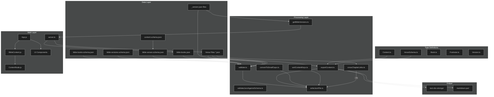

# EGP Graphai - Project Context

> **Updated:** August 3, 2026  
> **Repository:** [LegendaryMediaTV/EGP-Graphai](https://github.com/LegendaryMediaTV/EGP-Graphai)

## Project Summary

EGP Graphai (γραφαὶ – "writings" or "scriptures" in Koine Greek) is a comprehensive JSON standard for Bible resources with structured data, rich metadata including Strong's numbers, morphological codes, lexical lemmas, and conversion tools for text and markdown formats.

### Key Capabilities

- **Multi-Version Support** – Stores and serves multiple Bible translations (ASV, KJV, WEB, BYZ Greek, YLT, CLV)
- **Rich Annotations** – Strong's numbers, morphological parsing, lexical lemmas per word
- **Flexible Content Model** – Recursive structure supporting paragraphs, headings, subtitles, footnotes
- **Export Formats** – Text with Strong's annotations, paragraph-formatted Markdown
- **Web Reader** – React-based SPA for reading and studying with toggleable tools
- **Validation** – JSON Schema validation ensuring data integrity with automatic key sorting
- **Cross-Chapter Link Audit** – Detects and fixes `bibleLink` targets that span two chapters of the same book

## Recent Changes (Cross-Chapter Link Audit)

- **New Rule Owner** – [utils/crossChapterLinks.ts](../../utils/crossChapterLinks.ts) classifies every `bibleLink` target shape (`singleChapter`, `crossChapterRange`, `wholeChapterRange`, `mergedTarget`, `unparsed`) and splits a genuine cross-chapter range into two chapter-scoped links joined by an en dash
- **New Corpus Sweep & CLI** – [utils/auditCrossChapterLinks.ts](../../utils/auditCrossChapterLinks.ts) audits every version (dry-run by default) and writes fixes only when run with `--fix`; exits non-zero on any unsplit finding so it can gate CI like `validate.ts`
- **Version-Scoped, Never Shared** – Chapter length and book-name resolution are both read from each version's own data — never a table borrowed from another translation — since versification and canon differ between them
- **Real Finding Fixed** – WEBUS2020's Hebrews 11:34 footnote (`"2 Kings 6:31—7:20"`) split into `"2 Kings 6:31–33"` and `"2 Kings 7:1–20"`
- **Test Coverage Added** – 39 new tests (31 for classification/splitting, 8 for the corpus sweep and CLI), bringing the suite to 176 tests across 7 files
- See [4-domains/cross-chapter-links.md](4-domains/cross-chapter-links.md) for full domain detail

## Previous Changes (Atomic File Writes & Dependency Updates)

- **Atomic File Writes** – New [functions/writeJsonFile.ts](../../functions/writeJsonFile.ts) module (`writeFileAtomic` + `writeJsonFile`) stages writes to a temp file and renames over the target, retrying transient failures on a backoff — see [Writing files](../documentation/EGP-Graphai/data-pipeline.md#writing-files)
- **Four Writers Migrated** – `validate.ts`, `exportContent.ts`, `convertToSmallCaps.ts`, and `sortBibleKeys.ts` all now write through this module instead of `fs.writeFileSync` + a per-file `npx prettier --write` subprocess; their `processBook`/`main` functions are now `async`
- **Test Coverage Expansion** – Added 9 new tests for the write helper (Prettier-subprocess byte parity, atomic replace semantics, multibyte handling, retry/backoff and failure-naming under fake timers)
- **Dependency Updates** – `@types/lodash` 4.17.24 → 4.17.25, `@types/node` 24.12.4 → 24.13.3 (capped at v24 to match Node runtime), `prettier` 3.8.3 → 3.9.6, `vitest` 4.1.7 → 4.1.10; `typescript` held at 6.0.3 (7.x is a major, skipped)
- **Override Removed** – The `ajv` → `fast-uri` override was dropped; `fast-uri` now resolves to a safe version naturally without it

## Previous Changes (Branch: Add-bibleLink-node)

- **Bible Reference Links** – New `bibleLink` content variant for cross-reference targets; optional `content` override for display text
- **Schema, Types, Sorter Updated** – `content-schema.json`, [types/Content.ts](../../types/Content.ts), and canonical key order in [functions/sortContentKeys.ts](../../functions/sortContentKeys.ts) all recognize `bibleLink`
- **Export Dispatch** – [utils/exportContent.ts](../../utils/exportContent.ts) renders the override when present, otherwise the reference string
- **Web Reader Anchor** – [web/public/js/ContentNode.js](../../web/public/js/ContentNode.js) renders `bibleLink` as a clickable anchor with `onBibleLinkClick` callback
- **WEB Translation Migration** – WEBUS2020 footnotes updated to use `bibleLink` for embedded references; verse ranges normalized to en-dash separators with spaces after commas
- **Dependency Updates** – `vitest` 4.1.5 → 4.1.7, `@types/node` 24.12.2 → 24.12.4 (capped at v24 to match Node runtime), `fast-uri` override for high-severity advisories

## Previous Changes (Branch: Standardize-Bible-verse-key-order)

- **Key Ordering Standardization** – Added automatic key sorting during validation
- **Small Caps Utilities** – CLI tool for batch conversion of LORD/GOD to small caps format
- **Key Sorting Utilities** – CLI tool for standardizing key order across verse files
- **Test Coverage Expansion** – Added 66 new tests (40 for small caps, 26 for key sorting)
- **Enhanced Validation** – Modified validation script to auto-sort keys to canonical order

## Previous Changes (Branch: Converted-uppercase-to-small-caps)

- **Small Caps Support** – Added `sc` formatting mark for divine names (LORD/GOD rendered as small caps)
- **Nested Content Structure** – Extended content schema with `ContentNested` for shared properties
- **Divine Name Migration** – Converted uppercase LORD/GOD to small caps in KJV, ASV, WEB, YLT versions
- **Export Compatibility** – Text/markdown exports render small caps as uppercase
- **Web Reader Styling** – CSS `font-variant: small-caps` for proper visual rendering

## Previous Changes (Branch: Refactor-Bible-versions)

- **Version Metadata Refactored** – Moved from single `bible-versions.json` to per-folder `_version.json` files
- **New `getBibleVersions()` Function** – Discovers versions from folder structure dynamically
- **New `types/Version.ts`** – TypeScript interfaces for version metadata
- **Export System Refactored** – Unified rendering architecture with configurable options
- **Test Coverage Added** – 49 tests (17 for version discovery, 32 for export)
- **Font-Responsive Width** – Web reader content width scales with font size

## Quick Reference

| Command            | Purpose                            |
| ------------------ | ---------------------------------- |
| `npm install`      | Install dependencies               |
| `npm run dev`      | Start web reader at localhost:3000 |
| `npm run validate` | Validate all JSON data             |
| `npm run export`   | Export to text/markdown            |
| `npm run test`     | Run Vitest tests                   |
| `npm run audit-links` | Audit all versions for unsplit cross-chapter `bibleLink`s |

## Context Documents

### Developer Documentation (narrative)

| Document                                                           | Description                                            |
| ------------------------------------------------------------------ | ------------------------------------------------------ |
| [Supplemental Docs README](../documentation/EGP-Graphai/README.md) | Entry point for human-readable developer documentation |
| [content-model.md](../documentation/EGP-Graphai/content-model.md)  | Narrative walkthrough of the recursive content shapes  |
| [data-pipeline.md](../documentation/EGP-Graphai/data-pipeline.md)  | Validation, transforms, and export flow                |
| [web-reader.md](../documentation/EGP-Graphai/web-reader.md)        | Web reader architecture and component layout           |

### Domain Analysis

| Document                                                     | Description                                           |
| ------------------------------------------------------------ | ----------------------------------------------------- |
| [1-techstack.md](1-techstack.md)                             | Languages, frameworks, libraries, and domain analysis |
| [2-file-categorization.json](2-file-categorization.json)     | File organization by role                             |
| [3-architectural-domains.json](3-architectural-domains.json) | Architecture patterns and constraints                 |

### Business Domains

| Document                                                   | Description                           |
| ---------------------------------------------------------- | ------------------------------------- |
| [4-domains/bible-versions.md](4-domains/bible-versions.md) | Bible version registry and management |
| [4-domains/bible-books.md](4-domains/bible-books.md)       | Canonical book metadata               |
| [4-domains/content-verses.md](4-domains/content-verses.md) | Content structure and verse data      |
| [4-domains/export-system.md](4-domains/export-system.md)   | Export formats and processing         |
| [4-domains/validation.md](4-domains/validation.md)         | Data validation system                |
| [4-domains/cross-chapter-links.md](4-domains/cross-chapter-links.md) | Cross-chapter `bibleLink` detection and splitting |
| [4-domains/web-reader.md](4-domains/web-reader.md)         | Web application architecture          |

### Style Guides

| Document                                                                         | Description                        |
| -------------------------------------------------------------------------------- | ---------------------------------- |
| [5-style-guides/typescript-utilities.md](5-style-guides/typescript-utilities.md) | TypeScript utility module patterns |
| [5-style-guides/type-definitions.md](5-style-guides/type-definitions.md)         | TypeScript interface conventions   |
| [5-style-guides/react-components.md](5-style-guides/react-components.md)         | React component patterns           |
| [5-style-guides/ui-components.md](5-style-guides/ui-components.md)               | UI component patterns              |
| [5-style-guides/json-schemas.md](5-style-guides/json-schemas.md)                 | JSON Schema conventions            |

### Testing & Build

| Document                                     | Description                                       |
| -------------------------------------------- | ------------------------------------------------- |
| [6-tests-and-build.md](6-tests-and-build.md) | Test framework, build commands, coverage analysis |

## Architecture Overview


```mermaid
%%{init: {'theme': 'dark'}}%%
graph TB
    subgraph Data["Data Layer"]
        BS[bible-books-schema.json]
        BB[bible-books.json]
        VS[bible-versions-schema.json]
        VJ[_version.json files]
        CS[content-schema.json]
        VRS[bible-verses-schema.json]
        VF[Verse Files *.json]
    end

    subgraph Processing["Processing Layer"]
        VAL[validate.ts]
        EXP[exportContent.ts]
        VJS[validateJsonAgainstSchema.ts]
        GBV[getBibleVersions.ts]
        SCK[sortContentKeys.ts]
        CSC[convertToSmallCaps.ts]
        CCL[crossChapterLinks.ts]
        WJF[writeJsonFile.ts]
    end

    subgraph Types["Type Definitions"]
        TC[Content.ts]
        TV[VerseSchema.ts]
        TB[Book.ts]
        TF[Footnote.ts]
        TBV[Version.ts]
    end

    subgraph Web["Web Layer"]
        SRV[server.ts]
        APP[App.js]
        BC[BibleContent.js]
        CN[ContentNode.js]
        UI[UI Components]
    end

    subgraph Output["Output"]
        TXT[text-vbv-strongs/]
        MD[markdown-par/]
    end

    BS --> VAL
    VS --> VAL
    VRS --> VAL
    CS --> VRS
    BB --> VAL
    VJ --> VAL
    VF --> VAL

    VF --> EXP
    EXP --> TXT
    EXP --> MD

    VF --> CCL

    VAL --> WJF
    EXP --> WJF
    CSC --> WJF
    SCK --> WJF
    CCL -->|--fix| WJF

    TC --> EXP
    TV --> EXP

    VJ --> GBV
    GBV --> SRV
    SRV --> BB
    SRV --> VF

    APP --> BC
    BC --> CN
    APP --> UI
```

## Critical Patterns

### Content Processing (Recursive)

All code handling Content must handle three variants:

1. **String** – Plain text
2. **Object** – Structured with text, annotations, formatting
3. **Array** – Collection of content items (recursive)

```typescript
function processContent(content: Content): void {
  if (typeof content === "string") {
    /* handle string */
  }
  if (Array.isArray(content)) {
    content.forEach(processContent);
  }
  if (typeof content === "object") {
    /* handle object variants */
  }
}
```

### Schema Validation Chain

```
content-schema.json
       ↓ (referenced by)
bible-verses-schema.json
       ↓ (referenced by)
bible-versions-schema.json ← bible-books-schema.json
```

### Frontend Component Registration

Each React component must register on `window` for cross-file access:

```javascript
window.ComponentName = ComponentName;
```

## Key Constraints

1. **No Build Step for Frontend** – JSX transpiled at runtime via Babel
2. **No Database** – All data as flat JSON files
3. **Sequential Book Ordering** – Orders must be 1-indexed, sequential, no gaps
4. **Canonical Key Order** – Content keys must follow specific order (subtitle → heading → bibleLink → paragraph → type → text → content → script → marks → break → foot → strong → morph → lemma)
5. **Strong's Number Format** – Must match `^[GH][0-9]{1,4}$`
6. **Verse File Naming** – Must follow `{order}-{bookId}.json` pattern
7. **Exit on Validation Failure** – Scripts exit with code 1 on any error

## Test Status

✅ **176 tests passing** (Vitest):

- `functions/__tests__/convertToSmallCaps.test.ts` – 40 tests for small caps conversion
- `functions/__tests__/sortContentKeys.test.ts` – 26 tests for key ordering
- `functions/__tests__/getBibleVersions.test.ts` – 17 tests for version discovery
- `functions/__tests__/writeJsonFile.test.ts` – 9 tests for atomic file writes
- `utils/__tests__/exportContent.test.ts` – 45 tests for export functionality
- `utils/__tests__/crossChapterLinks.test.ts` – 31 tests for cross-chapter target classification and splitting
- `utils/__tests__/auditCrossChapterLinks.test.ts` – 8 tests for the corpus-wide sweep and CLI

See [6-tests-and-build.md](6-tests-and-build.md) for test details and coverage.

---

_This context documentation was generated to assist AI agents in understanding and modifying the EGP Graphai codebase. Refer to individual domain documents for detailed information._
