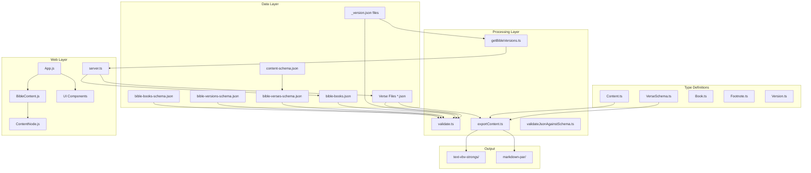

# EGP Graphai - Project Context

> **Generated:** December 17, 2025 | **Updated:** December 18, 2025  
> **Repository:** [LegendaryMediaTV/EGP-Graphai](https://github.com/LegendaryMediaTV/EGP-Graphai)  
> **Version:** 1.7.4

## Project Summary

EGP Graphai (γραφαὶ – "writings" or "scriptures" in Koine Greek) is a comprehensive JSON standard for Bible resources with structured data, rich metadata including Strong's numbers, morphological codes, lexical lemmas, and conversion tools for text and markdown formats.

### Key Capabilities

- **Multi-Version Support** – Stores and serves multiple Bible translations (ASV, KJV, WEB, BYZ Greek, YLT, CLV)
- **Rich Annotations** – Strong's numbers, morphological parsing, lexical lemmas per word
- **Flexible Content Model** – Recursive structure supporting paragraphs, headings, subtitles, footnotes
- **Export Formats** – Text with Strong's annotations, paragraph-formatted Markdown
- **Web Reader** – React-based SPA for reading and studying with toggleable tools
- **Validation** – JSON Schema validation ensuring data integrity

## Recent Changes (Branch: Refactor-Bible-versions)

- **Version Metadata Refactored** – Moved from single `bible-versions.json` to per-folder `_version.json` files
- **New `getBibleVersions()` Function** – Discovers versions from folder structure dynamically
- **New `types/Version.ts`** – TypeScript interfaces for version metadata
- **Export System Refactored** – Unified rendering architecture with configurable options
- **Test Coverage Added** – 49 tests (17 for version discovery, 32 for export)
- **Font-Responsive Width** – Web reader content width scales with font size

## Quick Reference

| Command            | Purpose                            |
| ------------------ | ---------------------------------- |
| `npm install`      | Install dependencies               |
| `npm run dev`      | Start web reader at localhost:3000 |
| `npm run validate` | Validate all JSON data             |
| `npm run export`   | Export to text/markdown            |
| `npm run test`     | Run Vitest tests                   |

## Context Documents

### Domain Analysis

| Document                                                     | Description                                           |
| ------------------------------------------------------------ | ----------------------------------------------------- |
| [1-techstack.md](1-techstack.md)                             | Languages, frameworks, libraries, and domain analysis |
| [2-file-categorization.json](2-file-categorization.json)     | File organization by role                             |
| [3-architectural-domains.json](3-architectural-domains.json) | Architecture patterns and constraints                 |

### Business Domains

| Document                                                   | Description                           |
| ---------------------------------------------------------- | ------------------------------------- |
| [4-domains/bible-versions.md](4-domains/bible-versions.md) | Bible version registry and management |
| [4-domains/bible-books.md](4-domains/bible-books.md)       | Canonical book metadata               |
| [4-domains/content-verses.md](4-domains/content-verses.md) | Content structure and verse data      |
| [4-domains/export-system.md](4-domains/export-system.md)   | Export formats and processing         |
| [4-domains/validation.md](4-domains/validation.md)         | Data validation system                |
| [4-domains/web-reader.md](4-domains/web-reader.md)         | Web application architecture          |

### Style Guides

| Document                                                                         | Description                        |
| -------------------------------------------------------------------------------- | ---------------------------------- |
| [5-style-guides/typescript-utilities.md](5-style-guides/typescript-utilities.md) | TypeScript utility module patterns |
| [5-style-guides/type-definitions.md](5-style-guides/type-definitions.md)         | TypeScript interface conventions   |
| [5-style-guides/react-components.md](5-style-guides/react-components.md)         | React component patterns           |
| [5-style-guides/ui-components.md](5-style-guides/ui-components.md)               | UI component patterns              |
| [5-style-guides/json-schemas.md](5-style-guides/json-schemas.md)                 | JSON Schema conventions            |

### Testing & Build

| Document                                     | Description                                       |
| -------------------------------------------- | ------------------------------------------------- |
| [6-tests-and-build.md](6-tests-and-build.md) | Test framework, build commands, coverage analysis |

## Architecture Overview



## Critical Patterns

### Content Processing (Recursive)

All code handling Content must handle three variants:

1. **String** – Plain text
2. **Object** – Structured with text, annotations, formatting
3. **Array** – Collection of content items (recursive)

```typescript
function processContent(content: Content): void {
  if (typeof content === "string") {
    /* handle string */
  }
  if (Array.isArray(content)) {
    content.forEach(processContent);
  }
  if (typeof content === "object") {
    /* handle object variants */
  }
}
```

### Schema Validation Chain

```
content-schema.json
       ↓ (referenced by)
bible-verses-schema.json
       ↓ (referenced by)
bible-versions-schema.json ← bible-books-schema.json
```

### Frontend Component Registration

Each React component must register on `window` for cross-file access:

```javascript
window.ComponentName = ComponentName;
```

## Key Constraints

1. **No Build Step for Frontend** – JSX transpiled at runtime via Babel
2. **No Database** – All data as flat JSON files
3. **Sequential Book Ordering** – Orders must be 1-indexed, sequential, no gaps
4. **Strong's Number Format** – Must match `^[GH][0-9]{1,4}$`
5. **Verse File Naming** – Must follow `{order}-{bookId}.json` pattern
6. **Exit on Validation Failure** – Scripts exit with code 1 on any error

## Test Status

✅ **49 tests passing** (Vitest):

- `functions/__tests__/getBibleVersions.test.ts` – 17 tests for version discovery
- `utils/__tests__/exportContent.test.ts` – 32 tests for export functionality

See [6-tests-and-build.md](6-tests-and-build.md) for test details and coverage.

---

_This context documentation was generated to assist AI agents in understanding and modifying the EGP Graphai codebase. Refer to individual domain documents for detailed information._
