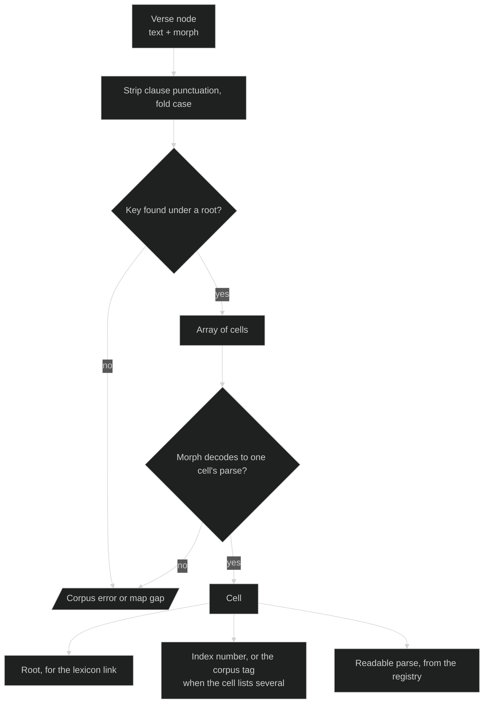

# Lexical Map Domain

## Overview

The lexical map is a per-language paradigm chart turned into data. It lists every attested inflected form of every word, spells out each form's morphology as category-tagged codes, and hangs external index numbers such as Strong's on those parses instead of using them as the key.

The point is that a concordance index and a lexical inventory are different things. Strong's gives the principal parts of a defective verb separate numbers, so εἰμί occupies more than a dozen of them. It also files several headwords under one number, so G3588 covers ὁ, ἡ and τό. Neither is a defect, and neither can be fixed by picking a side. Keying on the root and treating the number as a value on a cell lets both facts be true at once.

Its practical use in this repo is refining a corpus that was tagged at the lexical level. BYZ2026 arrived with every form of εἰμί on G1510; matching each token's spelling and morphology to a cell yields the finer number Strong's actually assigns that form.

Narrative treatment: [lexical-map.md](../../documentation/EGP-Graphai/lexical-map.md). Related: [content-verses.md](./content-verses.md) for the `strong` and `morph` fields this feeds, [validation.md](./validation.md) for what checks the corpus (and does not check the map).

## Core Entities

Four file kinds live under `lexical-maps/`, each with a schema beside it.

| Path | Holds | Schema |
| --- | --- | --- |
| `{language}/_language.json` | Inflection categories, codes, letters, normalization steps, transliteration table | `language-schema.json` |
| `{language}/morphology/{system}.json` | One morph code system's positional grammar and token map | `morphology-schema.json` |
| `{language}/{letter}.json` | Roots, their attested spellings, parses, transliterations | `codex-schema.json` |
| `{language}/indices/{index}.json` | Cell-level placement rules for one external index | `index-schema.json` |

### Root

```typescript
interface Root {
  language: string;          // _id of the language registry
  pos: string;               // resolves in the registry's "pos" category
  citationForms?: string[];  // ["ὁ", "ἡ", "τό"] where a word has several headwords
  shortDefinition?: string;
  indices?: Indices;         // identifiers belonging to the word, not one parse
  inflections: Record<string, Cell[]>;   // spelling -> one cell per parse
  transliterations: Record<string, string>; // same keys as inflections
}
```

A spelling maps to an *array* of cells because one spelling can carry more than one parse. Two spellings with the same root and the same parse are one paradigm slot written two ways, and nothing marks either as primary.

### Cell

```typescript
interface Cell {
  parse: string[];    // category-tagged codes, at most one per category
  indices?: Indices;  // the number this form takes, where it differs from the root's
}
```

`indices.strongs` is a single number, or an array when the index splits that one spelling and parse by sense and no single number belongs to the cell.

### Placement rule

```typescript
interface Rule {
  n: string;           // the index entry being placed
  root: string;        // the root whose cells it applies to
  requires?: string[]; // parse codes a cell must all carry
  spelling?: string;   // or a single spelling, for rules narrower than a parse class
}
```

Numbers that cannot be expressed as a rule go in the same file's `unplaced` array with a reason: the word does not occur in the corpus, or the split is by sense rather than parse.

## User Workflows

- **Resolve a token.** Take a verse node's text and morph. Strip trailing clause punctuation, fold sentence-initial case, look the key up under its root, decode the morph into a parse, match it to a cell. The cell yields the root for a lexicon link, the index number, and a readable parse from the registry.
- **Refine a corpus's index numbers.** Resolve every tagged token and write back the cell's number where it differs from the lemma-level one the corpus arrived with.
- **Build a lexicon page.** Group cells by root. `inflections` is already the shape a hand-typed paradigm table was trying to be.
- **Render a transliterated edition.** Join each token to its spelling's stored transliteration. No second corpus.
- **Join a non-Strong's lexicon.** A reference organized by dictionary headword meets the map on the root, with no number-to-number crosswalk.

## Key Business Rules

- **The root is the word as the language used it**, not as an index names it. Voice follows the wider language rather than what this corpus happens to attest; a verb with active forms in first-century Greek is cited active even where only the middle appears here.
- **A frozen case form is not a root.** It belongs to the paradigm it inflects from, and its cell's parse records the adverbial or prepositional use. A fused compound written solid is its own root; an elision is not.
- **Where two index numbers derive to the same citation form and the same word**, the root carries both. Where they derive to the same form and different words, the root takes a superscript, following the lexicon's own convention (ἄπειμι¹ from εἰμί, ἄπειμι² from εἶμι).
- **At most one code per category per parse.** This is what lets a validator reject an incoherent parse without knowing the language. It holds only if the registry mints genuinely ambiguous values as their own codes, which is why Greek voice has `midpas` and `midpas-dep` rather than tagging a form both middle and passive.
- **A root's part of speech and a cell's can differ**, and the difference is information. δεύτερον is tagged adjective in some verses and adverb in others because the word is used both ways.
- **A cell's index number is derived**: the corpus's tag, overridden by a matching rule. Two rules must never both match one cell.
- **Keys keep their accents**, graves included, because the positional spelling is what a reader will look up. Only trailing clause punctuation and sentence-initial capitalization come off. Keys are NFC.
- **The map is not validated.** `npm run validate` does not read this directory. The rules it would enforce are written down; the walker is not built.

## Representative Code Examples

### A defective verb's cells carry the finer numbers

```json
{
  "εἰμί": {
    "language": "greek",
    "pos": "verb",
    "shortDefinition": "I am",
    "indices": { "strongs": ["G1488", "G1510", "G1511", "G2076", "G2258"] },
    "inflections": {
      "ἐστίν": [{ "parse": ["verb", "pres", "act", "ind", "pers-3", "sg"], "indices": { "strongs": "G2076" } }],
      "ἦτε": [
        { "parse": ["verb", "impf", "act", "ind", "pers-2", "pl"], "indices": { "strongs": "G2258" } },
        { "parse": ["verb", "pres", "act", "subj", "pers-2", "pl"], "indices": { "strongs": "G5600" } }
      ]
    },
    "transliterations": { "ἐστίν": "estín", "ἦτε": "ē̂te" }
  }
}
```

The root's `indices` is trimmed here for length; it lists every number its cells use.

### A placement rule, and a number that cannot be one

```json
{
  "rules": [
    { "n": "G2076", "root": "εἰμί", "requires": ["pres", "ind", "pers-3", "sg"] },
    { "n": "G4235", "root": "πραΰς", "spelling": "πρᾷός" }
  ],
  "unplaced": [
    {
      "n": "G566",
      "reason": "sense split: ἀπέχει is the same third singular present indicative at Matthew 15:8, Mark 7:6 and Mark 14:41, but only Mark 14:41 is the impersonal \"it is enough\" the index numbers G566"
    }
  ]
}
```

### A sense split the parse cannot decide

```json
"ἀπέχει": [
  {
    "parse": ["verb", "pres", "act", "ind", "pers-3", "sg"],
    "indices": { "strongs": ["G566", "G568"] }
  }
]
```

The cell names both numbers and the corpus tag decides each token.

### Reading a morph code into a parse

The morphology file supplies everything; the decoder holds no language knowledge.

```json
{
  "delimiter": "-",
  "heads": { "V": { "pos": "verb", "slots": [["tenseVoiceMood"], ["agreement"]] } },
  "slots": {
    "tenseVoiceMood": { "prefix": { "2": "second" }, "fields": ["tense", "voice", "mood"] },
    "agreement": {
      "variants": [
        { "length": 2, "fields": ["person", "number"] },
        { "length": 3, "fields": ["case", "number", "gender"] }
      ]
    }
  },
  "qualifiers": { "ATT": "attic" },
  "tokens": { "tense": { "A": "aor" }, "voice": { "A": "act" }, "mood": { "I": "ind" } }
}
```

`V-2AAI-3P` decodes to `["verb", "second", "aor", "act", "ind", "pers-3", "pl"]`. A trailing qualifier can stand where an omitted slot would have been, so `V-RAN-ATT` is a perfect active infinitive in an Attic form, with no agreement slot to fill.

### Resolving a token



The failure branch matters as much as the success one. A token whose morph matches no parse under its spelling is either a corpus tagging error or a hole in the map, and either way a person should look at it.
