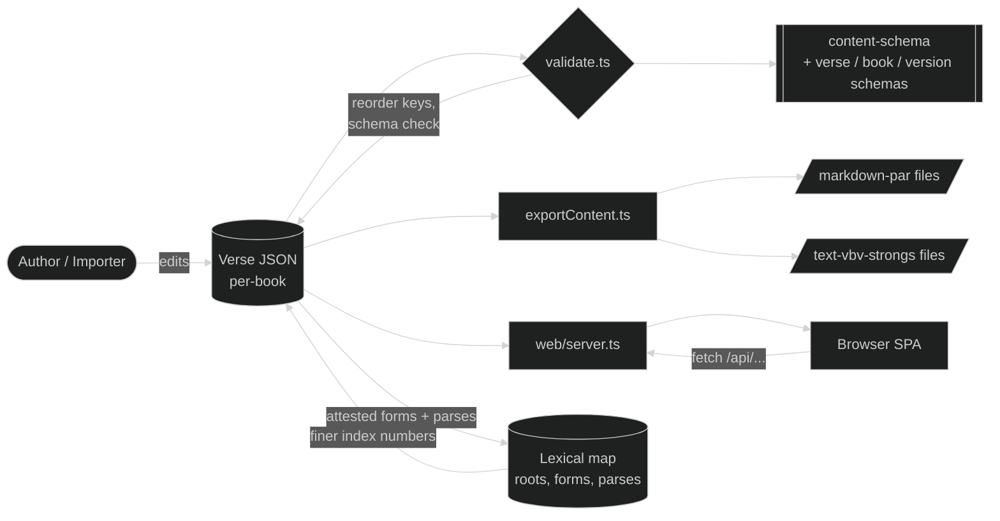

# EGP Graphai: Developer Documentation

Supplemental documentation for contributors and integrators working with the EGP Graphai codebase.

Project overview, install/run commands, and JSON examples live in the [project README](../../../README.md). This folder explains the *why* behind the data shapes and the moving parts that turn JSON files into rendered Scripture.

## When to read what

| You want to…                                                            | Start here                              |
| ----------------------------------------------------------------------- | --------------------------------------- |
| Understand the recursive content shape and add a new content variant    | [content-model.md](./content-model.md)  |
| Add a new translation, validate data, or change the export pipeline     | [data-pipeline.md](./data-pipeline.md)  |
| Import a translation from USFM source files, or add deuterocanon books  | [usfm-import.md](./usfm-import.md)      |
| Modify the web reader, add a study-tool toggle, or change the API shape | [web-reader.md](./web-reader.md)        |
| Work on roots, inflections, parses, or the Strong's crosswalk           | [lexical-map.md](./lexical-map.md)      |

For AI-agent reference material, such as file categorization, architectural domains, and style guides, see [_specs/ai-context/](../../ai-context/). The two folders are complementary: this folder is narrative, the ai-context folder is structured for retrieval.

## How the pieces fit together

A single recursive content shape (defined in [content-schema.json](../../../content-schema.json)) flows through validation, export, and the web reader, each rendering or transforming the same tree.

The lexical map sits beside that loop rather than inside it. It is built from the tagged corpora and then feeds back into them: a form's parse selects a cell, and the cell carries the index number that form deserves, which is finer than the lemma-level number a corpus usually arrives with. See [lexical-map.md](./lexical-map.md).

## Conventions worth knowing

- **Canonical key order**. Content objects sort to a fixed order during validation (`subtitle`, `heading`, `bibleLink`, `abbr`, `paragraph`, `type`, `text`, `content`, `script`, `marks`, `break`, `foot`, `strong`, `morph`, `lemma`). The sort is implemented in [functions/sortContentKeys.ts](../../../functions/sortContentKeys.ts); see [content-model.md](./content-model.md) for the rationale.
- **Verse file naming**: `{order}-{bookId}.json` (e.g., `01-GEN.json`). The order prefix lets the filesystem list books in canonical sequence; the book ID matches the registry.
- **No frontend build step**. The web reader transpiles JSX in the browser via Babel. Source files are plain `.js`; components register themselves on `window` for cross-file access.
- **Schemas are URLs**. The JSON Schemas use `$id` URLs and `$ref` against `https://github.com/LegendaryMediaTV/EGP-Graphai/...` paths. Validation resolves these locally; do not break the URL pattern when editing.
- **A lexical-map cell's number is derived, not authored**. It is the corpus's own tag unless a placement rule in `indices/{index}.json` overrides it. Edit the rule and re-derive; hand-editing a cell puts the file out of step with the rule that is supposed to produce it. Where the index splits one spelling and parse by sense, the cell lists every number involved and the corpus tag decides each token. See [lexical-map.md](./lexical-map.md).

## Where to look when something breaks

| Symptom                                              | Likely culprit                                                      |
| ---------------------------------------------------- | ------------------------------------------------------------------- |
| `npm run validate` fails with schema error           | Mismatched content shape; diff against [content-model.md](./content-model.md) examples |
| `npm run validate` fails on a cross-chapter link, `bibleLink` target, or Strong's-node finding | These are report-only audits inside the same `npm run validate` run, not separate tools; see their rows below for what to do |
| Exports look right but markdown drops a piece        | Missing case in `renderContent` dispatch; see [data-pipeline.md](./data-pipeline.md) |
| Web reader shows raw JSON or blank                   | A new content variant isn't handled in `ContentNode.js`; see [web-reader.md](./web-reader.md) |
| Strong's link points to a 404                        | Strong's number doesn't match `^[GH][0-9]{1,4}$` or starts with the wrong testament prefix |
| `Failed to write … after N attempts`                 | Something is holding that file open past the retry budget; see [Writing files](./data-pipeline.md#writing-files) |
| A cross-chapter link, truncated range, or unresolvable `bibleLink` target finding survives a run | Re-run `npm run validate` — the fix is a step in its own auto-fix pass; a survivor means the case was declined as unsafe. See [Cross-chapter link and bibleLink target conventions](./data-pipeline.md#cross-chapter-link-and-biblelink-target-conventions) |
| A Strong's-node placement finding survives a run      | Several checks repair themselves inside `npm run validate`'s own pass; the rest need a hand edit. See [Strong's-node placement audit](./data-pipeline.md#strongs-node-placement-audit) |
| `npm run validate` reports an unresolved abbreviation | The id is written in content but missing from that version's own `abbr` array, or defined there twice. Registries never fall through to another version, so fix the registry or the id. See [content-model.md](./content-model.md) |
| A validate run reformats far more of a file than expected | The file was carrying stale formatting from before a write went through the canonical path; see [Writing files](./data-pipeline.md#writing-files) |
| `importUsfm.ts` throws ENOENT on a source directory under `imports/` | The raw USFM corpus is gitignored local scaffolding, not a broken commit; point it at a checkout that has the source, or import from one that does. See [usfm-import.md operational tips](./usfm-import.md#operational-tips) |
| A tagged form has no cell in the lexical map, or its morph matches no parse under its spelling | Either the corpus mistagged the token or the map is missing the form. Both want a human; see [How a token resolves](./lexical-map.md#how-a-token-resolves) |
| A lexical-map edit produces a huge reordering diff | The Greek files are collator-sorted rather than code-point sorted; match the existing order or the diff fills with noise. See [Sorting](./lexical-map.md#sorting) |
| A corrected index number reappears after a re-derivation | The placement rule still says the old thing. The cell is derived from corpus tag plus rule, so the rule is where the correction belongs |

## License & contribution notes

The code, schemas, and tooling are MIT-licensed. Each Bible version carries its own license recorded in the version's `_version.json`; respect those terms when redistributing content.
