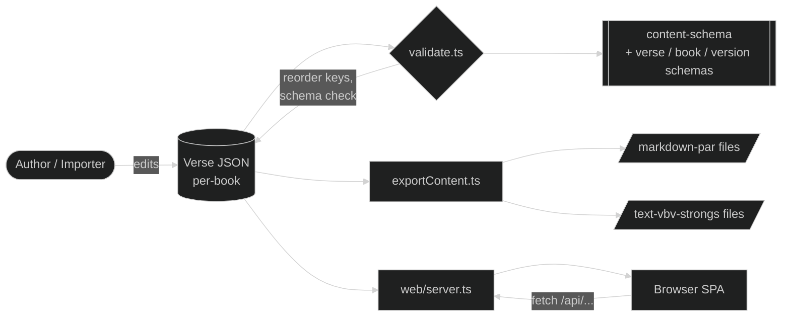

# EGP Graphai — Developer Documentation

Supplemental documentation for contributors and integrators working with the EGP Graphai codebase.

Project overview, install/run commands, and JSON examples live in the [project README](../../../README.md). This folder explains the *why* behind the data shapes and the moving parts that turn JSON files into rendered Scripture.

## When to read what

| You want to…                                                            | Start here                              |
| ----------------------------------------------------------------------- | --------------------------------------- |
| Understand the recursive content shape and add a new content variant    | [content-model.md](./content-model.md)  |
| Add a new translation, validate data, or change the export pipeline     | [data-pipeline.md](./data-pipeline.md)  |
| Modify the web reader, add a study-tool toggle, or change the API shape | [web-reader.md](./web-reader.md)        |

For AI-agent reference material — file categorization, architectural domains, style guides — see [_specs/ai-context/](../../ai-context/). The two folders are complementary: this folder is narrative, the ai-context folder is structured for retrieval.

## How the pieces fit together

A single recursive content shape (defined in [content-schema.json](../../../content-schema.json)) flows through three consumers — validation, export, and the web reader — each rendering or transforming the same tree.

## Conventions worth knowing

- **Canonical key order** — Content objects sort to a fixed order during validation (`subtitle`, `heading`, `bibleLink`, `paragraph`, `type`, `text`, `content`, `script`, `marks`, `break`, `foot`, `strong`, `morph`, `lemma`). The sort is implemented in [functions/sortContentKeys.ts](../../../functions/sortContentKeys.ts); see [content-model.md](./content-model.md) for the rationale.
- **Verse file naming** — `{order}-{bookId}.json` (e.g., `01-GEN.json`). The order prefix lets the filesystem list books in canonical sequence; the book ID matches the registry.
- **No frontend build step** — The web reader transpiles JSX in the browser via Babel. Source files are plain `.js`; components register themselves on `window` for cross-file access.
- **Schemas are URLs** — The JSON Schemas use `$id` URLs and `$ref` against `https://github.com/LegendaryMediaTV/EGP-Graphai/...` paths. Validation resolves these locally; do not break the URL pattern when editing.

## Where to look when something breaks

| Symptom                                              | Likely culprit                                                      |
| ---------------------------------------------------- | ------------------------------------------------------------------- |
| `npm run validate` fails with schema error           | Mismatched content shape — diff against [content-model.md](./content-model.md) examples |
| `npm run validate` fails on cross-chapter links or Strong's-node findings | It also runs both audits below for each version validated — see their rows for what to do |
| Exports look right but markdown drops a piece        | Missing case in `renderContent` dispatch — see [data-pipeline.md](./data-pipeline.md) |
| Web reader shows raw JSON or blank                   | A new content variant isn't handled in `ContentNode.js` — see [web-reader.md](./web-reader.md) |
| Strong's link points to a 404                        | Strong's number doesn't match `^[GH][0-9]{1,4}$` or starts with the wrong testament prefix |
| `Failed to write … after N attempts`                 | Something is holding that file open past the retry budget — see [Writing files](./data-pipeline.md#writing-files) |
| `auditCrossChapterLinks` reports an unsplit finding   | Run it with `--fix` for that version — see [Cross-chapter link audit](./data-pipeline.md#cross-chapter-link-audit) |
| `auditNodes` reports a finding                | Read-only — no `--fix`; fix the flagged node(s) by hand — see [Strong's-node audit](./data-pipeline.md#strongs-node-audit) |
| A validate run reformats far more of a file than expected | The file was carrying stale formatting from before a write went through the canonical path — see [Writing files](./data-pipeline.md#writing-files) |

## License & contribution notes

The code, schemas, and tooling are MIT-licensed. Each Bible version carries its own license recorded in the version's `_version.json` — respect those terms when redistributing content.
