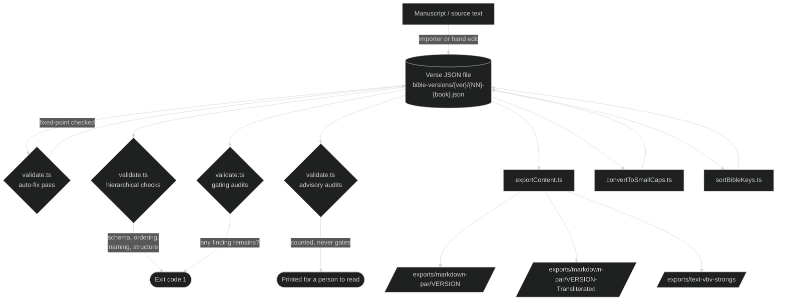
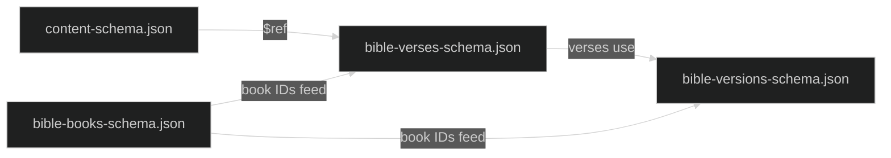

# Data Pipeline

How verse JSON files get validated, transformed, and exported to readable formats.

For the recursive shape they're transforming, see [content-model.md](./content-model.md). For how the same data is served to the browser, see [web-reader.md](./web-reader.md).

## The journey of a verse



A verse file is the source of truth. Every script in `utils/` either validates it, transforms it in place (with the canonical key order preserved), or reads it to produce a downstream artifact.

## Validation

`npm run validate` ([utils/validate.ts](../../../utils/validate.ts)) is the one command that runs every normalization and validation rule this repo enforces — there's no separate audit script anywhere in the tree, and no `--fix` flag on anything it calls into. It covers verse data, the lexical maps, and every other committable JSON file in the repo. A run has four stages:

1. **Auto-fix pass** — normalizes key order, JSON formatting, `bibleLink` dashes and ranges, fractions, ellipses, straight-quote direction, and Greek dialytika written after the accent or left uncomposed; tags an untagged Hebrew or Greek letter run embedded in otherwise-Latin text; repairs several Strong's-node placement conventions (joining-space position for both `strong` and `foot`, footnote-punctuation order, duplicate footnote anchors, mergeable siblings, a stray mark-boundary whitespace node, a missing paragraph flag after a heading); and unlinks a `bibleLink` target the version can't resolve. The pass then re-applies itself once more to every file it just changed, and fails by name if a second application would still find something to change — proof the corpus reached a fixed point, not just that the pass ran.
2. **Hierarchical checks** — schema validity, book ordering, file naming, verse structure, and cross-references between entities. Any failure here exits immediately.
3. **Gating audits**, run as peers so all of them always complete even when one already failed. They cover declared chapter counts against the version's own data, cross-chapter links, truncated `bibleLink` ranges, Strong's-node placement, unresolvable `bibleLink` targets, abbreviation references that name no entry in their own version's registry or name one defined there twice, schema coverage across every committable JSON file, the lexical map against its own registry, each corpus against the map, the enrichment values the auto-fix pass wrote, and what a word's printed ending proves about its parse. Each reports rather than repairs, and any surviving finding exits non-zero.
4. **Advisory audits**, which count and print but never fail a run. Word agreement and codex attestation both work by comparing two records that disagree, and in every finding only a person can say which side is wrong. Gating on a lead generator would make the command permanently red over correct Greek.

As a side effect of stage 1, validation rewrites every JSON file with canonical key order, both at the verse level (`book`, `chapter`, `verse`, `content`) and recursively inside every content object. This is intentional. Different authoring tools serialize keys in different orders, and the rewrite gives every commit a clean diff. If a validation run produces only key reorderings, the source data was already correct; the file change is just rehydration.

The validator exits non-zero on any remaining error or gating finding. This is deliberate so it can gate CI. Because it owns every normalization rule, a per-source importer no longer needs to enforce any of them itself — it only needs to produce content that a subsequent `npm run validate` can normalize and check like anything else.

### Which audits gate, and why the rest do not

An audit gates when its finding is a defect on its face. The word-orthography audit is the clearest case: it reads what a word prints and asks whether the parse is one that ending allows, without consulting the lexical map at all. That independence is the point, because the map was built downstream of these corpora, so a corpus error becomes a map cell and the cell then vouches for the error. A printed ending cannot be read two ways, so there is nothing for a person to overrule. There is also no auto-fix, and there cannot be one: the rule says what a parse cannot be, never what it is.

An audit stays advisory when its finding is a disagreement between two records rather than a defect in either. A Greek article that disagrees with the noun beside it means one of the two is wrong, and only the clause says which. The same holds for a codex cell the corpus's own index contradicts. Both are choked deliberately narrow, because a sweep whose findings are mostly ordinary Greek is a sweep nobody reads.

### Schema coverage

Every committable JSON file in the repo must be governed by a schema, and the schema-coverage audit ([utils/jsonSchemas.ts](../../../utils/jsonSchemas.ts)) is what enforces it. A file matching no rule is a finding in its own right, which is what stops a new data file from entering the repo unschematised. A format does not get away from a repo by one file breaking its schema; it gets away when nobody writes a schema for the fifth file.

The file set comes from `git ls-files` rather than a directory walk, since a walk cannot tell a data file from a scratch file and this repo keeps many of the second kind under `_specs/`. Each schema is also checked against JSON Schema's own meta-schema, because a schema with a typo in it silently stops constraining anything and that failure is invisible from the data side.

Adding a new kind of JSON file means adding its schema and its rule in the same change. A format genuinely owned by a tool outside this repo belongs in the rule table with its owner named, rather than left out of it.

### The lexical maps are inside the run

`lexical-maps/` is validated by the same command, not exempt from it. Codex files are checked against their schema and against the language registry that defines their vocabulary, each corpus is checked to see whether the map can explain every code it prints, and the enrichment values the auto-fix pass stores are recomputed and compared. [lexical-map.md](./lexical-map.md#validation-rules) covers what each of those asks and what remains unchecked.

## Schema chain



The schemas use absolute `$id` URLs and `$ref` against the same URL space. Validation resolves these locally, with no network fetch, but the URL pattern must remain consistent. If you fork or rename, the `$ref` targets need to follow.

## Export

`npm run export` ([utils/exportContent.ts](../../../utils/exportContent.ts)) produces three formats from the same verse data:

- **Markdown** (`exports/markdown-par/<VERSION>/`): paragraph-formatted, browser-readable, footnotes collected at the end of each chapter
- **Strong's text** (`exports/text-vbv-strongs/<VERSION>/`): verse-by-verse with inline lexical codes for grep-based study
- **Transliterated markdown** (`exports/markdown-par/<VERSION>-Transliterated/`): the markdown above with each node's stored `transliteration` printed in place of its original-script `text`

All three are produced by walking the same `renderContent` dispatch over the recursive content tree, configured with different `RenderOptions` (footnote style, paragraph marker, formatting wrappers) but sharing the dispatch logic. Adding a new shape to the content model means adding one case here. See the [content-model checklist](./content-model.md#adding-a-new-shape-a-checklist).

### The transliterated markdown

`RenderOptions.textOf` names which of a node's own strings a format prints, the way `escapeSourceText` beside it names how that string is escaped. `MARKDOWN_TRANSLITERATED_OPTIONS` spreads `MARKDOWN_OPTIONS` and overrides that one field; every other markdown knob is shared rather than restated, which is what makes the two trees line-for-line identical instead of merely intended to be. Verified across all 87 files: same line counts, same `## Chapter N` lines, same `<sup>` verse markers in the same order, same footnote labels and footnote line counts, same `<br>`, `**` and `_` counts per line.

Three things about it are worth knowing before you read a file and think something broke:

- **The romanization is read, not computed.** `npm run validate` stores it on the node; this exporter never imports [utils/lexicon.ts](../../../utils/lexicon.ts). A node with no stored value falls back to its own `text`, so a version that has not been through the enrichment pass exports readable text in its own script rather than blanks.
- **Only a version declaring a `script` gets a folder.** Romanizing Latin is the identity, so the alternative is hundreds of byte-identical duplicate files. Today that selects BYZ2026 and LXX1935; a future Hebrew edition needs no code change.
- **Some Greek survives on purpose.** BYZ2026's Greek-lettered manuscript sigla print unromanized, because "Δ" is Codex Bezae's companion siglum and "D" names a different manuscript; they reach the page through the `{ abbr }` registry, which `textOf` never touches. LXX1935 keeps `ϡ` (an editorial bracket pair at 2MC 13:15) and `Ϛ`/`ϛ` (the Greek numerals 6 and 16 heading acrostic stanzas at PSA 118:41 and 118:121), which are markers and numerals rather than words.

One rendering difference is not the transliteration's doing. GEN 42:18, EXO 1:1 and 1ES 9:50 each carry a `– ·`, and `convertVerseToMarkdown`'s long-standing "remove space before punctuation" rewrite matches the ASCII semicolon the ano teleia becomes where it never matched the ano teleia itself. Three lines corpus-wide, all mid-line, so no line count moves.

You can scope the export to a single version, or a single book within a version:

```bash
npm run export                                 # all versions
npx ts-node utils/exportContent WEBUS2020       # one version
npx ts-node utils/exportContent WEBUS2020 GEN   # one book
```

The CLI argument order is positional: version then book. Book is the three-letter ID, not the filename prefix.

## Batch transforms

A few one-shot tools live alongside validation and export:

- **[convertToSmallCaps.ts](../../../utils/convertToSmallCaps.ts)** finds divine names (`LORD`, `GOD`, `Lord GOD`) and wraps them in `{ text: "...", marks: ["sc"] }`. Used to migrate older translations that encoded small caps as uppercase letters.
- **[sortBibleKeys.ts](../../../utils/sortBibleKeys.ts)** runs the canonical key sorter as a standalone CLI when you want to reorder without doing a full validation pass.

These exist for migrations and corrections. Once a translation is clean, they shouldn't need to run again.

## Cross-chapter link and bibleLink target conventions

A `bibleLink` cross-reference must resolve inside a single chapter, and must name a chapter and verse the version being read actually carries. [utils/crossChapterLinks.ts](../../../utils/crossChapterLinks.ts) owns three related rules, each a step inside `npm run validate`'s own pass rather than a tool of its own:

- **Truncated-range reconstruction** completes a target cut off short of the multi-verse range its own display text already names.
- **Cross-chapter split** cuts a target spanning two chapters of the same book (e.g. a footnote pointing to `2 Kings 6:31–7:20`) into two chapter-scoped links joined by an en dash, since a cross-chapter target resolves inside neither chapter on its own. A range naming only whole chapters, with no verse on either end (an outline reference like `Romans 1–11`), splits the same way, just with no verse anchor to carry on either half.
- **Unresolvable-target unlink** strips the `bibleLink` wrapper from a target that parses but names a chapter or verse the version doesn't carry, keeping its display text as plain content — a wrong link is worse than no link, since it reads correctly right up until someone clicks it.

Each rule is version-scoped: a chapter's last verse, and which verse numbers within it actually exist, come from that version's own verse records, since translations disagree on where a chapter ends (Romans 14 runs to verse 23 in some editions, verse 26 in others). Book-name resolution still only matches within that version's own canon, but a target whose book fails to resolve there no longer counts as a reason to unlink it — a footnote can legitimately name a book the version being read doesn't carry (an NT-only version can still say "see Isaiah 7:14"), so with no resolved book left to check a chapter or verse against, that endpoint is simply left alone rather than flagged. Detection treats the en dash, em dash, and ASCII hyphen as equivalent targets, since real data doesn't always use the convention's own en dash, though splitting always emits an en dash. A version still carrying an unsplit range, a truncated range, or an unresolvable target after the auto-fix pass fails validation on the matching report-only audit.

## Strong's-node placement audit

Verse content is built one lexical node at a time, each carrying its own `strong` number, `marks`, and joining whitespace. That structure drifts out of alignment with this repo's own text-flow conventions during import or hand-editing. [utils/auditNodes.ts](../../../utils/auditNodes.ts) detects such drift patterns, corpus-wide; a representative sampling:

| Finding                          | What it catches                                                                                                                                                    |
| -------------------------------- | ------------------------------------------------------------------------------------------------------------------------------------------------------------------ |
| Unmerged node pairs              | An untagged connector word left split from the Strong's-carrying neighbor it should have folded into                                                               |
| Trailing whitespace              | A Strong's node's own text ending in a space, when the convention keeps joining spaces on the leading edge of what follows                                         |
| Footnote marker after whitespace | A footnote marker rendering a space away from the word it annotates instead of hugging it — the same leading-space convention applied to `foot`, not just `strong` |
| Untagged script run              | A Hebrew or Greek letter run embedded in otherwise-Latin text with no `script` tag                                                                                 |
| Duplicate footnote anchor        | A textless node repeating the identical footnote already carried by the node right before it                                                                       |
| Mergeable siblings               | Two adjacent nodes differing in nothing but `text`                                                                                                                 |

_A representative sampling. [utils/auditNodes.ts](../../../utils/auditNodes.ts) carries the full catalog._

`auditNodes.ts` itself only ever detects; it carries no CLI and never writes. Several of the checks below repair themselves automatically, as their own step in `validate.ts`'s auto-fix pass — most through a fixer that reuses this file's own eligibility logic rather than re-deriving it, plus straight-quote direction (the straight-quote check), which resolves the way real typography tools do: from the characters immediately around each quote, not from this file's own node-placement judgment. The rest stay report-only, because deciding what to do needs a judgment call — which direction a word belongs, or whether a non-breaking space was meant to hold two words together — that a mechanical fix would get wrong on real Bible text. Which group a check falls into is readable from [utils/validate.ts](../../../utils/validate.ts): a check with a matching `fix*` or `normalize*` module wired into the auto-fix pass repairs itself, and one with no such module is report-only.

## Writing files

These tools mutate a verse file or write an export: `validate.ts`, `exportContent.ts`, `convertToSmallCaps.ts`, `sortBibleKeys.ts`, `importUsfm.ts`, `overhaulFootnotes.ts`, `overhaulReferences.ts`. Every one of them goes through [functions/writeJsonFile.ts](../../../functions/writeJsonFile.ts) rather than calling `fs.writeFileSync` directly.

The bytes land in a staging file beside the target and get renamed over it, instead of truncating the target in place. This matters on Windows, where reopening an existing file for truncation can collide with something else briefly holding it open, such as a backup agent, an indexer, or a virus scanner, and fail with a transient error. A rename isn't blocked by a reader holding the old file, and a reader never observes a half-written file mid-swap. Writes that hit the transient retry on a backoff before giving up and throwing, naming the file.

JSON payloads are canonicalized from the parsed data, not from whatever text the file already contains, then formatted with the same Prettier call `validate.ts` uses to check formatting. So a file this writes is already a fixed point of validation, and re-running `npm run validate` right after should report no changes. Formatting from a file's existing text instead of its parsed data would let a stray line break persist indefinitely, since Prettier preserves whichever breaks it's handed rather than re-deriving them from width. This also replaces the old approach of shelling out to `npx prettier --write` once per file, which cost a process per book across a full run.

Markdown gets the same treatment through Prettier's Markdown parser. `exportContent.ts` assembles a chapter line by line, and the line breaks and blank lines that assembly happens to produce are not the ones Prettier would choose — so the assembled text goes through `formatMarkdownText` before the write, and `exports/markdown-par/` stays a fixed point of `npx prettier --check .` instead of drifting out of it on every run. The formatting is whitespace only in practice: over the whole export it stripped leading and trailing spaces and moved blank lines around headings, and changed no word, no punctuation mark, no emphasis marker and no escape. One pass is enough, because Prettier's Markdown printer settles on the first pass for every document this exporter produces. Only the Strong's plain-text export skips formatting and writes verbatim, since Prettier has no parser for it.

## Adding a new translation

The mechanical steps live in the [project README](../../../README.md#adding-new-bible-versions). The non-obvious things to think about:

| Decision              | Where it lives                          | Why it matters                                          |
| --------------------- | --------------------------------------- | ------------------------------------------------------- |
| Book ordering         | The `books` array in `_version.json`    | Determines filename prefixes and reader nav order       |
| Default script        | Optional `script` field on the version  | Greek/Hebrew text without explicit `script` inherits it |
| License & attribution | `copyright` and `license` fields        | The reader displays these; respect source terms         |
| Canon scope           | Include or omit books from the registry | A NT-only version like BYZ2026 lists only NT books      |

The exporter and reader are version-agnostic. They read whatever the version declares. No code changes are needed for a new translation if it follows the schema.

If the translation already exists as USFM source files, [usfm-import.md](./usfm-import.md) covers a pipeline that extracts this same metadata automatically instead of hand-authoring `_version.json`.

## Testing

Tests live in `functions/__tests__/` and `utils/__tests__/`, run with Vitest:

```bash
npm test
```

The export logic in particular has tight test coverage because it's the most fragile to schema additions. When you add a new content variant, add a representative verse to the export tests and confirm both formats produce the expected output. Forgetting this is the most common way to land a half-finished feature: schema accepts the shape, validation passes, but the exporter silently drops it.

## Operational tips

- **Run validation before committing.** It's fast and rewrites keys to canonical order; otherwise reviewers will see noisy diffs.
- **One translation at a time during migrations.** When using `convertToSmallCaps` or similar batch tools, scope to one version, eyeball the diff, then move on.
- **Watch for missing dispatch cases.** If exports start dropping content after a schema change, the first thing to check is `renderContent` in [utils/exportContent.ts](../../../utils/exportContent.ts) for a missing branch. The bug presents as silent omission, not as a crash.
- **Footnote letters are not stable across edits.** Inserting a footnote earlier in a chapter relabels every subsequent footnote in the export. Don't treat the letters as IDs.
- **A "Failed to write … after N attempts" error names a real holdout.** The retries in [writeJsonFile.ts](../../../functions/writeJsonFile.ts) already absorb the usual transient file lock; if a write still fails after all of them, something (antivirus, an indexer, a sync client) is holding that specific file open longer than the retry budget. Check what's watching the folder rather than re-running the tool.
- **A file's formatting reflects its data, not its history.** Two writers of identical content always produce identical bytes, because canonicalization starts from parsed data every time rather than from whatever a file already looks like. One translation once drifted into a far more spread-out style than the rest of the corpus this way. Formatting from raw text let a line break baked in by an earlier bug persist across every subsequent validation run instead of being caught and corrected.
- **`git diff` is the review surface, not a console count.** Nothing this pipeline runs commits itself; every fix from the auto-fix pass sits in the working tree afterward, so reviewing a `npm run validate` run means reading the diff it produced, not trusting a summary line.
- **`npm run validate` is expected to exit clean, always.** A version whose source content is still incomplete (CLV1880's Esther and Daniel are short their deuterocanonical additions) declares only the chapters its own verse files actually carry — the declared count moves up in the same change that imports the rest, so there's never a standing finding to work around.
