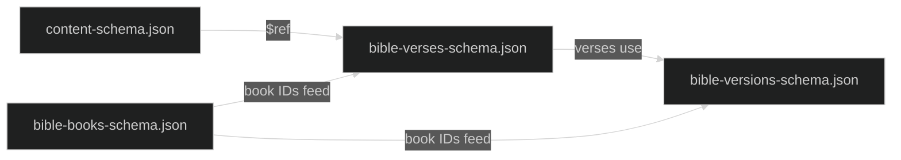

# Data Pipeline

How verse JSON files get validated, transformed, and exported to readable formats.

For the recursive shape they're transforming, see [content-model.md](./content-model.md). For how the same data is served to the browser, see [web-reader.md](./web-reader.md).

## The journey of a verse

```mermaid
%%{init: {'theme': 'dark'}}%%
flowchart TD
    Source[Manuscript / source text] -->|importer or hand edit| Verse[(Verse JSON file<br/>bible-versions/{ver}/{NN}-{book}.json)]
    Verse --> Validate{validate.ts}
    Validate -->|schema check| Verse
    Validate -->|reorder keys| Verse
    Validate -->|fails?| ExitErr([Exit code 1])

    Verse --> Export[exportContent.ts]
    Export --> Markdown[/exports/markdown-par/]
    Export --> Text[/exports/text-vbv-strongs/]

    Verse --> SmallCaps[convertToSmallCaps.ts]
    SmallCaps --> Verse
    Verse --> SortKeys[sortBibleKeys.ts]
    SortKeys --> Verse
    Verse --> Audit[auditCrossChapterLinks.ts]
    Audit -->|--fix| Verse
```

A verse file is the source of truth. Every script in `utils/` either validates it, transforms it in place (with the canonical key order preserved), or reads it to produce a downstream artifact.

## Validation

`npm run validate` (which runs [utils/validate.ts](../../../utils/validate.ts)) walks every translation folder and checks that:

- The folder's `_version.json` matches the version schema
- The book registry referenced by each version exists in `bible-books.json`
- Each verse file matches the verse schema, which recursively defers to the content schema
- File names follow the `{order}-{bookId}.json` pattern matching the version's declared book order

As a side effect, validation rewrites every JSON file with canonical key order — both at the verse level (`book`, `chapter`, `verse`, `content`) and recursively inside every content object. This is intentional. Different authoring tools serialize keys in different orders, and the rewrite gives every commit a clean diff. If a validation run produces only key reorderings, the source data was already correct; the file change is just rehydration.

The validator exits non-zero on any error. This is deliberate so it can gate CI.

## Schema chain



The schemas use absolute `$id` URLs and `$ref` against the same URL space. Validation resolves these locally — there's no network fetch — but the URL pattern must remain consistent. If you fork or rename, the `$ref` targets need to follow.

## Export

`npm run export` ([utils/exportContent.ts](../../../utils/exportContent.ts)) produces two formats from the same verse data:

- **Markdown** (`exports/markdown-par/`) — paragraph-formatted, browser-readable, footnotes collected at the end of each chapter
- **Strong's text** (`exports/text-vbv-strongs/`) — verse-by-verse with inline lexical codes for grep-based study

Both formats are produced by walking the same `renderContent` dispatch over the recursive content tree. The two formats are configured with different `RenderOptions` (footnote style, paragraph marker, formatting wrappers) but share the dispatch logic. Adding a new shape to the content model means adding one case here — see the [content-model checklist](./content-model.md#adding-a-new-shape-a-checklist).

You can scope the export to a single version, or a single book within a version:

```bash
npm run export                                 # all versions
npx ts-node utils/exportContent WEBUS2020       # one version
npx ts-node utils/exportContent WEBUS2020 GEN   # one book
```

The CLI argument order is positional: version then book. Book is the three-letter ID, not the filename prefix.

## Batch transforms

A few one-shot tools live alongside validation and export:

- **[convertToSmallCaps.ts](../../../utils/convertToSmallCaps.ts)** — finds divine names (`LORD`, `GOD`, `Lord GOD`) and wraps them in `{ text: "...", marks: ["sc"] }`. Used to migrate older translations that encoded small caps as uppercase letters.
- **[sortBibleKeys.ts](../../../utils/sortBibleKeys.ts)** — runs the canonical key sorter as a standalone CLI when you want to reorder without doing a full validation pass.

These exist for migrations and corrections. Once a translation is clean, they shouldn't need to run again.

## Cross-chapter link audit

A `bibleLink` cross-reference that spans two chapters of the same book (e.g. a footnote pointing to `2 Kings 6:31–7:20`) resolves inside neither chapter — this repo's convention requires splitting it into two chapter-scoped links joined by an en dash instead. [utils/auditCrossChapterLinks.ts](../../../utils/auditCrossChapterLinks.ts) sweeps every version (or one named on the command line) for this shape, built on the classification logic in [utils/crossChapterLinks.ts](../../../utils/crossChapterLinks.ts):

```bash
npm run audit-links                                         # audit every version, dry-run
npx ts-node utils/auditCrossChapterLinks.ts WEBUS2020       # audit one version
npx ts-node utils/auditCrossChapterLinks.ts WEBUS2020 --fix # split findings and write them
```

Unlike `convertToSmallCaps` and `sortBibleKeys` above, this one is meant to run repeatedly rather than once per migration — it exits non-zero when any version still carries an unsplit finding, so it can gate CI the same way `validate.ts` does. `--fix` is the only path that writes; every other invocation is a read-only report.

The classification is deliberately version-aware, not corpus-wide: a chapter's last verse is read from each version's own verse records, since translations disagree on where a chapter ends (Romans 14 runs to verse 23 in some, verse 26 in others), and book-name resolution is restricted to that version's own canon (a name valid in one translation may not exist in an NT-only one like BYZ2018). Detection also treats the en dash, em dash, and ASCII hyphen as equivalent targets, since real data doesn't always use the convention's own en dash.

## Writing files

Every tool that mutates a verse file or writes an export — `validate.ts`, `exportContent.ts`, `convertToSmallCaps.ts`, `sortBibleKeys.ts` — goes through [functions/writeJsonFile.ts](../../../functions/writeJsonFile.ts) rather than calling `fs.writeFileSync` directly.

The bytes land in a staging file beside the target and get renamed over it, instead of truncating the target in place. This matters on Windows, where reopening an existing file for truncation can collide with something else briefly holding it open — a backup agent, an indexer, a virus scanner — and fail with a transient error. A rename isn't blocked by a reader holding the old file, and a reader never observes a half-written file mid-swap. Writes that hit the transient retry on a backoff before giving up and throwing, naming the file.

JSON payloads are canonicalized from the parsed data, not from whatever text the file already contains, then formatted with the same Prettier call `validate.ts` uses to check formatting — so a file this writes is already a fixed point of validation, and re-running `npm run validate` right after should report no changes. Formatting from a file's existing text instead of its parsed data would let a stray line break persist indefinitely, since Prettier preserves whichever breaks it's handed rather than re-deriving them from width. This also replaces the old approach of shelling out to `npx prettier --write` once per file, which cost a process per book across a full run. Non-JSON output (Markdown, Strong's text) skips the formatting step and writes through the same staging-and-rename path verbatim.

## Adding a new translation

The mechanical steps live in the [project README](../../../README.md#adding-new-bible-versions). The non-obvious things to think about:

| Decision               | Where it lives                                  | Why it matters                                     |
| ---------------------- | ----------------------------------------------- | -------------------------------------------------- |
| Book ordering          | The `books` array in `_version.json`            | Determines filename prefixes and reader nav order  |
| Default script         | Optional `script` field on the version          | Greek/Hebrew text without explicit `script` inherits it |
| License & attribution  | `copyright` and `license` fields                | The reader displays these; respect source terms    |
| Canon scope            | Include or omit books from the registry         | A NT-only version like BYZ2018 lists only NT books |

The exporter and reader are version-agnostic — they read whatever the version declares. No code changes are needed for a new translation if it follows the schema.

## Testing

Tests live in `functions/__tests__/` and `utils/__tests__/`, run with Vitest:

```bash
npm test
```

The export logic in particular has tight test coverage because it's the most fragile to schema additions. When you add a new content variant, add a representative verse to the export tests and confirm both formats produce the expected output. Forgetting this is the most common way to land a half-finished feature: schema accepts the shape, validation passes, but the exporter silently drops it.

## Operational tips

- **Run validation before committing.** It's fast and rewrites keys to canonical order; otherwise reviewers will see noisy diffs.
- **One translation at a time during migrations.** When using `convertToSmallCaps` or similar batch tools, scope to one version, eyeball the diff, then move on.
- **Watch for missing dispatch cases.** If exports start dropping content after a schema change, the first thing to check is `renderContent` in [utils/exportContent.ts](../../../utils/exportContent.ts) for a missing branch — the bug presents as silent omission, not as a crash.
- **Footnote letters are not stable across edits.** Inserting a footnote earlier in a chapter relabels every subsequent footnote in the export. Don't treat the letters as IDs.
- **A "Failed to write … after N attempts" error names a real holdout.** The retries in [writeJsonFile.ts](../../../functions/writeJsonFile.ts) already absorb the usual transient file lock; if a write still fails after all of them, something (antivirus, an indexer, a sync client) is holding that specific file open longer than the retry budget — check what's watching the folder rather than re-running the tool.
- **A file's formatting reflects its data, not its history.** Two writers of identical content always produce identical bytes, because canonicalization starts from parsed data every time rather than from whatever a file already looks like. One translation once drifted into a far more spread-out style than the rest of the corpus this way — formatting from raw text let a line break baked in by an earlier bug persist across every subsequent validation run instead of being caught and corrected.
