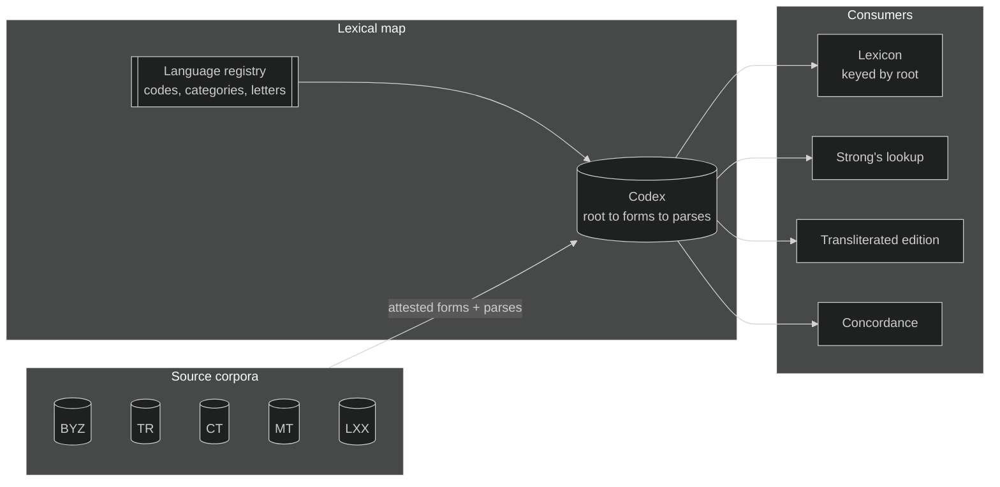
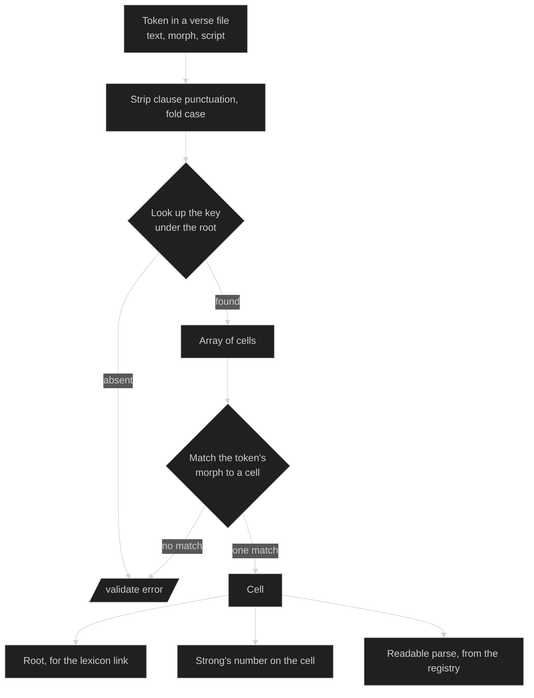

# Lexical Map

The lexical map is a specification for a per-language file that lists every inflected form of every word, with each form's parse spelled out as category-tagged codes. Lexical indices, Strong's among them, attach to the parses rather than serving as the key.

It is the paradigm chart from the back of a grammar, turned into data.

This document describes the format: what each file holds, what the rules are, and what an importer has to get right to produce one. For the content shape that consumes it, see [content-model.md](./content-model.md).

Nothing in the format is specific to one language or one edition. The worked examples are Greek and draw on BYZ2026, the tagged corpus in this repo. Hebrew, Aramaic and Latin use the same shape with their own registries.

A Greek map lives at [lexical-maps/greek/](../../../lexical-maps/greek/): the registry in `_language.json`, Robinson's positional grammar in `morphology/robinson.json`, Strong's cell-level placements in `indices/strongs.json`, and one file per letter of the alphabet.

The four file kinds have JSON Schemas beside them: [language-schema.json](../../../lexical-maps/language-schema.json), [morphology-schema.json](../../../lexical-maps/morphology-schema.json), [codex-schema.json](../../../lexical-maps/codex-schema.json) and [index-schema.json](../../../lexical-maps/index-schema.json). They cover shape only. The cross-file rules under [Validation rules](#validation-rules) need a walker, since no schema can check that a parse code resolves in the registry or that every attested form in the corpus has a home in the map.

## Why the root is the key

Strong's numbering is a concordance index, and an excellent one. Every number answers the question it was built to answer: where does this English rendering come from, and what else in Scripture comes from the same place. A century of reference work is keyed to it, and the map keeps it as a first-class index for exactly that reason.

What a concordance index cannot also be is a lexical inventory. Its unit is the concordance entry, not the dictionary word, and the two line up only most of the time. Where they part company, it happens in both directions.

**One word, many numbers.** Strong's assigns separate numbers to the principal parts of defective verbs, which is the right call for a concordance, since the KJV renders those parts differently. εἰμί accordingly occupies G1488, G1498, G1510, G1511, G1526, G2070, G2071, G2075, G2076, G2258, G2468, G5600 and G5607. A text tagged at the lexical level resolves all of them to G1510: in BYZ2026 that is 2,500 tokens on one entry, with the other twelve unreferenced. Across the Greek lexicon, 110 entries carry a non-zero occurrence count but appear nowhere in that edition, covering 10,007 occurrences, about 7% of its tokens.

**One number, many words.** Strong's also files several headwords under a single number, again reasonably, since the KJV renders them alike. G3588 covers ὁ, ἡ and τό across 20,286 BYZ2026 tokens. G3739 covers ὅς, ἥ and ὅ. G4341 covers both προσκαλέω and προσκαλέομαι. 98 Greek entries carry more than one headword in their lexicon `name`, spanning 22,154 tokens.

Neither direction is a tagging error to be corrected, and neither is a defect in Strong's. They are what happens when a concordance index is asked to serve as a primary key. The map asks it to do its own job instead: the word is the key, the parse selects the cell, and the Strong's number is a value on the cell, where it is free to be many-to-one or one-to-many without conflict.

## What the map is



The map is derived from the source corpora, not from any translation. A translation inherits tags by declaring which source it follows, so the KJV's partial morphology and the NET's absent morphology stop being ceilings on what those editions can carry.

## The language registry

One registry per language, following the same pattern as a version's `abbr` array in `_version.json`: an id, a display name, a description. The addition here is `category`, which is what makes the parse validatable.

The registry describes the language and names no encoding. A worked Greek registry is at [lexical-maps/greek/_language.json](../../../lexical-maps/greek/_language.json), with 16 categories and 67 codes; the excerpt below shows the shape.

```json
{
  "_id": "greek",
  "name": "Greek",
  "inflectionCategories": [
    { "_id": "pos", "name": "Part of speech", "required": true },
    { "_id": "tense", "name": "Tense" },
    { "_id": "voice", "name": "Voice" },
    { "_id": "mood", "name": "Mood" },
    {
      "_id": "formation",
      "name": "Formation",
      "description": "How a stem is built, as against what the form does. Kept apart from tense because the two co-occur."
    }
  ],
  "inflections": [
    { "_id": "verb", "category": "pos", "name": "Verb" },
    { "_id": "pres", "category": "tense", "name": "Present" },
    { "_id": "aor", "category": "tense", "name": "Aorist" },
    { "_id": "act", "category": "voice", "name": "Active" },
    {
      "_id": "midpas",
      "category": "voice",
      "name": "Middle or passive",
      "description": "The form is identical in both voices; context decides which is meant."
    },
    { "_id": "ind", "category": "mood", "name": "Indicative" },
    {
      "_id": "second",
      "category": "formation",
      "name": "Second formation",
      "description": "A second aorist, future, perfect or pluperfect. Same tense, different stem."
    }
  ]
}
```

Tense and formation are separate categories because Robinson's `2` prefix marks how a stem is built rather than which tense it is, and the two co-occur: `V-2AAM-2S-ATT` is a second aorist in an Attic form. Folding either into the other would break the one-code-per-category rule. Both code systems mark it on four tenses, so `aor2` would be a wrong name rather than a short one: BYZ2026 has 5,231 second aorists but also 176 second perfects, 47 second pluperfects and 34 second futures.

### Code systems live in their own files

A morphology file holds the positional grammar and the token map for one code system, as [greek/morphology/robinson.json](../../../lexical-maps/greek/morphology/robinson.json) does for Robinson. Keeping it out of the registry matters more than it first appears. A token like `A` means aorist in the verb group, active in the voice slot, accusative in the case slot and adjective in the head slot, so it says nothing until the positional grammar tells you which slot you are reading. Put the tokens in the registry and you have half a table that looks whole. Put both halves in a morphology file and each code system is self-contained.

```json
{
  "heads": {
    "V": { "pos": "verb", "slots": [["tenseVoiceMood"], ["agreement"]] },
    "P": { "pos": "pron-pers", "slots": [["personCaseNumber", "caseNumberGender"]] }
  },
  "slots": {
    "tenseVoiceMood": { "prefix": { "2": "second" }, "fields": ["tense", "voice", "mood"] },
    "agreement": {
      "variants": [
        { "length": 2, "fields": ["person", "number"] },
        { "length": 3, "fields": ["case", "number", "gender"] }
      ]
    }
  },
  "qualifiers": { "C": "comp", "S": "super", "N": "neg", "I": "interr", "K": "crasis", "ATT": "attic" },
  "tokens": {
    "tense": { "P": "pres", "I": "impf", "F": "fut", "A": "aor", "R": "perf", "L": "plup" }
  }
}
```

A decoder driven by that file, holding no Greek and no Robinson conventions of its own, reads all 1,055 distinct codes in BYZ2026 with no failures and no category collisions.

The three file kinds and their schemas:

| Path | Holds | Schema |
| --- | --- | --- |
| `<language>/_language.json` | Categories, codes, letters, normalization | `language-schema.json` |
| `<language>/morphology/<system>.json` | One code system's grammar and tokens | `morphology-schema.json` |
| `<language>/<letter>.json` | Roots, forms, parses, transliterations | `codex-schema.json` |
| `<language>/indices/<index>.json` | Placement rules for one external index's cell-level entries | `index-schema.json` |

### One code per category

A parse may carry at most one code from any category. That single rule is what lets `validate` reject an incoherent parse without knowing any Greek: nothing can be tagged first person and second person at once, because both codes sit in `person`.

The rule holds only if the registry mints genuinely ambiguous values as their own codes. Greek voice is the case that forces this. Robinson's codes already do it, and BYZ2026 uses seven distinct voice letters:

| Voice                       | BYZ2026 tokens |
| --------------------------- | -------------: |
| Active                      |     20,956 |
| Passive                     |      3,195 |
| Middle or passive deponent  |      1,691 |
| Middle deponent             |      1,517 |
| Middle                      |        964 |
| Passive deponent            |        337 |
| Middle or passive           |         25 |

If the registry offered only `mid` and `pas`, the first import would need to tag 1,716 tokens with both, breaking the rule on day one. Minting `midpas` and `midpas-dep` as separate voice codes keeps it intact.

`ATT` is the other case. It marks an Attic form on 125 BYZ2026 tokens, and it is not a mood or a tense. It gets its own category.

### Why not keep the Robinson strings?

`V-2AAI-3P` is a rendering choice, no different from the KJV data's `Aor2ActInd`. Both are morph tags, and both bury the categories inside a positional string that only their own parser can read. Keying a parse on that string means a cell tagged by Robinson and the same cell tagged by another system never join. BYZ2026 carries 1,055 distinct Robinson codes with person, number, case and gender; KJV1769 carries 152 internal codes with no person and no number at all. Same cells, unjoinable names.

The category-tagged array is the joinable form. Robinson and the 152-code set both parse into it, the second one lossily, which is honest, because it genuinely says less.

## The codex entry

One file per language, split by letter, keyed by root. Each root carries `inflections`, keyed by the spelling as it appears in the text. Each spelling carries an array of cells, one per parse, because a spelling can have more than one.

```json
{
  "εἰμί": {
    "language": "greek",
    "pos": "verb",
    "shortDefinition": "to be, exist",
    "indices": { "strongs": "G1510" },
    "inflections": {
      "ἐστίν": [{ "parse": ["verb", "pres", "act", "ind", "pers-3", "sg"], "indices": { "strongs": "G1510" } }],
      "ἐστιν": [{ "parse": ["verb", "pres", "act", "ind", "pers-3", "sg"], "indices": { "strongs": "G1510" } }],
      "ἔστιν": [{ "parse": ["verb", "pres", "act", "ind", "pers-3", "sg"], "indices": { "strongs": "G1510" } }],
      "ἦτε": [
        { "parse": ["verb", "impf", "act", "ind", "pers-2", "pl"], "indices": { "strongs": "G1510" } },
        { "parse": ["verb", "pres", "act", "subj", "pers-2", "pl"], "indices": { "strongs": "G1510" } }
      ]
    },
    "transliterations": { "ἐστίν": "estín", "ἐστιν": "estin", "ἔστιν": "éstin", "ἦτε": "ē̂te" }
  }
}
```

Two things are happening in that excerpt and they point in opposite directions.

ἐστίν, ἐστιν and ἔστιν are three spellings of one cell. Greek respells an enclitic depending on what stands beside it, so the same third person singular turns up three ways in the text. Each spelling is its own key, each carries the same parse, and nothing marks one as the real one. Two spellings with the same root and the same parse are the same paradigm slot written two ways, and that is all the map says about them.

ἦτε is one spelling with two cells. It is the imperfect indicative in some verses and the present subjunctive in others, so it carries both parses.

The map does not pick a dictionary spelling for a cell. It was tempting, and an earlier draft did it, with a `canonical` pointer from each positional spelling to a preferred one. That needed a rule for which spelling wins, the rule needed an exception list for enclitics, and the exception list needed a review queue. All of it answered a question a parsing chart is not asked. A renderer that wants one spelling per cell can choose by any rule it likes at display time.

### Citation forms

A root can have more than one headword. The article is one word with one paradigm, but its dictionary entry is ὁ, ἡ, τό, and a lexicon page that showed only ὁ would look wrong to anyone who learned it the usual way.

`citationForms` holds that list. It changes nothing about the key or the parses, which is the point: the root stays one row, gender stays a parse category, and the display gets the three headwords it expects.

```json
"citationForms": ["ὁ", "ἡ", "τό"]
```

Omit it when the root is its own only citation form, as εἰμί is.

### Why the parses are an array

`ἦτε` is the reason. In BYZ2026 it appears 11 times as an imperfect indicative and 8 times as a present subjunctive. Those are Strong's G2258 and G5600. One form, two numbers.

Flattening the attributes into a single array would produce `["verb", "impf", "pres", "act", "ind", "subj", "pers-2", "pl"]`, which reads as four possible parses rather than two, breaks the one-code-per-category rule, and leaves nowhere to put the second Strong's number.

The scale of this is not marginal. Of 18,517 distinct (root, form) keys in BYZ2026, 822 carry more than one parse, or 4.4%:

| Collision type                        | Keys |
| ------------------------------------- | ---: |
| Nominal case, gender or number differs |  596 |
| Verb person or number differs          |   94 |
| Verb tense, voice or mood differs      |   98 |
| Verb, two dimensions differ            |   23 |
| Different part of speech               |   11 |

The nominal cases are genuine syncretism and would survive a flat array. `τῶν` really is genitive plural in all three genders. The 215 verb cases would not: `εἶπον` is first singular and third plural, `λέγω` is indicative and subjunctive, `ποιεῖτε` is indicative and imperative.

One rule handles both. Nest.

### What counts as a root

The root is the dictionary form of the word, determined from the language itself. It is not an index headword, and a numbering system has no say in which words exist or how many there are.

Each language states its citation convention in the registry, because the conventions differ. Greek cites a verb in the first person singular present active indicative, so λαμβάνω rather than the infinitive; Latin dictionaries cite the infinitive and Hebrew cites the third masculine singular perfect. Within Greek:

| Part of speech | Citation form |
| --- | --- |
| Verb | first person singular present active indicative, or the middle for a deponent |
| Noun | nominative singular |
| Adjective, article, pronoun | nominative singular masculine |
| Indeclinable | the form itself |
| Adverb, preposition, conjunction, particle, interjection | the form itself |

The root need not appear in the corpus. ἔλαβον and λαβών both belong to λαμβάνω whether or not λαμβάνω is ever written, because the paradigm decides the root, not the attestation.

A frozen case form is not a root. πρῶτον used adverbially is the accusative singular neuter of πρῶτος; χάριν used as a preposition is the accusative of χάρις; μακράν is the accusative of μακρός. Each belongs to the paradigm it inflects from, and the parse on its cell records that it was used adverbially.

Index entries do not line up with this, and they are not meant to. A concordance gives πρῶτον its own number because the adverbial use earns an entry, and gives δεύτερον none because it does not. That difference belongs to the concordance. It has no bearing on how many Greek words there are, so the map records one root in both cases and hangs the numbers on the cells.

### How roots are derived

Roots come from the forms. For each index number in the corpus, the attested spellings and their parses are put in front of something that reads Greek, with the number reduced to an opaque label and no lexicon in reach, and it returns the citation form. Nothing about the derivation depends on which numbering system tagged the text or on what any index calls the word.

The Greek map's 5,373 roots were produced that way. Set against roots taken from index headwords, 373 of 5,380 numbers came out differently, 6.9%. Most were Byzantine spellings the headwords do not carry: breathings, accents, single against double consonants, iota subscripts, omicron for omega. The rest were headwords that are not citation forms at all, a plural (ἀμφότεροι), a superlative (ἀκριβέστατος), a frozen accusative (ἀκμήν), a verb cited active that only occurs in the middle, two typos, and two proper names filed as common nouns (Τύραννος at Acts 19:9, Φιλητός at 2 Timothy 2:17).

Where two numbers derive to the same citation form and the same word, the root carries both numbers, which is what happened to πρῶτος, δωρεά, ὅστις, Ἰούδας, καλός, ἐγγύς, and ἐσθίω with its suppletive aorist ἔφαγον.

Where two numbers derive to the same citation form and different words, the root takes a superscript, the convention the lexicon already uses. ἄπειμι¹ is 'be absent' from εἰμί and ἄπειμι² is 'go away' from εἶμι. σύνειμι splits the same way. βάτος¹ is a bramble and βάτος² a liquid measure. μήν¹ is a particle and μήν² a month.

Part of speech on the root follows the corpus tag rather than the deriver's judgment, since Ἀθηναῖος can be argued as an adjective or a noun and the tagger already argued it.

### The root is the word as the language used it

Two questions come up on almost every uncertain lemma, and one principle answers both: the root belongs to the language, not to this text and not to any one lexicon.

**Voice.** A verb is cited in the active if it had active forms in first-century Greek at large, whatever this corpus happens to attest. Only a verb that was deponent across the language is cited in the middle. ἀναβάλλω and περικρύπτω are active even though the corpus shows only the middle; φρυάσσομαι is middle because no active exists anywhere.

**Spelling.** Variant spellings of one word are both right, the way John and Jon are. Where the corpus is consistent, its spelling is the attested one and stands, so Πύθων keeps its capital and Ἄβελ its smooth breathing. Where the corpus is split or never writes the form in question, the wider language decides, and the standard lexica are the best sample of it available: Βαρσαββᾶς takes the double beta the text splits on, and ῥαῖδα takes LSJ's accent because the corpus only ever writes the genitive plural.

The check on all of this is independent lexica keyed by headword, never by number. Two separate passes over the 110 uncertain lemmas, each reading LSJ, Middle Liddell and Abbott-Smith, agreed on 101 of them; the nine they split on were settled by the rule above.

### When cells disagree about part of speech

A root carries its own part of speech and each cell carries the one it was tagged with. They can differ, and the difference is information rather than an error.

δεύτερος is an adjective. Its neuter accusative δεύτερον is tagged as an adjective in some verses and as an adverb in others, because the word is being used both ways. One root, one paradigm, cells that disagree.

The same holds for τρίτος, μέγας, ὀλίγος, δοῦλος and πρῶτος. Reading the root's part of speech as authoritative for every cell would flatten exactly the distinction a reader wants.

### Why the parse carries the Strong's number

The corpus tags at the lexical level, so every form of εἰμί arrives as G1510. The index goes finer, and those finer numbers live in [greek/indices/strongs.json](../../../lexical-maps/greek/indices/strongs.json) as placement rules: a root, and the parse codes a cell must carry to take the number.

```json
{ "n": "G2076", "root": "εἰμί", "requires": ["pres", "ind", "pers-3", "sg"] }
{ "n": "G2258", "root": "εἰμί", "requires": ["impf", "act"] }
{ "n": "G5213", "root": "σύ",   "requires": ["dat", "pl"] }
```

The rules came from the index's own statements about itself ("third person singular present indicative form of G1510") and from KJV1769, which tags with the finer numbers; each was checked against the corpus and kept only where the count it produces sits within about 5% of the index's own occurrence figure. 70 of the 110 numbers absent from BYZ2026 place that way. The 40 that do not are either words the Byzantine text never uses, or splits by sense rather than by parse (ἅγιον as "sanctuary"), which no parse rule can express.

The result on εἰμί: the root lists all sixteen of its numbers, and ἦτε carries G2258 on its imperfect cell and G5600 on its subjunctive cell.

The defective-verb numbers are parse-level facts by definition. Strong's G2076 *is* "third person singular present indicative of εἰμί." It is not a property of the word and not a property of the spelling.

`indices` on the root is for identifiers that genuinely belong to the word, and it is where non-Strong's lexicons attach. Because the key is the root rather than a KJV-derived index, a lexicon organized by dictionary headword slots in with no crosswalk at all.

## Keys

A key is the word as written, less what is not part of the word. Two things come off.

**Trailing clause punctuation.** Greek ends a clause with U+0387 and asks a question with U+037E, and the tagger leaves them on the token. Strip those and the ASCII comma, semicolon, colon and period. An apostrophe at U+2019 marks elision and belongs to the word, so it stays.

**Sentence-initial capitalization.** Ἐστιν at the head of a sentence is ἐστιν. Fold case.

Nothing else comes off. Accents stay, including graves, because the accent is part of the word as written in that position and because 1,070 of the Greek map's 18,298 cells are written more than one way and every one of those spellings is a real key someone will look up. Keys are NFC.

Of the Greek map's 18,514 keys, 823 carry more than one parse, which is the other reason a spelling maps to an array.

### Hebrew and Aramaic

Cantillation marks are stripped before the key is formed. They are chant and phrasing, they vary with a word's position in a verse, and no transliteration scheme represents them. `בְּרֵאשִׁית` and `בְּרֵאשִׁ֖ית` are the same word.

The marks stay in the corpus. A source text keeps its te'amim in the verse content; only the map key drops them. Cantillation is a property of the token, not of the word.

Biblical Aramaic uses the Hebrew script and shares Hebrew's normalization and collation rules. It needs its own registry only if its inflection categories diverge.

## Transliteration

Every root carries a `transliterations` map alongside `inflections`, keyed by the same spellings.

```json
"transliterations": { "ὁ": "ho", "ὅ": "hó", "τό": "tó", "τὸ": "tò", "τοῦ": "toû" }
```

The scheme is academic rather than a reading aid, and that choice is load-bearing. A reading aid renders ἐστίν as *estin* and ἐστιν as *estin*, so it destroys the distinction the map exists to record. The academic scheme keeps accents as combining marks, so `ἐστίν` reads *estín* and stays reversible. A friendlier form derives from it by stripping marks; the reverse does not work.

The table lives in the registry under `transliteration`, not in code, so a consumer reads it rather than reimplementing the scheme. Greek needs three context rules beyond letter-for-letter, all named in the table: gamma before a velar is a nasal (ἄγγελος reads *ángelos*), upsilon closing a diphthong is *u* rather than *y* (αὐτοῦ reads *autoû*), and a rough breathing prefixes *h* to the vowel or to the whole diphthong, with rho taking *rh* (ῥῆμα reads *rhē̂ma*, οὗτος reads *hoûtos*).

`lossy` names what the scheme drops. For Greek that is the iota subscript, which no common academic scheme represents. Nothing else is lost, so the transliteration can double as a sort key where a Latin one is wanted.

## Source conventions the importer has to know

Tagged corpora carry structure that a naive walk over text-bearing nodes silently drops. These are properties of the source, not of any one edition, and an importer for a new corpus should be checked against each.

**A tagged node with no text belongs to the word in front of it.** It renders nothing, and it means the tagger recorded a second reading rather than a second word. Attach it to the preceding word's spelling as another cell. Reading only text-bearing nodes loses it.

**An exact repeat is bad data, not an ambiguity.** Where the second tagging matches the first in both index and parse, it adds nothing and inflates counts. Fix the source rather than working around it.

**A second reading can change the index, not just the parse.** When it does, the two readings belong to different entries, and the spelling lands under both roots.

**A shared annotation can sit on a wrapper.** A node carrying an index and a `content` array applies to several words at once, so a walk has to recurse rather than expect a flat list.

**Trailing punctuation is part of the node's text.** Strip it with the language's own marks, not their ASCII lookalikes. Greek ends a clause with U+0387 and asks a question with U+037E, and an apostrophe at U+2019 marks elision and belongs to the word.

### Worked example: BYZ2026

27 second taggings, all but one keeping the same Strong's number and differing only in parse:

| Reference | Form | Both readings |
| --- | --- | --- |
| Matthew 4:15 | Γῆ | nominative or vocative |
| Matthew 26:45 | Καθεύδετε | indicative or imperative |
| Matthew 27:9 | ἔλαβον | first singular or third plural |
| John 21:15 | τούτων | genitive plural masculine or neuter |
| 1 Corinthians 7:36 | ὑπέρακμος | nominative singular masculine or feminine |
| 1 John 5:1 | ἀγαπᾷ | indicative or subjunctive |

James 4:5 does it twice in a row, on the article and then on its noun, because τὸ πνεῦμα can be the subject or the object of ἐπιποθεῖ:

```json
{ "text": " τὸ",     "strong": "G3588", "morph": "T-NSN" },
{                    "strong": "G3588", "morph": "T-ASN" },
{ "text": " πνεῦμα", "strong": "G4151", "morph": "N-NSN" },
{                    "strong": "G4151", "morph": "N-ASN" },
```

2 Timothy 2:6 is the one that changes the index: πρῶτον is tagged G4412 and also G4413, which is Strong's filing the adverbial use of πρῶτος under a second number. See [What counts as a root](#what-counts-as-a-root).

Acts 4:9 was the bad-data case: τίνι carried G5101 I-DSN twice, identically. Removed from [05-ACT.json](../../../bible-versions/BYZ2026/05-ACT.json).

## Sorting

Files split by letter, using the ordered `letters` array from the language registry, whose `_id` values (`alpha` through `omega`) drive the filenames. The Greek files total 4.9 MB; alpha is the fattest at 792 KB and none is awkward to open.

For ordering inside a file, `Intl.Collator` handles polytonic Greek and pointed Hebrew correctly, and `sensitivity: "accent"` gives exactly the behavior wanted: case ignored, base letters at the primary level, accents as the subsort.

```js
const collate = new Intl.Collator("el", { sensitivity: "accent" });
// ἀγάπη vs Ἀγάπη →  0   case ignored
// ἀγάπη vs ἀγαπη →  1   accent counts
```

Three cautions:

- Pass `el` for Greek and `he` for both Hebrew and Aramaic. `grc` and `arc` are not collation locales and resolve silently to `en-US` root collation.
- Do not reach for `sensitivity: "base"` to ignore accents. It produced 1,263 ties on the 20,309 normalized BYZ2026 forms and 1,690 on the Hebrew headwords, so the sort goes unstable. At `accent` sensitivity both sets come out with no ties at all, since case folding has already run over the keys.
- Collator output depends on the ICU version of the runtime that produced it. An ICU bump silently reorders a committed file and yields a diff that means nothing.

Because of the third point, **sort files on disk by NFD code point** and collate with `Intl.Collator` at display time. Code point order is a total order on every runtime forever, and nobody browses a 20,000-key JSON file alphabetically.

## How a token resolves



The failure branch matters as much as the success one. A token whose morph matches no parse under its form is either a tagging error in the corpus or a gap in the map, and either way somebody should look at it. Today that discrepancy has nowhere to surface.

## What the map makes possible

**The lexicon keys on the root.** Strong's numbers become one of the indices that forward into it, with the many-to-one and one-to-many cases handled by presenting options rather than guessing.

**Lexicons that are not keyed to Strong's join directly.** A lexicon organized by dictionary headword meets the map on the root, with no number-to-number crosswalk to build or maintain. Strong's-keyed and headword-keyed references then sit side by side on the same entry.

**Translations inherit tags from their source.** Declaring that an edition follows BYZ, TR or MT lets it carry root and morphology even where its own tagging has none.

**A transliterated edition becomes a render-time join.** Store an academic transliteration on each form and the edition is a projection of existing data rather than a second corpus.

**`inflections` on lexicon entries stops being hand work.** Grouping (root, parse) over a tagged corpus produces exactly the shape that was being typed by hand, corpus-attested rather than transcribed.

## Validation rules

- Every code in a parse resolves in the language registry.
- At most one code per category per parse.
- Required categories present for the part of speech.
- Every key in `inflections` has an entry in `transliterations`, and nothing in `transliterations` points at a key that is not there.
- Every Strong's number on a cell matches `^[GH][0-9]{1,4}$` and resolves in the lexicon.
- Every (form, parse) pair attested in a tagged corpus exists in the map.
