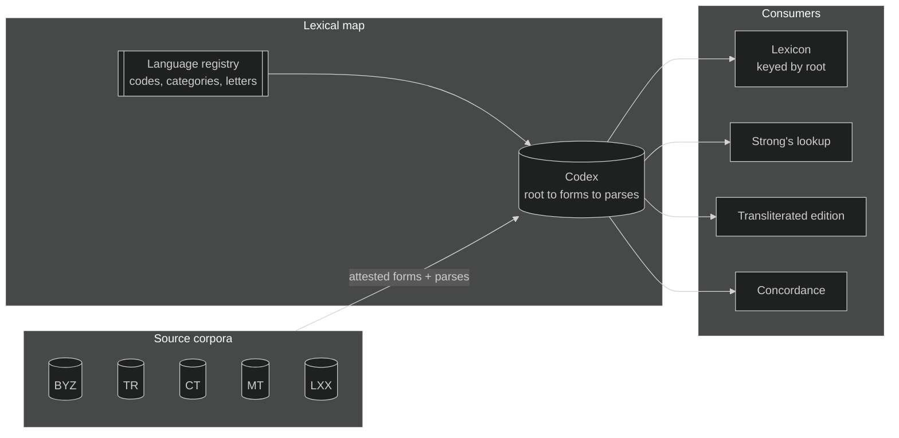
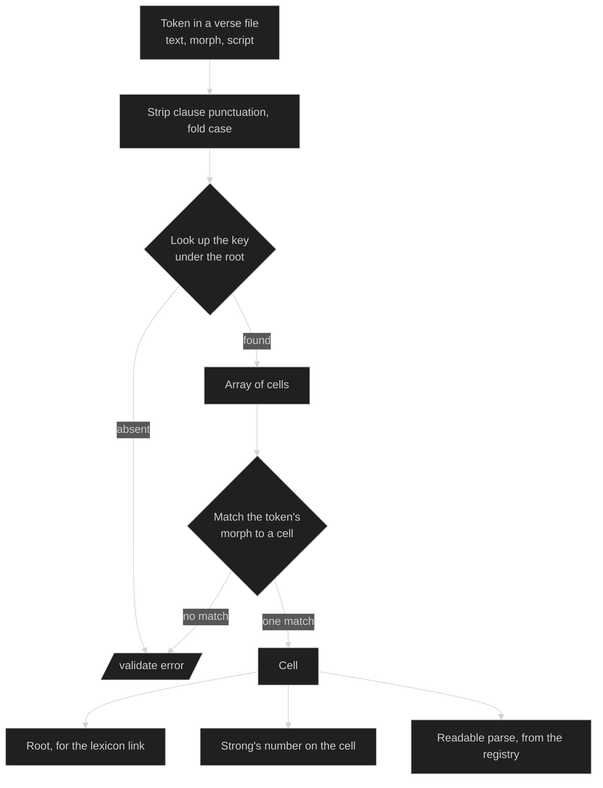

# Lexical Map

The lexical map is a specification for a per-language file that lists every inflected form of every word, with each form's parse spelled out as category-tagged codes. Lexical indices, Strong's among them, attach to the parses rather than serving as the key.

It is the paradigm chart from the back of a grammar, turned into data.

This document describes the format: what each file holds, what the rules are, and what an importer has to get right to produce one. For the content shape that consumes it, see [content-model.md](./content-model.md).

Nothing in the format is specific to one language or one edition. The worked examples are Greek and draw on BYZ2026, the tagged corpus in this repo. Hebrew, Aramaic and Latin use the same shape with their own registries.

A Greek map lives at [lexical-maps/greek/](../../../lexical-maps/greek/): the registry in `_language.json`, Robinson's positional grammar in `morphology/robinson.json`, Strong's cell-level placements in `indices/strongs.json`, and one file per letter of the alphabet.

The four file kinds have JSON Schemas beside them: [language-schema.json](../../../lexical-maps/language-schema.json), [morphology-schema.json](../../../lexical-maps/morphology-schema.json), [codex-schema.json](../../../lexical-maps/codex-schema.json) and [index-schema.json](../../../lexical-maps/index-schema.json). They cover shape only. The cross-file rules under [Validation rules](#validation-rules) need a walker, since no schema can check that a parse code resolves in the registry or that every attested form in the corpus has a home in the map.

## Why the root is the key

Strong's numbering is a concordance index, and an excellent one. Every number answers the question it was built to answer: where does this English rendering come from, and what else in Scripture comes from the same place. A century of reference work is keyed to it, and the map keeps it as a first-class index for exactly that reason.

What a concordance index cannot also be is a lexical inventory. Its unit is the concordance entry, not the dictionary word, and the two line up only most of the time. Where they part company, it happens in both directions.

**One word, many numbers.** Strong's assigns separate numbers to the principal parts of defective verbs, which is the right call for a concordance, since the KJV renders those parts differently. εἰμί accordingly occupies G1488, G1498, G1510, G1511, G1526, G2070, G2071, G2075, G2076, G2258, G2468, G5600 and G5607. A text tagged at the lexical level resolves all of them to G1510, piling thousands of tokens onto one entry and leaving the other twelve unreferenced. Across the Greek lexicon, a hundred-odd entries have occurrences to their name and appear nowhere in such an edition.

**One number, many words.** Strong's also files several headwords under a single number, again reasonably, since the KJV renders them alike. G3588 covers ὁ, ἡ and τό, which between them are the commonest word in the language. G3739 covers ὅς, ἥ and ὅ. G4341 covers both προσκαλέω and προσκαλέομαι. Scores of Greek entries carry more than one headword in their lexicon `name`.

Neither direction is a tagging error to be corrected, and neither is a defect in Strong's. They are what happens when a concordance index is asked to serve as a primary key. The map asks it to do its own job instead: the word is the key, the parse selects the cell, and the Strong's number is a value on the cell, where it is free to be many-to-one or one-to-many without conflict.

## What the map is



The map is derived from the source corpora, not from any translation. A translation inherits tags by declaring which source it follows, so the KJV's partial morphology and the NET's absent morphology stop being ceilings on what those editions can carry.

## The language registry

One registry per language, following the same pattern as a version's `abbr` array in `_version.json`: an id, a display name, a description. The addition here is `category`, which is what makes the parse validatable.

The registry describes the language and names no encoding. A worked Greek registry is at [lexical-maps/greek/_language.json](../../../lexical-maps/greek/_language.json); the excerpt below shows the shape.

```json
{
  "_id": "greek",
  "name": "Greek",
  "inflectionCategories": [
    { "_id": "pos", "name": "Part of speech", "required": true },
    { "_id": "tense", "name": "Tense" },
    { "_id": "voice", "name": "Voice" },
    { "_id": "mood", "name": "Mood" },
    {
      "_id": "formation",
      "name": "Formation",
      "description": "How a stem is built, as against what the form does. Kept apart from tense because the two co-occur."
    }
  ],
  "inflections": [
    { "_id": "verb", "category": "pos", "name": "Verb" },
    { "_id": "pres", "category": "tense", "name": "Present" },
    { "_id": "aor", "category": "tense", "name": "Aorist" },
    { "_id": "act", "category": "voice", "name": "Active" },
    {
      "_id": "midpas",
      "category": "voice",
      "name": "Middle or passive",
      "description": "The form is identical in both voices; context decides which is meant."
    },
    { "_id": "ind", "category": "mood", "name": "Indicative" },
    {
      "_id": "second",
      "category": "formation",
      "name": "Second formation",
      "description": "A second aorist, future, perfect or pluperfect. Same tense, different stem."
    }
  ]
}
```

Tense and formation are separate categories because Robinson's `2` prefix marks how a stem is built rather than which tense it is, and the two co-occur: `V-2AAM-2S-ATT` is a second aorist in an Attic form. Folding either into the other would break the one-code-per-category rule. Both code systems mark it on four tenses, so `aor2` would be a wrong name rather than a short one. Second aorists dominate the count, but second perfects, pluperfects and futures are all attested, and a name that only fits the common case is a trap for whoever meets the others.

### Code systems live in their own files

A morphology file holds the positional grammar and the token map for one code system, as [greek/morphology/robinson.json](../../../lexical-maps/greek/morphology/robinson.json) does for Robinson. Keeping it out of the registry matters more than it first appears. A token like `A` means aorist in the verb group, active in the voice slot, accusative in the case slot and adjective in the head slot, so it says nothing until the positional grammar tells you which slot you are reading. Put the tokens in the registry and you have half a table that looks whole. Put both halves in a morphology file and each code system is self-contained.

```json
{
  "heads": {
    "V": { "pos": "verb", "slots": [["tenseVoiceMood"], ["agreement"]] },
    "P": { "pos": "pron-pers", "slots": [["personCaseNumber", "caseNumberGender"]] }
  },
  "slots": {
    "tenseVoiceMood": { "prefix": { "2": "second" }, "fields": ["tense", "voice", "mood"] },
    "agreement": {
      "variants": [
        { "length": 2, "fields": ["person", "number"] },
        { "length": 3, "fields": ["case", "number", "gender"] }
      ]
    }
  },
  "qualifiers": { "C": "comp", "S": "super", "N": "neg", "I": "interr", "K": "crasis", "ATT": "attic" },
  "tokens": {
    "tense": { "P": "pres", "I": "impf", "F": "fut", "A": "aor", "R": "perf", "L": "plup" }
  }
}
```

A decoder driven by that file, holding no Greek and no Robinson conventions of its own, reads every distinct code in BYZ2026 with no failures and no category collisions.

The three file kinds and their schemas:

| Path | Holds | Schema |
| --- | --- | --- |
| `<language>/_language.json` | Categories, codes, letters, normalization | `language-schema.json` |
| `<language>/morphology/<system>.json` | One code system's grammar and tokens | `morphology-schema.json` |
| `<language>/<letter>.json` | Roots, forms, parses, transliterations | `codex-schema.json` |
| `<language>/indices/<index>.json` | Placement rules for one external index's cell-level entries | `index-schema.json` |

### One code per category

A parse may carry at most one code from any category. That single rule is what lets `validate` reject an incoherent parse without knowing any Greek: nothing can be tagged first person and second person at once, because both codes sit in `person`.

The rule holds only if the registry mints genuinely ambiguous values as their own codes. Greek voice is the case that forces this. Robinson's codes already do it, and BYZ2026 uses seven distinct voice letters:

| Voice | Code | Ambiguous? |
| --- | --- | --- |
| Active | `act` | |
| Middle | `mid` | |
| Passive | `pas` | |
| Middle deponent | `mid-dep` | |
| Passive deponent | `pas-dep` | |
| Middle or passive | `midpas` | yes |
| Middle or passive deponent | `midpas-dep` | yes |

The last two are the load-bearing ones. If the registry offered only `mid` and `pas`, every token Robinson marks as either would have to carry both codes, and the one-code-per-category rule would break on the first import rather than on some later edge case. Minting the ambiguous values as codes of their own keeps it intact.

`ATT` is the other case. It marks an Attic form, and it is not a mood or a tense. It gets its own category.

### Why not keep the Robinson strings?

`V-2AAI-3P` is a rendering choice, no different from the KJV data's `Aor2ActInd`. Both are morph tags, and both bury the categories inside a positional string that only their own parser can read. Keying a parse on that string means a cell tagged by Robinson and the same cell tagged by another system never join. BYZ2026's Robinson codes carry person, number, case and gender; KJV1769's internal codes are a far smaller set with no person and no number at all. Same cells, unjoinable names.

The category-tagged array is the joinable form. Both code sets parse into it, the smaller one lossily, which is honest, because it genuinely says less.

## The codex entry

One file per language, split by letter, keyed by root. Each root carries `inflections`, keyed by the spelling as it appears in the text. Each spelling carries an array of cells, one per parse, because a spelling can have more than one.

```json
{
  "εἰμί": {
    "language": "greek",
    "pos": "verb",
    "shortDefinition": "to be, exist",
    "indices": { "strongs": "G1510" },
    "inflections": {
      "ἐστίν": [{ "parse": ["verb", "pres", "act", "ind", "pers-3", "sg"], "indices": { "strongs": "G1510" } }],
      "ἐστιν": [{ "parse": ["verb", "pres", "act", "ind", "pers-3", "sg"], "indices": { "strongs": "G1510" } }],
      "ἔστιν": [{ "parse": ["verb", "pres", "act", "ind", "pers-3", "sg"], "indices": { "strongs": "G1510" } }],
      "ἦτε": [
        { "parse": ["verb", "impf", "act", "ind", "pers-2", "pl"], "indices": { "strongs": "G1510" } },
        { "parse": ["verb", "pres", "act", "subj", "pers-2", "pl"], "indices": { "strongs": "G1510" } }
      ]
    },
    "transliterations": { "ἐστίν": "estín", "ἐστιν": "estin", "ἔστιν": "éstin", "ἦτε": "ē̂te" }
  }
}
```

Two things are happening in that excerpt and they point in opposite directions.

ἐστίν, ἐστιν and ἔστιν are three spellings of one cell. Greek respells an enclitic depending on what stands beside it, so the same third person singular turns up three ways in the text. Each spelling is its own key, each carries the same parse, and nothing marks one as the real one. Two spellings with the same root and the same parse are the same paradigm slot written two ways, and that is all the map says about them.

ἦτε is one spelling with two cells. It is the imperfect indicative in some verses and the present subjunctive in others, so it carries both parses.

The map does not pick a dictionary spelling for a cell. It was tempting, and an earlier draft did it, with a `canonical` pointer from each positional spelling to a preferred one. That needed a rule for which spelling wins, the rule needed an exception list for enclitics, and the exception list needed a review queue. All of it answered a question a parsing chart is not asked. A renderer that wants one spelling per cell can choose by any rule it likes at display time.

### Citation forms

A root can have more than one headword. The article is one word with one paradigm, but its dictionary entry is ὁ, ἡ, τό, and a lexicon page that showed only ὁ would look wrong to anyone who learned it the usual way.

`citationForms` holds that list. It changes nothing about the key or the parses, which is the point: the root stays one row, gender stays a parse category, and the display gets the three headwords it expects.

```json
"citationForms": ["ὁ", "ἡ", "τό"]
```

Omit it when the root is its own only citation form, as εἰμί is.

### Why the parses are an array

`ἦτε` is the reason. In BYZ2026 it appears 11 times as an imperfect indicative and 8 times as a present subjunctive. Those are Strong's G2258 and G5600. One form, two numbers.

Flattening the attributes into a single array would produce `["verb", "impf", "pres", "act", "ind", "subj", "pers-2", "pl"]`, which reads as four possible parses rather than two, breaks the one-code-per-category rule, and leaves nowhere to put the second Strong's number.

The scale of this is not marginal. Around one key in twenty-five carries more than one parse, and they fall out like this:

| Collision type | Survives a flat array? |
| --- | --- |
| Nominal case, gender or number differs | yes |
| Verb person or number differs | no |
| Verb tense, voice or mood differs | no |
| Verb, two dimensions differ | no |
| Different part of speech | no |

Most collisions are the nominal kind, and those are genuine syncretism that a flat array survives: `τῶν` really is genitive plural in all three genders. The verb cases would not: `εἶπον` is first singular and third plural, `λέγω` is indicative and subjunctive, `ποιεῖτε` is indicative and imperative. Flatten those and the reader cannot tell which combinations are real.

One rule handles both. Nest.

### What counts as a root

The root is the dictionary form of the word, determined from the language itself. It is not an index headword, and a numbering system has no say in which words exist or how many there are.

Each language states its citation convention in the registry, because the conventions differ. Greek cites a verb in the first person singular present active indicative, so λαμβάνω rather than the infinitive; Latin dictionaries cite the infinitive and Hebrew cites the third masculine singular perfect. Within Greek:

| Part of speech | Citation form |
| --- | --- |
| Verb | first person singular present active indicative, or the middle for a deponent |
| Noun | nominative singular |
| Adjective, article, pronoun | nominative singular masculine |
| Indeclinable | the form itself |
| Adverb, preposition, conjunction, particle, interjection | the form itself |

The root need not appear in the corpus. ἔλαβον and λαβών both belong to λαμβάνω whether or not λαμβάνω is ever written, because the paradigm decides the root, not the attestation.

A frozen case form is not a root. πρῶτον used adverbially is the accusative singular neuter of πρῶτος; χάριν used as a preposition is the accusative of χάρις; μακράν is the accusative of μακρός. Each belongs to the paradigm it inflects from, and the parse on its cell records that it was used adverbially.

Index entries do not line up with this, and they are not meant to. A concordance gives πρῶτον its own number because the adverbial use earns an entry, and gives δεύτερον none because it does not. That difference belongs to the concordance. It has no bearing on how many Greek words there are, so the map records one root in both cases and hangs the numbers on the cells.

### How roots are derived

Roots come from the forms. For each index number in the corpus, the attested spellings and their parses are put in front of something that reads Greek, with the number reduced to an opaque label and no lexicon in reach, and it returns the citation form. Nothing about the derivation depends on which numbering system tagged the text or on what any index calls the word.

The Greek map's roots were produced that way. Set against roots taken from index headwords, about one in fifteen came out differently. Most were Byzantine spellings the headwords do not carry: breathings, accents, single against double consonants, iota subscripts, omicron for omega. The rest were headwords that are not citation forms at all, a plural (ἀμφότεροι), a superlative (ἀκριβέστατος), a frozen accusative (ἀκμήν), a verb cited active that only occurs in the middle, two typos, and two proper names filed as common nouns (Τύραννος at Acts 19:9, Φιλητός at 2 Timothy 2:17).

Where two numbers derive to the same citation form and the same word, the root carries both numbers, which is what happened to πρῶτος, δωρεά, ὅστις, Ἰούδας, καλός, ἐγγύς, and ἐσθίω with its suppletive aorist ἔφαγον.

Where two numbers derive to the same citation form and different words, the root takes a superscript, the convention the lexicon already uses. ἄπειμι¹ is 'be absent' from εἰμί and ἄπειμι² is 'go away' from εἶμι. σύνειμι splits the same way. βάτος¹ is a bramble and βάτος² a liquid measure. μήν¹ is a particle and μήν² a month.

Part of speech on the root follows the corpus tag rather than the deriver's judgment, since Ἀθηναῖος can be argued as an adjective or a noun and the tagger already argued it.

### The root is the word as the language used it

Two questions come up on almost every uncertain lemma, and one principle answers both: the root belongs to the language, not to this text and not to any one lexicon.

**Voice.** A verb is cited in the active if it had active forms in first-century Greek at large, whatever this corpus happens to attest. Only a verb that was deponent across the language is cited in the middle. ἀναβάλλω and περικρύπτω are active even though the corpus shows only the middle; φρυάσσομαι is middle because no active exists anywhere.

**Spelling.** Variant spellings of one word are both right, the way John and Jon are. Where the corpus is consistent, its spelling is the attested one and stands, so Πύθων keeps its capital and Ἄβελ its smooth breathing. Where the corpus is split or never writes the form in question, the wider language decides, and the standard lexica are the best sample of it available: Βαρσαββᾶς takes the double beta the text splits on, and ῥαῖδα takes LSJ's accent because the corpus only ever writes the genitive plural.

The check on all of this is independent lexica keyed by headword, never by number. Two separate passes over the uncertain lemmas, each reading LSJ, Middle Liddell and Abbott-Smith, agreed on all but a handful; the ones they split on were settled by the rule above.

### When cells disagree about part of speech

A root carries its own part of speech and each cell carries the one it was tagged with. They can differ, and the difference is information rather than an error.

δεύτερος is an adjective. Its neuter accusative δεύτερον is tagged as an adjective in some verses and as an adverb in others, because the word is being used both ways. One root, one paradigm, cells that disagree.

The same holds for τρίτος, μέγας, ὀλίγος, δοῦλος and πρῶτος. Reading the root's part of speech as authoritative for every cell would flatten exactly the distinction a reader wants.

### Why the parse carries the Strong's number

The corpus tags at the lexical level, so every form of εἰμί arrives as G1510. The index goes finer, and those finer numbers live in [greek/indices/strongs.json](../../../lexical-maps/greek/indices/strongs.json) as placement rules: a root, and the parse codes a cell must carry to take the number.

```json
{ "n": "G2076", "root": "εἰμί", "requires": ["pres", "ind", "pers-3", "sg"] }
{ "n": "G2258", "root": "εἰμί", "requires": ["impf", "act"] }
{ "n": "G5213", "root": "σύ",   "requires": ["dat", "pl"] }
```

The rules came from the index's own statements about itself ("third person singular present indicative form of G1510") and from KJV1769, which tags with the finer numbers. A second pass rechecked every rule token by token against a Strong's-tagged Greek text and against the index's own occurrence count for each number, and corrected eight rules that KJV1769 alone had got wrong: KJV1769 puts 2 Corinthians 8:17 on G4707, for one, where both other witnesses say G4705. Most of the index numbers absent from BYZ2026 place that way. The rest are either words the Byzantine text never uses, or splits by sense rather than by parse (ἅγιον as "sanctuary"), which no parse rule can express. `unplaced` lists every one of them with its reason, so the file itself answers which is which.

A rule is not the only way a cell gets a finer number. Where the split is by sense on one spelling and one parse, the number belongs to the token rather than to the cell, so the corpus tag stands and the cell lists every number its tokens carry. ἀπέχει is the same third singular present indicative at Matthew 15:8, Mark 7:6 and Mark 14:41, but only Mark 14:41 is the impersonal "it is enough" that the index numbers G566, so that cell reads `["G566", "G568"]` and the verse files hold the distinction. A handful of Greek cells work this way. Each number involved is listed under `unplaced` with the reason.

The result on εἰμί: the root lists all sixteen of its numbers, and ἦτε carries G2258 on its imperfect cell and G5600 on its subjunctive cell.

### A cell's number only ever narrows the root's

The rule, stated once: **a cell carries `indices.strongs` only where the root's set has more than one member, and then it names which member or members this spelling and parse take. It is never equal to the root's value, and always a subset of it.**

The first import did not work that way. It copied the corpus tag onto every cell, so 18,702 of 19,429 cell-level numbers repeated the number their root already carried — 96% noise, and the εἰμί example above once wrote `G1510` onto every cell of the word. The 727 that survive the rule are the ones that say something: 726 are a root holding an array with the cell naming one member, and one is `ἀπέχει`, whose cell array is a subset of its root's. No cell anywhere carries a number its root lacks.

The rule also closes off the way the redundancy got in. A writer that copies the corpus tag recreates it; a writer that applies the placement rules and then drops anything equal to the root cannot. The audit enforces both halves.

The defective-verb numbers are parse-level facts by definition. Strong's G2076 *is* "third person singular present indicative of εἰμί." It is not a property of the word and not a property of the spelling.

`indices` on the root is for identifiers that genuinely belong to the word, and it is where non-Strong's lexicons attach. Because the key is the root rather than a KJV-derived index, a lexicon organized by dictionary headword slots in with no crosswalk at all.

## What the root knows that no ending can tell you

Five facts sit on the root rather than on a cell, because they belong to the word rather than to any one of its forms. None is derivable from a spelling, and each is read off a corpus rather than guessed.

```json
"λόγος": { "pos": "noun", "gender": "masc", "declension": "2m", … }
"λέγω":  { "pos": "verb", "conjugation": "thematic", "stems": { "aor": "ειπ" }, … }
"γίνομαι": { "pos": "verb", "deponent": true, … }
```

**`gender`** is the one a citation form usually hides: `ὁδός` is feminine and `λόγος` masculine, and both end in `-ος`. Without it a noun stays open on gender, and so does the article in front of it, since agreement can only narrow what one side already knows. Read from the articles a text prints, since most article forms name one gender outright and only `τοῦ`, `τῷ`, `τῶν` and `τοῖς` are open.

**`declension`** and **`conjugation`** name the inflection class. This is the piece that makes a second morphology derivable rather than only Robinson: Packard puts the class in its type code (`N1T`, `N3`, `A1A`, `VF`) and Robinson encodes none of it, so a map holding only what Robinson can say could never render a Packard code even in principle. Settled by scoring each candidate class against the root's own attested spellings, and left absent where the evidence does not discriminate — `1f-a` and `1f-a-impure` differ only in the genitive, so a root attested in the nominative alone genuinely cannot be told apart, and writing either would put a guess beside facts.

**`stems`** are the principal parts no rule produces. `λέγω`'s aorist is `εἰπ-`, and nothing about the present stem says so.

**`deponent`** says the middle and passive forms carry an active meaning, which is why the corpus tags their voice `midpas-dep` rather than `midpas`. Not derivable from any ending: `γίνομαι` has no active at all, and nothing about `-ομαι` says that.

### Why they are worth storing

Because the map is meant to hold what is known, and these are known. A consumer that wants to inflect a word the map has not attested needs the class; one that wants to render a scheme Robinson cannot express needs it too. Storing them is also what lets the map be checked: a root claiming a gender its own cells contradict is a real error, and the audit above catches it.

They are stated only where a corpus settles them. Same discipline the schema already applies to gender, and the reason `declension` is absent on 6,391 roots.

## Keys

A key is the word as written, less what is positional rather than lexical. The test for what comes off: a character-level rule removes it with no exceptions, and what it removes says nothing about which word this is. Four things pass that test.

**Trailing and leading punctuation.** Greek ends a clause with U+0387 and asks a question with U+037E, and a tagger leaves them on the token. Strip those and the ASCII comma, semicolon, colon and period. An apostrophe at U+2019 marks elision and *belongs to the word*, so it stays: `μεθ’` is a spelling and `μεθ` is not. This mattered more than it sounds. Stripping it collided `μεθ’` with a proper name `Μεθ` that occurs once in 1 Chronicles, and 208 tokens of the preposition `μετά` shipped as an indeclinable proper noun.

**Initial case, taken from the root.** Root `Ζαβαδ` gives key `Ζαβαδ`. Root `καί` gives key `καὶ` whatever the token printed. That one rule handles the proper noun and the sentence-opening capital with no special case for either, because sentence-position capitalization is a rendering rather than a spelling — Rahlfs uses a capital to open a *paragraph* and BYZ uses it to open a *sentence*, so the same mark means different things in two editions and cannot be part of the word.

**The grave accent, folded to its acute.** A grave appears only when another word follows, so it is positional and never an inflectional difference. `τὰ` and `τά` are one key.

**NFC.** Keys are composed.

Nothing else comes off. Every other accent stays, because a good many cells are genuinely written more than one way and each spelling is a real key someone will look up: `ἐστίν` and `ἐστιν` differ by enclitic accent shift, and BYZ prints `Ἀβραάμ` where Rahlfs prints `Αβρααμ`. Two editions printing one word differently is what the model is for; a case fold or a grave fold producing a spelling no edition prints is not.

### What this asks of a script reading the map

The map is normalized and most sources are not, so the difference is the caller's to bridge.

**Fold case on the way in.** A source that capitalizes sentence openings will not match a lower-case key, and one that leaves them lower will not match a capitalized proper-noun key. Fold before you look up. This is lossless: the map's initial case carries no information a lookup needs, since it came from the root.

**Fold the grave on the way in**, for the same reason and with the same safety. `τὰ` must find `τά`.

**Strip accents only if your source has none, and know what it costs.** An accent-insensitive lookup conflates words the map deliberately keeps apart. `ἐν` and `ἕν`, `ὁ` and `ὅ`, `εἰς` and `εἷς`, `οὗ` and `οὐ`, `εἰ` and `εἶ` each fold together and are each two different words. For a fully accented source, honoring accents takes this repo's own Septuagint import from 58.6% of tokens resolved on spelling alone to 68.4%, and cuts what needs disambiguating from 25.4% to 15.6%. So an accent-insensitive lookup is a fallback for a source that genuinely lacks accents, or a last resort after an exact lookup misses. It is not the default, and a consumer that reaches for it should expect several answers where one was available.

The importer's own implementation is `foldGrave` and `foldGreek` in `imports/lxx/lib/greek.mjs`: the first folds grave and case and is the exact lookup, the second additionally strips every diacritic and is the fallback. `utils/corpusMorphology.ts` has the same pair, and the two disagreeing on the case fold is how 13 capitalized sentence openings were once reported as parses the map could not explain.

### Hebrew and Aramaic

Cantillation marks are stripped before the key is formed. They are chant and phrasing, they vary with a word's position in a verse, and no transliteration scheme represents them. `בְּרֵאשִׁית` and `בְּרֵאשִׁ֖ית` are the same word.

The marks stay in the corpus. A source text keeps its te'amim in the verse content; only the map key drops them. Cantillation is a property of the token, not of the word.

Biblical Aramaic uses the Hebrew script and shares Hebrew's normalization and collation rules. It needs its own registry only if its inflection categories diverge.

## Transliteration

Each inflection carries its own `transliteration`.

```json
"inflections": {
  "τοῦ": { "transliteration": "toû", "cells": [ … ] },
  "τὸ":  { "transliteration": "tò",  "cells": [ … ] }
}
```

It sits on the inflection rather than on a cell because it romanizes the spelling, and 823 spellings in the Greek codex carry more than one parse; the transliteration is the same for all of them. It sat in a root-level `transliterations` map at first, keyed by the same spellings as `inflections`, which duplicated every key and let the two drift. Nothing is keyed twice now.

The scheme is academic rather than a reading aid, and that choice is load-bearing. A reading aid renders ἐστίν as *estin* and ἐστιν as *estin*, so it destroys the distinction the map exists to record. The academic scheme keeps accents as combining marks, so `ἐστίν` reads *estín* and stays reversible. A friendlier form derives from it by stripping marks; the reverse does not work.

The table lives in the registry under `transliteration`, not in code, so a consumer reads it rather than reimplementing the scheme. Greek needs three context rules beyond letter-for-letter, all named in the table: gamma before a velar is a nasal (ἄγγελος reads *ángelos*), upsilon closing a diphthong is *u* rather than *y* (αὐτοῦ reads *autoû*), and a rough breathing prefixes *h* to the vowel or to the whole diphthong, with rho taking *rh* (ῥῆμα reads *rhē̂ma*, οὗτος reads *hoûtos*).

**Case carries over from the spelling.** `Ζαβδος` is *Zabdos* and `θεός` is *theós*, so the transliteration matches the key it romanizes and a proper name stays a proper name. Only the first Latin letter takes the capital, because the Greek theta is *Th* and psi is *Ps*, never *TH* or *PS*. A breathing shifts where the capital lands rather than removing it: a vowel's aspirate stands first and takes it, so `Ἅγιος` is *Hágios* and not *hÁgios*, while a rho's aspirate follows the letter and the rho keeps it, so `Ῥώμη` is *Rhṓmē*.

An earlier implementation lower-cased everything, which read 5,732 capitalized spellings as though they were common words and broke the round trip a reader would expect between a key and its romanization.

`lossy` names what the scheme drops. For Greek that is the iota subscript, which no common academic scheme represents. Nothing else is lost, so the transliteration can double as a sort key where a Latin one is wanted.

## Source conventions the importer has to know

Tagged corpora carry structure that a naive walk over text-bearing nodes silently drops. These are properties of the source, not of any one edition, and an importer for a new corpus should be checked against each.

**A tagged node with no text belongs to the word in front of it.** It renders nothing, and it means the tagger recorded a second reading rather than a second word. Attach it to the preceding word's spelling as another cell. Reading only text-bearing nodes loses it.

**An exact repeat is bad data, not an ambiguity.** Where the second tagging matches the first in both index and parse, it adds nothing and inflates counts. Fix the source rather than working around it.

**A second reading can change the index, not just the parse.** When it does, the two readings belong to different entries, and the spelling lands under both roots.

**A shared annotation can sit on a wrapper.** A node carrying an index and a `content` array applies to several words at once, so a walk has to recurse rather than expect a flat list.

**Trailing punctuation is part of the node's text.** Strip it with the language's own marks, not their ASCII lookalikes. Greek ends a clause with U+0387 and asks a question with U+037E, and an apostrophe at U+2019 marks elision and belongs to the word.

That last sentence has cost this repo twice, both times because two Greek marks are visually identical to ASCII ones. The Greek question mark U+037E looks exactly like a semicolon, and a sentence-boundary test written with the ASCII `;` silently skipped 1,298 words. The ano teleia U+0387 looks exactly like a middle dot, and it is a *comma-level pause*, not a sentence end, so a rule that treats it as one is wrong in the other direction. Write both as escapes, not as literals: a literal is unreadable in a character class and vanishes the first time something rewrites the file.

**A source lemma names which word a token is, and outranks a spelling collision.** Where two lexemes share a spelling, a lookup on the spelling alone answers for both, and whichever the map happens to hold wins. `Αβδιου` is the genitive of the declinable `Ἀβδίας` in Obadiah and an indeclinable name in its own right in Kings; the source says which, and ignoring it cost 497 proper names their case, number, gender and lemma at once. The narrowing has to be self-limiting — apply it only where the source's lemma names a root the map actually carries, or a source with worse lemma conventions than the map's will drag it down with them.

**An edition's capitalization is its own.** Rahlfs marks a *paragraph* with a capital and leaves sentences lower case; BYZ marks a *sentence*. So a capital is not a fact about the word, and reading one as though it were will either invent paragraph divisions or lose them. Read whatever the edition means by it before normalizing, because normalizing destroys the evidence: this repo's Septuagint import recovered 2,980 paragraph divisions from Rahlfs' capitals, and it had to do that before the capitalization pass rewrote them.

**Uppercasing a Greek letter is not `toUpperCase`.** Unicode's full uppercase mapping spells an iota subscript out as a second letter, so `ᾳ` becomes `ΑΙ` and `ᾧ` becomes `ὯΙ`. That is right for setting a whole word in capitals and wrong for capitalizing one letter of a lower-case word, which wants the precomposed prosgegrammeni capitals `ᾼ ῌ ῼ`. Decomposing to NFD, uppercasing the base vowel and recomposing gets there without a table.

### Worked example: BYZ2026

A couple of dozen second taggings, all but one keeping the same Strong's number and differing only in parse:

| Reference | Form | Both readings |
| --- | --- | --- |
| Matthew 4:15 | Γῆ | nominative or vocative |
| Matthew 26:45 | Καθεύδετε | indicative or imperative |
| Matthew 27:9 | ἔλαβον | first singular or third plural |
| John 21:15 | τούτων | genitive plural masculine or neuter |
| 1 Corinthians 7:36 | ὑπέρακμος | nominative singular masculine or feminine |
| 1 John 5:1 | ἀγαπᾷ | indicative or subjunctive |

James 4:5 does it twice in a row, on the article and then on its noun, because τὸ πνεῦμα can be the subject or the object of ἐπιποθεῖ:

```json
{ "text": " τὸ",     "strong": "G3588", "morph": "T-NSN" },
{                    "strong": "G3588", "morph": "T-ASN" },
{ "text": " πνεῦμα", "strong": "G4151", "morph": "N-NSN" },
{                    "strong": "G4151", "morph": "N-ASN" },
```

2 Timothy 2:6 is the one that changes the index: πρῶτον is tagged G4412 and also G4413, which is Strong's filing the adverbial use of πρῶτος under a second number. See [What counts as a root](#what-counts-as-a-root).

Acts 4:9 was the bad-data case: τίνι carried G5101 I-DSN twice, identically. Removed from [05-ACT.json](../../../bible-versions/BYZ2026/05-ACT.json).

## Sorting

Files split by letter, using the ordered `letters` array from the language registry, whose `_id` values (`alpha` through `omega`) drive the filenames. Alpha is the fattest of the Greek files and none is awkward to open.

For ordering inside a file, `Intl.Collator` handles polytonic Greek and pointed Hebrew correctly, and `sensitivity: "accent"` gives exactly the behavior wanted: case ignored, base letters at the primary level, accents as the subsort.

```js
const collate = new Intl.Collator("el", { sensitivity: "accent" });
// ἀγάπη vs Ἀγάπη →  0   case ignored
// ἀγάπη vs ἀγαπη →  1   accent counts
```

Three cautions:

- Pass `el` for Greek and `he` for both Hebrew and Aramaic. `grc` and `arc` are not collation locales and resolve silently to `en-US` root collation.
- Do not reach for `sensitivity: "base"` to ignore accents. It ties every spelling that differs only by accent, and a map whose whole point is that those spellings are distinct then has no stable order at all. At `accent` sensitivity there are no ties, because case folding has already run over the keys.
- Collator output depends on the ICU version of the runtime that produced it, so an ICU bump can reorder a committed file and yield a diff that means nothing. Watch for it; do not trade the ordering away to avoid it.

**This is the order on disk**, for roots and for inflection keys alike, and a tool that writes a letter file has to use the same comparator or its diff fills with reordering noise. Nothing else reproduces it. Sorting by code point looks like the safe deterministic alternative and is not: code point order is case-sensitive, so it files Ἀγάπη away from ἀγάπη and loses the one property this ordering exists to have. Reproducing ICU's Greek tailoring by hand means reimplementing the accent weights it applies, which is more machinery than the ordering is worth.

## How a token resolves



The failure branch matters as much as the success one. A token whose morph matches no parse under its form is either a tagging error in the corpus or a gap in the map, and either way somebody should look at it. Today that discrepancy has nowhere to surface.

## What the map makes possible

**The lexicon keys on the root.** Strong's numbers become one of the indices that forward into it, with the many-to-one and one-to-many cases handled by presenting options rather than guessing.

**Lexicons that are not keyed to Strong's join directly.** A lexicon organized by dictionary headword meets the map on the root, with no number-to-number crosswalk to build or maintain. Strong's-keyed and headword-keyed references then sit side by side on the same entry.

**Translations inherit tags from their source.** Declaring that an edition follows BYZ, TR or MT lets it carry root and morphology even where its own tagging has none.

**A transliterated edition becomes a render-time join.** Store an academic transliteration on each form and the edition is a projection of existing data rather than a second corpus.

**`inflections` on lexicon entries stops being hand work.** Grouping (root, parse) over a tagged corpus produces exactly the shape that was being typed by hand, corpus-attested rather than transcribed.

## Validation rules

`npm run validate` runs two audits over this directory. Both are report-only, like every other audit there: a finding is either a codex to correct or a registry entry to add, and only a person can say which.

**The lexical-map audit** ([utils/lexicalMaps.ts](../../../utils/lexicalMaps.ts)) checks the map against itself and against the registry.

- Every letter file validates against `codex-schema.json`.
- Every code in a parse resolves in the registry, and a parse states at most one code per category.
- Every root's `pos` resolves, and every cell's part of speech is either the root's or a reading the registry's `posReadings` allows.
- Every root-level `gender`, `declension`, `conjugation`, `deponent` and `stems` belongs to a part of speech that can have it, resolves in the registry, and does not contradict the root's own cells.
- Every stored `transliteration` is the one the registry's own table produces for that spelling. This is a reimplementation on purpose: the point is that the value is reproducible from the registry alone, so a consumer implementing the table gets the same answer.

**The corpus-against-map audit** ([utils/corpusMorphology.ts](../../../utils/corpusMorphology.ts)) checks that the map can explain every corpus that names a scheme.

Each version declares one in its own `morphology` field. The audit decodes every `morph` code that version prints, through the scheme file that field names, and asks whether some cell for that spelling accounts for it. A finding means a spelling the map lacks, a parse missing from a spelling, or a code in some other scheme.

It earns its keep. It found a cell a cleanup pass had deleted by mistake — BYZ tags `οὐαὶ` both `INJ` and `N-OI`, and a pass that could not tell its own output from the committed data removed the second, taking four tokens of corpus with it. Nothing else would have noticed.

**Narrowing is allowed and is never a finding.** A word that does not inflect has no case marking, and the map records that as `indecl-proper` rather than by listing every case it could stand in, because "this can be anything" is a different claim from "this is one of these two". A corpus may then narrow it from context. So `Ἀβραάμ` reads `N-PRI` in BYZ2026, which did not narrow it, and `N-GSM` in LXX1935, which did, and both are right about the same word.

Still unchecked, and worth building:

- No two `inflections` keys under one root are equal under the case-and-grave fold.
- A cell's Strong's number is never equal to its root's, and always a subset of it.
- Every Strong's number resolves in the lexicon, not only its pattern.
- Two placement rules never both match one cell.
- Every cell's number is what the corpus tag plus the placement rules produce, so the codex and the index file cannot drift apart.
- Every attested cell of a root the generator handles is one the generator produces. This needs the paradigm generator, which lives in the gitignored importer; see below.

Treat a change to a letter file the way you would treat a change to generated output: re-derive it rather than typing it.

### A cleanup pass runs after the last writer, and only subtracts

Two rules that each looked right have now cost a session between them, and both failures have the same shape.

**A cleanup that runs before the last writer cleans a state nobody ships.** The pass that drops a cell another cell strictly subsumes used to run in the middle, so it never saw what the later passes added, and 401 duplicates survived: `Ζαβδος` held both `[noun indecl-proper]` and `[noun indecl-proper masc]`, where the first says strictly less and reads as though the gender were open. Same for the passes that write a root's class and gender — running them only before the last cell writer left `Ἄννας` claiming the class `1m-as` while every cell it ended up with said the word never inflects.

**A cleanup must not supply, only subtract.** The obvious next move, when both rules empty an inflection between them, is to refill it from the generator. It does not work, and it is worth recording so nobody spends an evening on it: the build does not read the generator directly. `candidatesFor` completes what the generator returns — a neuter's accusative twin, an adjective's comparative — so a pass refilling from the generator alone reproduces a narrower answer than the build's, and 58 then 44 printed codes had no cell to explain them.

For the same reason there is no longer a rule dropping a cell the root's settled class cannot produce. The build's lookup does not consult the class, so the two disagreed by construction, and the rule kept deleting cells the corpus then printed. A map holding a cell a class cannot explain is the lesser fault, and it is what "the map stores everything" asks for anyway. Both rules become worth having the day generation takes the class as an input and one generator answers for both sides.

### The map must rebuild byte for byte

`node imports/lxx/build-map.mjs --check` runs the whole derivation over the committed map and fails if a single byte moves. Run it alongside `npm run validate`.

This is not a formality. "The map is derived" was asserted for a whole session and was false: two runs from the same commit differed by 7 roots, and one of the differing cells had `νεανίαι` as a dative singular, which it is not — `νεανίαι` is a nominative plural and `νεανίᾳ` is the dative. Nothing detected it, because nothing was checking.

The cause is worth stating as a rule, because it is easy to reintroduce. **No pass may read a corpus this importer builds.** One did: the pass that stores what a corpus attests read `bible-versions/LXX1935`, which is built from this map. So the map was a function of the last build and the build a function of the last map, and neither run was wrong — neither was reproducible. It also let a mistake confirm itself, since a wrong gender printed itself into the corpus and the corpus read it back into the map.

A corpus somebody else tagged is evidence. A corpus this repository generates is not; it is the output, and reading the output back closes a loop that no single sweep settles. The derivation is a pure function of three inputs, and `--check` is what keeps it one:

- the committed map,
- the source text the importer reads,
- the externally tagged corpora, which today is BYZ2026.
