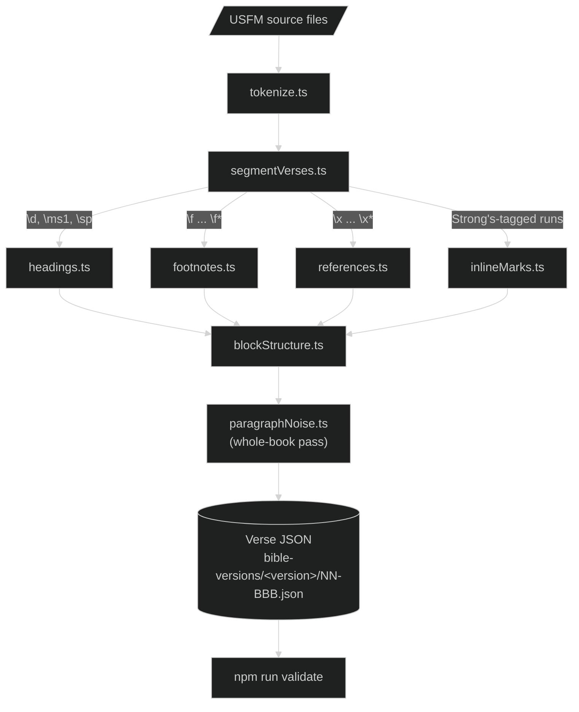

# USFM Import

USFM (Unified Standard Format Markers) is the markup most Bible-translation tools export in. This pipeline converts USFM source files straight into Graphai's own verse JSON, the same shape validation, export, and the web reader already consume, so a translation authored elsewhere doesn't need hand-transcription into the schema. It's how WEBUS2020 gained its deuterocanonical books.

For the shape everything below is converted into, see [content-model.md](./content-model.md). Once written, USFM-imported content flows through the exact same tooling described in [data-pipeline.md](./data-pipeline.md); this document only covers the conversion step upstream of that.

## From USFM text to verse JSON



`segmentVerses.ts` is the largest and most central module in this pipeline. It walks the full token stream and decides every structural boundary: where a paragraph or stanza break falls, how a chapter cut is treated, which specialized builder a given span belongs to. Everything else either feeds it a decision (headings, footnotes, references, the Strong's-run builder) or renders what it already decided (`blockStructure.ts`).

## Module responsibilities

| Module | Owns |
| --- | --- |
| `tokenize.ts` | Lexes raw USFM into a flat, source-ordered stream of markers and text. No tree yet, since paired markers (`\w`...`\w*`) and unpaired position markers (`\v`, `\c`, `\p`) interleave freely |
| `segmentVerses.ts` | Walks that stream and decides every verse-level boundary: paragraphs, real stanza breaks vs. ordinary line wraps, chapter cuts, and the deuterocanon-only structural markers |
| `blockStructure.ts` | Renders the blocks `segmentVerses.ts` already decided into the content-schema shape |
| `headings.ts` | Psalm superscriptions, the acrostic letter names (in whichever spelling a given edition uses, singly or joined into one combined-stanza heading) that open each stanza of Psalm 119, Psalter book-division headings recognized by their printed label rather than tied to one specific section-heading marker, and Song of Solomon's speaker labels |
| `footnotes.ts` | Assembles a footnote from one `\f`...`\f*` span, including deuterocanon front-matter blocks that get wrapped as a synthetic footnote on the book's opening verse |
| `footnoteTypeRules.ts` | The classification table that sorts footnote text into cross-reference, variant, translation, or study. Shared by the importer and by the standalone re-classification tool below |
| `references.ts` | Resolves `\x` cross-references against the book registry directly, and finds Scripture references sitting in ordinary footnote prose with no marker at all |
| `inlineMarks.ts` | The shared run-builder that turns Strong's-tagged USFM into joined, readable text, used for both verse content and footnote bodies |
| `splitScriptRuns.ts` | Splits an embedded Hebrew or Greek letter run out into its own `{text, script}` node; the same eligibility judgment `npm run validate`'s own untagged-script-run check reuses |
| `metadata.ts` | Book-id resolution and version-metadata extraction and merging |
| `paragraphNoise.ts` | The pipeline's one whole-book pass. Cleans up a source-tool artifact that over-applies paragraph flags |

Fraction normalization isn't a `utils/usfm/` module at all: `segmentVerses.ts` and `footnotes.ts` both call the shared [functions/normalizeFractions.ts](../../../functions/normalizeFractions.ts), the same function `npm run validate`'s own unnormalized-fraction check applies to hand-edited content. One convention, one function, so an imported verse and a hand-edited one are never held to two different rules that could quietly drift apart.

## Running an import

```bash
# Preview one chapter without writing anything
npx ts-node utils/importUsfm.ts path/to/usfm-files WEBUS2020 GEN 1

# Import every book found in the source folder
npx ts-node utils/importUsfm.ts path/to/usfm-files WEBUS2020

# Import without Strong's tagging
npx ts-node utils/importUsfm.ts path/to/usfm-files WEBUS2020 --no-strongs
```

Supplying a chapter number switches the run to preview mode. The resulting JSON prints to stdout and nothing is written. A real import writes each book to `bible-versions/<version>/<order>-<id>.json`, folds extracted metadata (title, chapter count) into `_version.json`, then runs `npm run validate` for that version as a real subprocess rather than an in-process call — validation owns every normalization and audit rule this repo enforces (see [data-pipeline.md](./data-pipeline.md)), and a fresh process is the only way to guarantee the cross-chapter-link auditor's own cached per-version index can't go stale mid-import.

`importUsfm.ts` is deliberately not wired into `package.json`'s scripts. It's meant to be pointed at whatever local source directory holds the USFM files for a given translation, and its own header comment documents the invocation.

## USFM markers, sampled

| USFM marker | Becomes |
| --- | --- |
| `\d` (an ordinary superscription) | A subtitle |
| `\d` (one of the 22 Psalm 119 acrostic names) | An acrostic heading, told apart from the ordinary case by matching the text against a fixed name list, never by position |
| `\f`...`\f*` | A footnote, typed by `footnoteTypeRules.ts` |
| `\x`...`\x*` | A footnote typed as cross-reference |
| `\ip` (deuterocanon front matter) | A synthetic footnote attached to a textless leading node on the book's first verse |
| `\bk`...`\bk*` (a cited book title) | Text marked italic |

This is a representative sampling. The test fixtures under `utils/usfm/__tests__/fixtures/*.usfm` and their matching specs cover the full set of markers the pipeline handles, including how a stanza break (`\b`) differs from an ordinary line wrap (`\q1`–`\q3`) and how a footnote and a cross-reference sitting back to back on the same word are kept as two separate pieces rather than one overwriting the other.

## Footnote classification and cross-references

`footnoteTypeRules.ts` sorts a footnote's plain text into cross-reference, variant, translation, or study. Rather than matching phrases memorized from one translation's own house style, it asks structural questions of the body: is it nothing but citations, does it name a manuscript witness, does it open with a translation marker, does it weigh one language's reading against another. That's what lets the same table hold up across different editions instead of needing a fresh pass of literals re-derived from each one. The priority isn't a flat first-to-last ordering either: cross-reference is checked first, then the witness/textual-variant signal, then translation, then the weaker witness signal (a language name showing up after a semicolon, comparing two readings), which is only checked once the stronger signals have both already had their turn.

A Greek or Hebrew critical edition often prints its apparatus as operators between competing readings rather than prose — a symbolic notation the witness signal recognizes on its own terms, checked right alongside the prose-based witness rules: `⇒` sets the edition's own reading against a competing one, a standalone `~` marks a verse the compared edition omits outright, and `¦` separates one witness group's reading from the next. Without this, an edition whose apparatus is built entirely from these operators would fall through every prose-based rule straight to the study default. The importer and the retroactive re-classification tool below both import this one table, so the two never disagree about what a given footnote should be.

The citation-only check that clears a footnote as nothing but references leans on the book registry rather than a hand-kept list of exceptions, so a spelled-out citation naming a long or multi-word book (a full "1 Thessalonians 5:1–11," "Song of Solomon") is recognized instead of falling through to the study default for not fitting a one-word book slot. That same slot is barred from matching a printed-edition or manuscript siglon standing where a book name would go, so a variant reading like "WH 76" reads as the number 276, not as chapter 76 of a book called WH.

`references.ts` handles two distinct cases. An explicit `\x` cross-reference resolves against the book registry directly, rather than through the cached index the cross-chapter-link auditor builds, which may be incomplete mid-import. A reference named in ordinary footnote prose with no marker at all is linked whenever the surrounding text actually names a real book and chapter, not because it follows a cue phrase like "See" — a verse is no longer required, so a bare chapter mention like Genesis 3:24's real "See Ezekiel 10." now links the whole chapter, reversing this scanner's own earlier verse-mandatory rule (a bare parenthetical citation with no book name of its own, like "(12)" floating with nothing anchoring it, still requires a verse — weaker evidence needs the extra anchor a named verse gives it). The book name itself can take several real-world forms — a Roman-numeral ordinal ("I Kings"), a period-abbreviated name ("Isa."), a parenthetical aside, or a single-chapter book's own bare "C:V" shorthand — and a bare "C:V" continuation chains onto whichever reference came right before it in the same footnote, the same way a later bare parenthetical citation resolves against the last book that footnote already named. Resolution isn't limited to the version's own canon either: a footnote can legitimately name a book the version being read doesn't carry, so a reference links whenever it names a real book, chapter, and verse anywhere in the registry, not just this version's own. A comma-separated list that follows a chapter-only reference is read as more chapters, not a verse list of that one chapter — a real MSB2025 note citing "Psalms 32, 42, 44–45" no longer misreads the numbers after the first as verses of Psalm 32, which doesn't have that many.

## Verifying an import

A second, independent tool checks the result without trusting any code the importer itself relies on:

```bash
npx ts-node utils/usfm/verify.ts path/to/usfm-files WEBUS2020
```

`verify.ts` never calls `tokenize.ts` or `segmentVerses.ts`. Its own header explains why. Sharing mechanisms with the code under test would let a shared bug cancel itself out in both directions. Instead it re-derives verse, chapter, and book totals straight from the raw USFM with its own regexes and checks them against hand-measured figures for the corpus, reconciles every character inside every footnote span against what actually landed in the emitted JSON, confirms cross-references resolved, and inventories every marker name it saw. Anything left unaccounted for is reported as a bug rather than silently ignored. It's standalone and not part of `npm run validate`. Run it by hand right after a real import, comparing the freshly written tree against the source that produced it.

## Retroactively re-classifying footnotes

```bash
# Report footnotes whose type would change under the current rules
npm run overhaul-footnotes WEBUS2020

# Rewrite them
npm run overhaul-footnotes WEBUS2020 -- --fix

# Re-derive every type from scratch, ignoring what's already stored
npm run overhaul-footnotes WEBUS2020 -- --hard-reset --fix
```

This tool works on JSON already committed to `bible-versions/`, independent of import. It reruns every existing footnote through the same classification table the importer uses and reports (or writes) any type that would now come out differently. It exists because most versions in the corpus predate this pipeline; without it, an improvement to the classification rules could never reach content that was never imported through USFM in the first place.

One case is deliberately excluded from that rewrite: a recomputed result of study never overwrites a stored type that's something else. Study is the table's own fallback for a body with no matching construct, not a considered judgment that the note carries no real signal, and some editions carry thousands of real translation-note footnotes that are bare glosses with no textual marker at all. Overwriting a human's stored judgment on no evidence would discard it rather than correct it, so only genuine upgrades out of study into a specific type stay unconditional.

`--hard-reset` is the escape hatch from that rule. It gives the stored type no weight at all and takes whatever the classifier derives, study included. Reach for it when the existing types aren't worth keeping: a version bulk-typed to a single value as a placeholder, or an earlier machine pass whose output has since proven unreliable. Without it a stored non-study type is unreachable by study, so re-deriving a version cleanly would otherwise mean blanking every type by hand first. It composes with `--fix` and previews the same way on its own.

## Retroactively re-linking embedded references

```bash
# Report references the current grammar would now catch
npm run overhaul-references WEBUS2020

# Rewrite them
npm run overhaul-references WEBUS2020 -- --fix

# Preview or apply to one book only
npm run overhaul-references WEBUS2020 GEN -- --fix
```

Same shape as the footnote re-classification tool above: it works on JSON already committed to `bible-versions/`, independent of import, and exists for the same reason — most versions in the corpus predate a grammar improvement, or were imported before one landed, so an upgrade to the shared scanner could otherwise never reach content that was never (re-)imported through USFM. Unlike footnote reclassification, this transform is purely additive. It only ever turns a plain string into a `bibleLink`; an already-tagged reference is left untouched rather than re-targeted or second-guessed. There's no `--hard-reset` escape hatch here, because nothing this tool writes is worth discarding wholesale rather than simply re-finding.

## The apocrypha addition

WEBUS2020 grew from 66 to 81 books when its deuterocanonical books (Tobit, Judith, the Greek additions to Esther and Daniel, Wisdom, Sirach, Baruch, 1–4 Maccabees, 1–2 Esdras, the Prayer of Manasseh, and Psalm 151) were inserted between Malachi and Matthew and reimported through this pipeline. This didn't introduce a new canon concept. The book registry's testament field still only distinguishes Old and New Testament, with the apocrypha grouped under the former, and only two of those books needed new registry entries at all. The rest were already present in the registry, even though no other translation in this repo carries verse files for them. See [bible-books.md](../../ai-context/4-domains/bible-books.md) for the registry itself.

Bringing these books in surfaced structural markers the pipeline hadn't needed before: a per-pericope section heading distinct from the Psalm/canticle headings above, and a purely decorative divider particular to one book. Both route through the existing heading and paragraph-noise handling rather than a new content shape.

## Operational tips

- **A chapter preview is the cheapest way to catch a markup edge case.** Passing a chapter number to `importUsfm.ts` prints the resulting JSON without writing anything. Check a tricky chapter before committing a whole book to disk.
- **Run `verify.ts` before trusting a fresh import.** It's deliberately built not to share code with the importer, so it's the one thing in this pipeline positioned to catch a bug the importer itself couldn't see.
- **`--no-strongs` exists for a reason, not a shortcut.** WEBUS2020 imports without Strong's tagging because a quality pass found the automatically assigned numbers unreliable across a large share of sampled words for this translation. Don't re-enable it for that version without redoing that review.
- **The test suite needs no local source corpus.** Earlier versions of this pipeline's tests read the raw USFM directly out of gitignored directories (`imports/webus2020/ebible-usfm/` and similar), so a fresh clone without them would report a run of skipped placeholders. Every one of those checks now runs against tracked `.usfm` fixtures or against this repo's own committed `HEAD` content instead, so `npx vitest run` exercises the full suite on a fresh clone with no setup. Only `importUsfm.ts` itself still takes a real local source directory, since running an actual import is the point of pointing it at one.
