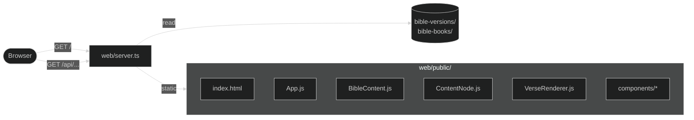
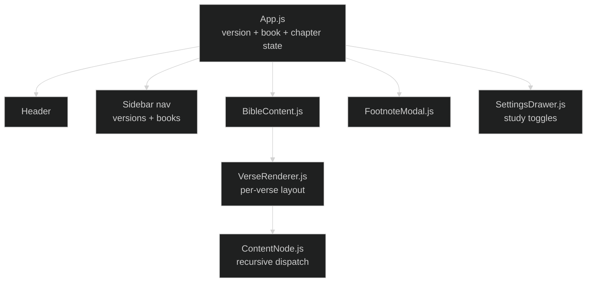

# Graphai Reader (Web App)

The Graphai Reader is a reference implementation: a browser-based Bible reader that demonstrates how to consume the JSON data and render it for study. It's also the easiest way to eyeball whether a translation imported correctly.

For the data it consumes, see [content-model.md](./content-model.md). For how that data is produced and validated, see [data-pipeline.md](./data-pipeline.md).

## Run it

```bash
npm run dev
```

Opens at [http://localhost:3000](http://localhost:3000). No build step. The server transpiles JSX in the browser via Babel.

## Architecture at a glance



A small Node HTTP server in [web/server.ts](../../../web/server.ts) does two things: serves static files from `web/public/` and exposes a tiny JSON API. The browser does the rest.

## The API

| Endpoint                              | Returns                                                   |
| ------------------------------------- | --------------------------------------------------------- |
| `GET /api/versions`                   | All available translations with their book registries     |
| `GET /api/books`                      | The canonical book registry from `bible-books.json`       |
| `GET /api/content/{version}/{bookId}` | Verse array for one book in one version                   |

The endpoints map directly to filesystem paths. There's no caching, no auth, and no database. The server is a thin file reader with a routing layer. Restarting it picks up data edits immediately.

## Frontend layout

The SPA loads three things in parallel on mount: the version list, the canonical book registry, and (once a version is chosen) the verse content for the active book. State lives in [App.js](../../../web/public/js/App.js) as React hooks. There's no router and no global store. The URL doesn't reflect navigation, which is a deliberate simplification for a reading app.



The interesting work happens in **[ContentNode.js](../../../web/public/js/ContentNode.js)**, a single recursive component that dispatches on the shape of each node. It's the browser counterpart to the exporter's `renderContent` function and follows the same dispatch order (see [content-model.md](./content-model.md#discrimination-order)).

## Settings and toggles

The reader carries a settings panel with toggles for the various annotations:

| Toggle           | Effect                                                                     |
| ---------------- | -------------------------------------------------------------------------- |
| Paragraph mode   | Lay out text by paragraph (vs. verse-by-verse, one per line)               |
| Verse numbers    | Show/hide verse number superscripts                                        |
| Strong's         | Show concordance numbers as outbound links to the EGP lexicon              |
| Morphology       | Show parsing codes inline                                                  |
| Lemma            | Show the lexical lemma in the original script                              |
| Footnotes        | Show clickable footnote markers (opens a modal)                            |
| Headings         | Show editorial section headings                                            |
| Subtitles        | Show psalm superscriptions and similar text-internal titles                |
| Words of Christ  | Tint Jesus' words: choice of off, red, blue, or purple                     |
| Dark mode        | Light/dark theme (defaults to system preference)                           |
| Font size        | Scales the reading column proportionally                                   |

Acrostic headings (Hebrew stanza markers, e.g. Psalm 119) render one size smaller than standard headings but share the same Headings toggle. See [content-model.md](./content-model.md#why-these-particular-shapes).

The settings live in component state, not localStorage. They reset on reload. Persistence would be a reasonable enhancement.

## Component registration

The frontend uses no module bundler. Each component file ends with:

```javascript
window.ComponentName = ComponentName;
```

That's how cross-file references resolve. When you add a new component, register it the same way; otherwise other files won't see it. This is a deliberate trade-off: no build pipeline at the cost of explicit registration boilerplate.

## Rendering original-language script

Greek and Hebrew text uses the `script` property on text nodes (`"G"` or `"H"`). The reader applies a CSS class and, for Hebrew, sets `dir="rtl"` so the browser handles bidirectional text correctly. Fonts are loaded via the page's stylesheet. Latin text uses the default body font, Greek and Hebrew get their own script-specific stacks.

## Bible reference links

A `bibleLink` node renders as an anchor. Clicking it calls an `onBibleLinkClick` callback all the way up through the recursion. Today that handler isn't wired to anything navigable. The link's `title` attribute shows the target reference as a tooltip, but there's no chapter jump yet. The data structure is in place; the navigation handler is the next step.

If you implement navigation, the parser needs to handle the canonical formats (`"Hebrews 11:3"`, `"Psalm 104:30"`, `"John 3:15–18"`, comma-separated lists like `"Isaiah 66:10, 13"`). The en-dash (not hyphen) is the canonical range separator.

## Operational tips

- **The server reads files synchronously on each request.** Fine for local dev; if you ever expose this beyond localhost, add caching.
- **The reader doesn't tolerate unknown content shapes gracefully.** A schema variant that `ContentNode.js` doesn't recognize will render nothing (no error in the console either). When you add a content variant, smoke-test the reader before declaring it done.
- **Babel-in-browser is slow on first paint.** Refreshing while testing repeatedly is noticeably slower than refreshing a built SPA. That's expected, not a bug to chase.
